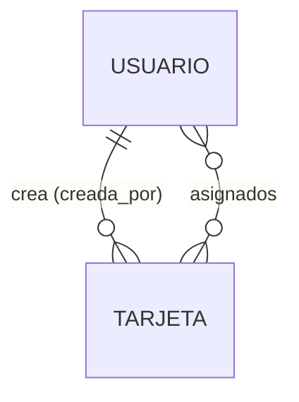
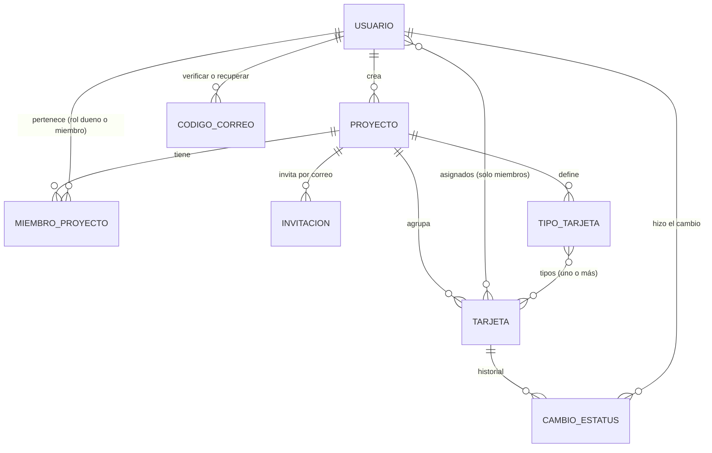

# TaskFlow — Propuesta de arquitectura y esquema de datos

> **Estado:** v3. Etapa 1 (esqueleto) y Etapa 2 (backend de proyectos, miembros, permisos,
> invitaciones, tipos e historial, §4.5) implementadas el 2026-10-01. **Etapa 3 (API `/api/v1/`,
> PWA y portada de instalación, §5–§7) implementada el 2026-10-01**. **Cuentas con correo
> verificado, recuperación de contraseña y apellidos separados** implementados el 2026-10-02
> (§4.3, §7). **En producción todo lo anterior (`3b54d39`) desde el 2026-10-02 en
> `https://taskflow.rourendev.com/`**, servidor propio en Hetzner (§9). La instalación anterior en
> `sistemas.reduaz.mx/taskflow/` (solo Etapa 1) se retiró el 2026-10-03.
> **Fecha:** 2026-10-03
> **Alcance:** describe el funcionamiento general y el esquema. Lo pendiente de decidir está en
> [§10](#10-preguntas-abiertas); los ajustes hechos al implementar, en [§11](#11-notas-de-implementación).

---

## 1. Resumen

**TaskFlow** es un gestor de tarjetas para organizar actividades. Cada tarjeta representa una
actividad, tiene uno de tres estatus (**Pendiente**, **En curso**, **Finalizada**) y puede asignarse
a una o más personas.

| Frente | Usuarios | Tecnología | Ruta | Estado |
| --- | --- | --- | --- | --- |
| Administración del sistema | Superadministrador | Django admin | `/django-admin/` | ✅ en producción |
| Portada de instalación | Cualquiera | Plantilla de Django | `/` | ✅ en producción |
| Aplicación (tablero de tarjetas) | Usuarios con cuenta | PWA: Vue 3 + Vite (§5) | `/app/` | ✅ en producción |
| API de la PWA | La PWA (misma sesión) | Django REST Framework (§6) | `/api/v1/` | ✅ en producción |

Las rutas son relativas a `https://taskflow.rourendev.com`. El código funciona también bajo una
ruta de otro dominio (`/taskflow/…`, como hasta 2026-10-03; §9).

## 2. Stack

Python 3.13 · Django 5.2 LTS · Django REST Framework 3.18 · PostgreSQL 18 · uv · Docker (dev y
producción con gunicorn + WhiteNoise). PWA: Vue 3.5 + vue-router 5 + Vite 8 + vite-plugin-pwa
(Workbox) + TypeScript; Inter empaquetada (`static/fonts/`, licencia OFL). Mismo stack y convenciones que mi-campus, sin Wagtail ni multi-tenant: TaskFlow no
tiene sitios públicos ni unidades, así que esas piezas solo agregarían complejidad.

## 3. Aplicaciones

```
apps/
├── core/        TimeStampedModel, /healthz/, portada (/), entrega de la PWA (/app/)
├── usuarios/    Usuario (AUTH_USER_MODEL), CodigoCorreo + servicios (verificar, recuperar)
├── proyectos/   Proyecto, MiembroProyecto, Invitacion, TipoTarjeta + servicios (reglas)
├── tarjetas/    Tarjeta, CambioEstatus + servicios (reglas)
└── api/         /api/v1/: vistas finas que llaman a los servicios; sin reglas propias
frontend/        PWA (Vue + Vite). `npm run build` la deja en pwa/app/ (no se versiona)
static/          tema.css (paleta), fuentes.css + fonts/ (Inter), portada.css/js, marca/
```

## 4. Esquema de datos

### 4.1 Diagrama entidad-relación



Propuesto para la Etapa 2 (§4.5, pendiente de implementar):



### 4.2 Campos comunes

`TimeStampedModel` (abstracto): `creado_en` (auto al crear) y `actualizado_en` (auto al guardar).

### 4.3 `usuarios`

#### `Usuario` — la cuenta (`AUTH_USER_MODEL`)

| Campo | Tipo | Notas |
| --- | --- | --- |
| `email` | Email, único | Credencial de acceso. Se guarda en minúsculas y hay restricción única sin distinguir mayúsculas (`usuario_email_unico_ci`). |
| `nombre` | Texto | Obligatorio al registrarse y en el perfil (lo exige la API). |
| `primer_apellido` | Texto (100) | Obligatorio al registrarse y en el perfil. |
| `segundo_apellido` | Texto (100), opcional | Hay personas con un solo apellido (y extranjeros). |
| `correo_verificado_en` | Fecha y hora, nula | Nula = la cuenta no ha confirmado su correo y **no puede entrar a la app**. Fecha y no booleano, para saber desde cuándo (igual que `archivado_en`). |
| `is_active`, `is_staff`, permisos | | Los de Django. |

Extiende `AbstractBaseUser` y no `AbstractUser` para no arrastrar `username`: una sola credencial
(el correo) evita que dos campos digan cosas distintas. Se definió desde la primera migración porque
cambiar `AUTH_USER_MODEL` después es muy costoso.

Los nombres van en la base **por separado y sin obligatoriedad** (`blank=True`): el superusuario
se crea sin nombre y el admin no debe exigirlo. La obligatoriedad de nombre y primer apellido la
aplica la API al registrarse y al editar el perfil. `nombre_completo` = nombre + primer apellido
+ segundo apellido, omitiendo los vacíos.

**Quién queda verificado sin código:** quien se registra desde una **invitación** (el enlace llegó
a ese correo), el **superusuario** (`create_superuser`), las cuentas **creadas desde el admin** y
las que **ya existían** al agregar la verificación (la migración `usuarios.0002` les pone su
`creado_en`, para no cerrarles la puerta por una regla nueva).

#### `CodigoCorreo` — código de un solo uso *(2026-10-02)*

| Campo | Tipo | Notas |
| --- | --- | --- |
| `usuario` | FK `Usuario`, `CASCADE` | |
| `proposito` | `verificar` · `recuperar` | `CheckConstraint`. |
| `codigo_hash` | Texto (64) | HMAC-SHA256 con la `SECRET_KEY` (`salted_hmac`), **nunca el código en claro**: quien lea la base o un respaldo no puede usarlo. |
| `intentos` | Entero | Intentos fallidos con este código. |
| `creado_en` | Fecha y hora (`default=timezone.now`) | De ahí sale el vencimiento. No `auto_now_add`, para poder simular un código vencido en las pruebas. |

Reglas (`apps/usuarios/servicios.py`): 6 dígitos (`secrets`), **vence a los 15 min**, **5
intentos**, solo vale **el más reciente** de cada propósito, **un minuto entre envíos** y **5
envíos por hora**. Con eso, adivinar uno de un millón no es práctico. Al usarlo bien se borran
los códigos de ese propósito; los vencidos o sin usar se quedan (son pocos y cuentan para el tope
por hora). *Pendiente:* limpiar los viejos con un comando periódico si la tabla creciera.
El correo sale con `transaction.on_commit` (plantillas en
`apps/usuarios/templates/usuarios/correos/`).

### 4.4 `tarjetas`

#### `Tarjeta`

| Campo | Tipo | Notas |
| --- | --- | --- |
| `titulo` | Texto (200), obligatorio | |
| `descripcion` | Texto largo, obligatorio | |
| `prioridad` | `baja` · `media` · `alta` · `urgente` | Por omisión `media`. Fija para todos los proyectos (a diferencia de los tipos), decidida el 2026-10-01 al adoptar la identidad visual (`docs/identidad-visual.md`). `CheckConstraint` `tarjeta_prioridad_valida`. |
| `estatus` | `pendiente` · `en_curso` · `finalizada` | Por omisión `pendiente`. Indexado (los tableros filtran por estatus). `CheckConstraint` `tarjeta_estatus_valido` para que la BD rechace valores fuera de las tres opciones aunque se escriba sin pasar por Django. |
| `fecha_fin` | Fecha, **opcional** | Muchas actividades no tienen fecha comprometida; un valor inventado ensuciaría los vencimientos. |
| `asignados` | M2M a `Usuario` | Una o más personas. Hoy admite cero (ver §10). |
| `creada_por` | FK a `Usuario`, opcional | `SET_NULL`: borrar una cuenta no debe borrar las tarjetas que creó. |

Orden por omisión: más recientes primero (`-creado_en`).

### 4.5 Proyectos y miembros *(Etapa 2 — decidido e implementado el 2026-10-01)*

Código: `apps/proyectos/` (`Proyecto`, `MiembroProyecto`, `Invitacion`, `TipoTarjeta`) y
`apps/tarjetas/` (`Tarjeta`, `CambioEstatus`). **Las reglas viven en `servicios.py` de cada app**
(no en los modelos ni en las vistas): `PermisoDenegado` cuando el usuario no puede (no es miembro,
no es dueño, le falta el permiso o el proyecto está archivado) y `ValidationError` cuando los datos
son inválidos. La API (`apps/api/`, §6) solo traduce peticiones a esas funciones.

Reglas decididas (Ernesto, 2026-10-01):

- Cualquier usuario puede **crear proyectos**; las **tarjetas pertenecen a un proyecto**.
- Un usuario puede pertenecer a **uno o varios** proyectos.
- Solo el **dueño** invita gente a su proyecto (y quita personas o cancela invitaciones).
- **Todos los miembros ven todas las tarjetas** del proyecto; quien no es miembro no ve el proyecto.
- Las tarjetas pueden quedar **sin asignar**.
- **Crear, editar, cambiar estatus y eliminar** tarjetas son permisos que el **dueño asigna a cada
  miembro**; el dueño siempre puede todo. Quien acepta una invitación entra con crear, editar y
  cambiar estatus (sin eliminar).
- Las invitaciones se pueden **reenviar**.
- Si la cuenta del dueño se desactiva sin haber transferido, un **administrador** transfiere el
  proyecto desde el admin de Django.
- Cada proyecto tiene **tipos de tarjeta** (nombre, descripción opcional y color configurable). Los
  gestiona el dueño o quien tenga el permiso **«Gestionar tipos»**. Una tarjeta puede tener **uno o
  más** tipos.
- Una tarjeta se mueve **libremente entre los tres estatus**, también de *Finalizada* hacia atrás.
  Cada cambio se registra en un **historial**: quién, de qué estatus a cuál, fecha y hora.
- El proyecto se puede **transferir** a otro miembro (un solo dueño a la vez), **archivar** y
  **eliminar**. Las **invitaciones no vencen**.

Esquema (implementado; explorado antes en `docs/_mockups/app-v1.html`):

| Modelo | Campos | Notas |
| --- | --- | --- |
| `Proyecto` | `nombre`, `creado_por` (FK `Usuario`, `PROTECT`), fechas | El creador queda como miembro con rol `dueno`. |
| `Proyecto` (más) | + `archivado_en` (fecha, nula) | Archivado = solo lectura para todos; nulo = activo. Fecha y no booleano para saber desde cuándo. |
| `MiembroProyecto` | `proyecto` (FK, `CASCADE`), `usuario` (FK, `CASCADE`), `rol` (`dueno` · `miembro`), `puede_crear` (por omisión `True`), `puede_editar` (`True`), `puede_cambiar_estatus` (`True`), `puede_eliminar` (`False`), `puede_gestionar_tipos` (`False`), `unido_en` | `UniqueConstraint(proyecto, usuario)` y **un solo dueño por proyecto** (`UniqueConstraint(proyecto, condition=rol='dueno')`). Los permisos son columnas y no un sistema genérico porque son cinco, fijos, y el dueño los marca por persona; para el dueño se ignoran (puede todo). Transferir = cambiar los dos roles en una transacción. |
| `Invitacion` | `proyecto` (FK), `correo`, `invitada_por` (FK `Usuario`), `token` (único), `estado` (`pendiente` · `aceptada` · `cancelada`), `creada_en`, `enviada_en` (último envío), `veces_enviada`, `respondida_en` | **Sin vencimiento** (decidido). **Reenviar** manda otra vez el mismo enlace y actualiza `enviada_en`; `veces_enviada` sirve para poner un límite si alguien abusa. Una pendiente por proyecto y correo (`UniqueConstraint` condicional). Se invita por correo porque la persona puede no tener cuenta todavía. |
| `TipoTarjeta` | `proyecto` (FK, `CASCADE`), `nombre` (50), `descripcion` (opcional), `color` (7, `#rrggbb`), fechas | `UniqueConstraint(proyecto, Lower(nombre))`: no dos tipos con el mismo nombre en un proyecto, sin distinguir mayúsculas. `color` validado con `RegexValidator(^#[0-9a-f]{6}$)` y guardado en minúsculas: es el único color que viene del usuario, por eso se valida en el servidor. Eliminar un tipo lo quita de las tarjetas (el M2M se borra solo) sin borrarlas. |
| `CambioEstatus` | `tarjeta` (FK, `CASCADE`), `estatus_anterior` (**vacío** en la creación: cadena vacía y no nulo, por la convención de Django para textos), `estatus_nuevo`, `usuario` (FK `Usuario`, `SET_NULL`), `fecha` (fecha y hora, `default=timezone.now`: no `auto_now_add`, para que la migración pueda sembrar la fecha de creación de las tarjetas que ya existían) | Solo se agregan filas, nunca se editan. Índice `(tarjeta, -fecha)`. Se escribe en la **misma transacción** que el cambio, desde un único servicio (`cambiar_estatus`) que también usan la creación de tarjetas y el admin, para que ningún camino cambie el estatus sin dejar rastro. La hora se guarda en UTC y se muestra en `America/Mexico_City`. `SET_NULL` en `usuario`: si se borra una cuenta, el cambio sigue y se muestra «Usuario eliminado». Si se elimina la tarjeta, su historial se va con ella. |
| `Tarjeta` (cambio) | + `proyecto` (FK `Proyecto`, **obligatoria**, `CASCADE`), + `tipos` (M2M a `TipoTarjeta`, opcional) | `asignados` es **opcional** y solo puede contener miembros del proyecto; `tipos` solo puede contener tipos **del mismo proyecto** (ambas validaciones en el formulario/servicio, la BD no puede expresarlas). Eliminar el proyecto borra sus tarjetas. |

Migración (`tarjetas.0003`–`0005`): `proyecto` entra opcional, la `0004` pasa las tarjetas que ya
existían a un proyecto **«Tarjetas anteriores»** (dueño: quien creó la primera, o el primer
superusuario; sus asignados se vuelven miembros) y siembra su historial con una entrada de
creación, y la `0005` hace `proyecto` obligatorio. Se prefirió a borrarlas para no perder datos.

Decisiones tomadas al implementar (2026-10-01):

- **Una invitación solo la acepta una cuenta con el mismo correo invitado.** El enlace llega a ese
  correo; si alguien lo reenvía, la otra persona no entra al proyecto. Quien tenga cuenta con otro
  correo pide que lo inviten con ese.
- **Transferir** baja al dueño actual y sube al nuevo en una transacción, en ese orden (la
  restricción «un solo dueño» no puede diferirse porque es condicional). En el admin de Django no se
  edita el rol: el formulario del proyecto tiene «Transferir a», que llama al mismo servicio.
- **El admin también deja rastro:** cambiar el estatus desde el admin escribe en `CambioEstatus`.
- **Tope de 10 envíos por invitación** (`MAX_ENVIOS_INVITACION`): no vencen y se pueden reenviar,
  pero el tope evita usar TaskFlow para mandar correo masivo.
- **El enlace de invitación** apunta a `TASKFLOW_URL/app/#/invitacion/<token>`, la pantalla de la
  PWA que la acepta (§5). El correo sale por SMTP (`DJANGO_EMAIL_*`); sin configurar, se imprime en el
  registro del contenedor.

## 5. Vistas de la aplicación

*Aprobadas el 2026-10-01* con las maquetas `docs/_mockups/app-v2.html` y
`docs/_mockups/instalacion-v2.html` (paleta y componentes en `docs/identidad-visual.md`).

### 5.1 Portada de instalación — `/`

Plantilla de Django (`apps/core/templates/core/portada.html`, sin la PWA): qué es TaskFlow y cómo
instalarla. Detecta iPhone/iPad, Android o computadora (`static/js/portada.js`) y resalta los pasos
de esa plataforma. Botones: **Abrir e instalar** (`/app/?instalar=1`: la PWA muestra el aviso de
instalación aunque se haya descartado), **Crear mi cuenta** (`/app/#/registro`, solo si
`TASKFLOW_REGISTRO_ABIERTO`) y **Entrar**.

### 5.2 PWA — `/app/`

Código en `frontend/`. Rutas con `#` (decisión en §9):

| Ruta | Pantalla | Notas |
| --- | --- | --- |
| `#/entrar`, `#/registro` | Acceso | Sin armazón. `?siguiente=` regresa a donde iba. Registro: nombre, primer apellido, segundo apellido (opcional), correo y contraseña; al enviarlo pasa a `#/verificar`. Entrar con una cuenta sin confirmar también pasa ahí. Enlace «¿Olvidaste tu contraseña?». |
| `#/verificar?correo=` | Confirmar correo | Código de 6 dígitos (`autocomplete="one-time-code"` para que el teléfono lo sugiera) y «Reenviar código», habilitado tras 60 s, lo mismo que exige el servidor. Al confirmar, entra. |
| `#/recuperar` | Recuperar contraseña | Paso 1: correo. Paso 2: código y contraseña nueva; al guardar, entra. El paso 2 aparece siempre, exista o no la cuenta (§7). |
| `#/invitacion/<token>` | Aceptar invitación | Pública. Ver §7. |
| `#/proyectos` | Mis proyectos | Activos con barra de avance y conteos (pendientes, en curso, finalizadas, vencidas); archivados aparte. Aviso de instalación. |
| `#/proyectos/<id>` | Tablero | Teléfono: pestañas por estatus y botón «+». Computadora (≥ 900 px): tres columnas. Filtro por tipo y «Solo mías». Banner de solo lectura si está archivado. |
| `#/proyectos/<id>/ajustes` | Miembros y ajustes | Invitar, reenviar/cancelar, permisos por miembro, «Hacer dueño», quitar, tipos, renombrar, archivar/restaurar, eliminar, salir. |
| `#/mis-tarjetas` | Mis tarjetas | Asignadas a mí, sin finalizar, de mis proyectos activos; vencidas primero, luego por fecha. |
| `#/perfil` | Perfil | Nombre y apellidos, contraseña, instalar, cerrar sesión. |

- **Detalle de tarjeta** en hoja inferior (teléfono) o panel lateral (computadora): estatus con un
  toque, prioridad, tipos, descripción, fecha, historial (quién, de qué a qué, fecha y hora) y
  asignados. Lo que el usuario no tiene permitido no aparece o queda deshabilitado, con una nota que
  remite al dueño. El mismo panel tiene el formulario de alta/edición.
- **Orden** dentro de cada columna: prioridad (urgente → baja) y luego fecha de fin.
- **Confirmaciones** en un diálogo propio que nombra lo afectado y la consecuencia (nunca
  `window.confirm`); **avisos** breves en pasado («Se creó la tarjeta.»).
- **Sin conexión:** el service worker (Workbox, `registerType: "prompt"`) guarda la app y, con
  `NetworkFirst`, las últimas respuestas `GET` de `auth/csrf`, `yo`, `proyectos` y `tarjetas`; se ve
  lo último cargado. Las escrituras requieren conexión. Al cerrar sesión se borra esa caché.
  **Versión nueva** *(cambiado 2026-10-02)*: la app la busca al abrirse, al volver al frente y cada
  hora; al encontrarla avisa «TaskFlow se actualizará en 15 s. Guarda lo que estés escribiendo.»
  con «Actualizar ahora», y al llegar a cero se recarga sola (`frontend/src/App.vue`).
- **Instalación:** Chrome/Edge/Android usan `beforeinstallprompt` (botón «Instalar»); iOS muestra
  los pasos de Safari. El aviso se puede descartar (`localStorage`).
- **Entrega:** `npm run build` deja la app en `pwa/app/`; WhiteNoise la sirve en `/app/`
  (`WHITENOISE_ROOT`). Si no está compilada, `/app/` responde 503 con la instrucción. En la imagen
  de producción la compila la etapa `pwa` del Dockerfile.

## 6. API

Privada para la PWA, en `/api/v1/` (`apps/api/`), JSON, vistas de función de DRF. Cada acción llama
a un servicio de `apps/*/servicios.py`; la API no tiene reglas propias. Salida armada en
`apps/api/representacion.py`.

| Método y ruta | Qué hace |
| --- | --- |
| `GET auth/csrf/` | Deja la cookie CSRF; devuelve `registro_abierto` y el `usuario` de la sesión (o `null`). |
| `POST auth/entrar/` · `auth/salir/` | Sesión. Entrar con una cuenta sin confirmar responde **403** `{detalle, verificar: true, correo}`, sin sesión, y reenvía el código (si no se mandó uno en el último minuto). |
| `POST auth/registro/` | Crea la cuenta **sin sesión** y manda el código: `201 {verificar: true, correo}`. Pide `nombre`, `primer_apellido`, `segundo_apellido` (opcional), `correo`, `password`. |
| `POST auth/verificar/` · `auth/verificar/reenviar/` | Confirmar con `{correo, codigo}` (abre la sesión y devuelve el usuario) · reenviar con `{correo}`. |
| `POST auth/recuperar/` · `auth/recuperar/confirmar/` | Pedir el código con `{correo}` (siempre `{ok: true}`) · `{correo, codigo, password}` cambia la contraseña, verifica el correo y abre la sesión. |
| `GET, PATCH yo/` · `POST yo/password/` | Mi cuenta (`nombre_pila`, `primer_apellido`, `segundo_apellido`; contraseña). |
| `GET yo/tarjetas/` | Mis tarjetas sin finalizar en proyectos activos. |
| `GET, POST proyectos/` | Mis proyectos (resumen con conteos y mis permisos) · crear. |
| `GET, PATCH, DELETE proyectos/<id>/` | Detalle (miembros, tipos, invitaciones si soy dueño) · renombrar · eliminar. |
| `POST proyectos/<id>/{archivar,restaurar,salir,transferir}/` | Acciones del proyecto. |
| `PATCH, DELETE proyectos/<id>/miembros/<usuario>/` | Permisos de un miembro · quitarlo. |
| `POST proyectos/<id>/invitaciones/` · `…/<inv>/{reenviar,cancelar}/` | Invitaciones. |
| `POST proyectos/<id>/tipos/` · `PATCH, DELETE …/tipos/<tipo>/` | Tipos de tarjeta. |
| `GET, POST proyectos/<id>/tarjetas/` | Tarjetas del proyecto (ordenadas) · crear. |
| `GET, PATCH, DELETE tarjetas/<id>/` | Detalle con historial · editar · eliminar. |
| `POST tarjetas/<id>/estatus/` | Mover a otro estatus (queda en el historial). |
| `GET invitaciones/<token>/` | Pública: proyecto, correo, quién invitó, estado y si ya hay cuenta. |
| `POST invitaciones/<token>/aceptar/` · `…/registro/` | Aceptar con sesión · crear cuenta con el correo invitado (ya verificada) y aceptar. |

Errores: `{"detalle": "…"}` o un mensaje por campo (`{"titulo": ["…"]}`); 400 validación, 403 sin
permiso, 404 lo que no existe **o no es tuyo** (§7). Todo lo de `auth/` exige CSRF y tiene el
límite `acceso`.

## 7. Acceso y seguridad

- **Sesión de Django + CSRF** en el mismo origen; nada de tokens en `localStorage`. La PWA manda
  `X-CSRFToken` leído de la cookie `taskflow_csrftoken`. Entrar y registrarse también exigen CSRF
  (`SesionConCsrf`) y tienen límite de intentos (`TASKFLOW_LIMITE_ACCESO`, 20/min por omisión).
- **Registro abierto** (`TASKFLOW_REGISTRO_ABIERTO`, `True` por omisión): cualquiera crea su cuenta
  y sus proyectos. Si se cierra, solo entra quien recibe una invitación.
- **Correo verificado** *(2026-10-02)*: quien se registra solo recibe un código de 6 dígitos y
  **no tiene sesión hasta capturarlo**; así no se llenan proyectos e invitaciones con correos
  ajenos o inventados. Reglas del código en §4.3.
- **Recuperar contraseña** *(2026-10-02)* con el mismo código. `auth/recuperar/` responde igual
  exista o no la cuenta, y un código equivocado, vencido o de un correo sin cuenta dan el mismo
  mensaje. Usar el código **también verifica el correo**: así, si alguien registró primero un
  correo ajeno sin poder confirmarlo, el dueño real recupera la cuenta y pone su contraseña. Las
  cuentas desactivadas no reciben códigos.
  Límite conocido: «Espera un minuto…» al reenviar sí delata que hay una cuenta con ese correo; el
  registro ya lo delata («Ya existe una cuenta…»), así que no se gana nada ocultándolo aquí.
- **Invitaciones:** solo la cuenta con el correo invitado puede aceptarla. Sin cuenta, la crea desde
  el enlace con ese correo (no se puede cambiar) y queda dentro del proyecto. Con sesión de otra
  cuenta, se le pide salir y entrar con la correcta.
- **Lo ajeno responde 404, no 403**, para no revelar que un proyecto o tarjeta existe. Las reglas
  (dueño, permisos, archivado) las aplican los servicios y responden 403.
- Admin de Django en `/django-admin/` (`is_staff`).
- Producción: `https://taskflow.rourendev.com/` (§9). HTTPS lo termina el nginx del servidor con un
  certificado propio de Let's Encrypt; Django confía en `X-Forwarded-Proto`
  (`SECURE_PROXY_SSL_HEADER`), cookies `Secure` y `Lax`. Solo entran 22, 80 y 443 (firewall de
  Hetzner); SSH solo con llave y sin `root`.
- Cookies con nombre propio (`taskflow_sessionid`, `taskflow_csrftoken`) y ruta `RUTA_BASE`: no
  pisan las de otra app del mismo dominio o de `localhost` en desarrollo.
- HSTS solo para `taskflow.rourendev.com` (sin subdominios): `300` desde 2026-10-02, *pendiente*
  subirlo a un año. En `sistemas.reduaz.mx` estaba en 0 porque el dominio conservaba el 8080 de
  actividades-uaz.
- Visibilidad (§4.5): un usuario ve solo los proyectos de los que es miembro y todas sus tarjetas.
  Cada endpoint tiene prueba de que un no miembro no puede leer ni modificar
  (`apps/api/tests/test_api.py`).

## 8. Plan por etapas

| Etapa | Contenido | Estado |
| --- | --- | --- |
| 1 | Esqueleto: Docker, settings, `Usuario`, `Tarjeta`, admin, pruebas básicas | ✅ 2026-10-01 |
| 1.5 | CI (GitHub Actions + ghcr.io) y despliegue en el servidor compartido de la UAZ | ✅ 2026-10-01 · `f6d2e40` · retirado 2026-10-03 |
| 1.6 | Servidor propio `srv-01` (Hetzner), dominio `rourendev.com`, correo por Resend (docs/operacion.md, docs/despliegue-actual.md) | ✅ 2026-10-02 · en producción `3b54d39` |
| 2 | Proyectos, miembros, permisos, invitaciones, tipos e historial (§4.5): modelos, migraciones, servicios, admin y pruebas | ✅ 2026-10-01 (maquetas en `docs/_mockups/`) |
| 3 | API `/api/v1/`, PWA (tablero, tarjetas, miembros, invitaciones, tipos, perfil) y portada de instalación (§5–§7) | ✅ 2026-10-01 · en producción 2026-10-02 |
| 3.5 | Correo verificado con código, recuperar contraseña y apellidos separados (§4.3, §7) | ✅ 2026-10-02 · en producción 2026-10-02 |
| 4 | Por definir: avisos por correo de asignación o vencimiento, búsqueda, comentarios en tarjetas | — |

## 9. Decisiones de diseño

- **Sin Wagtail ni multi-tenant** (2026-10-01): TaskFlow no publica contenido ni separa datos por
  unidad. Si en el futuro hiciera falta separar tableros por equipo, se modelaría con una FK
  explícita, no con multi-site.

- **Servidor propio en Hetzner con dominio propio** (2026-10-02, Ernesto; sustituye a la decisión
  siguiente): TaskFlow pasa a `https://taskflow.rourendev.com/`, en `srv-01` (Hetzner Cloud, 2 vCPU,
  4 GB), servidor pensado para alojar varias apps propias, una por subdominio de `rourendev.com`
  (dominio en Cloudflare). Motivos: dejar de compartir el servidor de la UAZ (y sus restricciones:
  sin HSTS, 2 workers, ruta en vez de dominio) y poder publicar y monetizar apps personales.
  Descartados: **Vercel** (serverless: sin Docker, sin procesos permanentes ni disco persistente;
  habría que rehacer el despliegue y mover los archivos a S3), **DigitalOcean** (mismo esquema pero
  el doble de precio por la mitad de RAM), **Clouding** (1 GB de RAM y 0.5 vCPU por el mismo precio)
  y **Render/Railway/Fly** (más caros y dejan sin uso `desplegar.sh` y los respaldos). Correo por
  **Resend** (SMTP; gratis hasta 3,000 al mes) porque no requiere código y la verificación del
  dominio se hizo con Cloudflare en un paso. No se contrataron los Backups de Hetzner ni se instaló
  el respaldo diario (riesgo aceptado, docs/despliegue-actual.md §4).
- **Publicación bajo `/taskflow/` de `sistemas.reduaz.mx` en vez de dominio propio** (2026-10-01;
  *sustituida el 2026-10-02 por la anterior; se conserva el razonamiento*):
  no se pueden pedir más dominios por ahora. Se descartó entrar por IP y puerto
  (`http://148.217.94.155:8082`) porque dejaría la aplicación sin HTTPS (contraseñas en claro) y
  obligaría a abrir un puerto en el firewall. La ruta reutiliza el certificado existente; el costo
  es `FORCE_SCRIPT_NAME`, cookies con nombre y ruta propios y la regla de no escribir URLs a mano.
  Pasar a dominio propio después es cambiar dos variables y el `server{}` (docs/operacion.md).
- **PWA con rutas `#` y `base: "./"`** (2026-10-01): la misma build funciona en `/app/` y bajo una
  ruta (`/taskflow/app/`, producción hasta 2026-10-03) sin recompilar, y el servidor solo entrega `index.html`; no hace
  falta un *catch-all* en Django ni en nginx. La raíz de la API se calcula de la URL
  (`frontend/src/api.ts`). Costo: URLs con `#`, sin importancia en una app instalada.
- **API con vistas de función de DRF y salida a mano** (2026-10-01), no `ViewSet` ni `Serializer`:
  la salida mezcla datos calculados (mis permisos, conteos, vencidas) y la validación de entrada ya
  vive en los servicios. Se usa DRF por sesión, CSRF, límites de intentos y manejo de errores.
- **Registro abierto por omisión** (2026-10-01): cualquier persona puede crear su cuenta y sus
  proyectos (§4.5: «cada usuario podrá crear un proyecto»). Se puede cerrar con una variable.
- **Código de 6 dígitos y no enlace mágico para verificar y recuperar** (2026-10-02): en la app
  instalada, un enlace del correo se abre en el navegador y no en la PWA, así que la persona
  terminaría en otra ventana sin su sesión; el código se escribe donde ya está, y el teléfono lo
  sugiere solo (`one-time-code`). Se descartó también `PasswordResetTokenGenerator` de Django por
  la misma razón (es un enlace) y porque no limita intentos.
- **El código se guarda como HMAC, no en claro ni con el hasher de contraseñas** (2026-10-02): un
  respaldo filtrado no debe servir para entrar; el HMAC basta porque el código vive 15 minutos y
  tiene 5 intentos, y no paga el costo de PBKDF2 en cada intento.
- **La PWA se actualiza sola con cuenta regresiva** (2026-10-02, Ernesto): con el aviso que
  esperaba a que alguien tocara «Actualizar», una app instalada podía quedarse días en una versión
  vieja, con pantallas que ya no coinciden con la API (p. ej. un registro sin el campo de primer
  apellido que el servidor ahora exige). Se descartó recargar al instante, porque perdería lo que
  alguien estuviera escribiendo, y esperar a que no hubiera formularios abiertos, por complejo:
  15 s de aviso bastan para guardar. Los datos no corren riesgo con una versión vieja (las reglas
  viven en el servidor); el riesgo era de pantallas rotas. Los despliegues se hacen en horas de
  poco uso.
- **Paleta y tipografía compartidas** (2026-10-01): la PWA importa `static/css/tema.css` y
  `static/css/fuentes.css`, los mismos que la portada; no hay una segunda copia de los colores.
- **Sin nginx interno** (2026-10-01), a diferencia de mi-campus: no hay archivos privados que
  entregar con `X-Accel-Redirect` y WhiteNoise sirve los estáticos. `web` se publica directo en
  `127.0.0.1:8082`.

## 10. Preguntas abiertas

1. ~~¿Qué tarjetas ve un usuario normal?~~ **Resuelta (2026-10-01):** las tarjetas se agrupan en
   proyectos y cada miembro ve todas las de sus proyectos (§4.5).
2. ~~¿Una tarjeta puede quedar sin asignados?~~ **Resuelta (2026-10-01):** sí, asignar es opcional.
3. ~~¿Se permite regresar de Finalizada? ¿Se registra cuándo cambió?~~ **Resuelta (2026-10-01):**
   se mueve entre todos los estatus en cualquier dirección, y cada cambio queda en el historial
   (`CambioEstatus`: quién, de qué estatus a cuál, fecha y hora). No hace falta `finalizada_en`: se
   obtiene del historial.
4. ~~¿Hace falta agrupar tarjetas en tableros o proyectos?~~ **Resuelta (2026-10-01):** sí, en
   proyectos (§4.5).
5. ~~¿Quién invita?~~ **Resuelta (2026-10-01):** solo el dueño.
6. ~~¿Varios dueños o transferir?~~ **Resuelta (2026-10-01):** un dueño, el proyecto se puede
   transferir; si la cuenta del dueño se desactiva sin transferir, lo transfiere un administrador
   desde el admin de Django.
7. ~~Permisos sobre tarjetas~~ **Resuelta (2026-10-01):** crear, editar, cambiar estatus y eliminar
   son permisos que el dueño asigna a cada miembro; quien acepta una invitación entra con crear,
   editar y cambiar estatus.
8. ~~¿Vencen las invitaciones?~~ **Resuelta (2026-10-01):** no vencen y se pueden reenviar.
9. ~~¿Archivar o eliminar proyectos?~~ **Resuelta (2026-10-01):** ambos, solo el dueño; archivado =
   solo lectura y se puede restaurar.

10. ~~¿Cómo recupera alguien su contraseña?~~ **Resuelta (2026-10-02):** con un código por
    correo (§7), el mismo mecanismo que verifica la cuenta al registrarse.

## 11. Notas de implementación

- (2026-10-01) Las migraciones de `tarjetas` quedaron en `0001_initial` y `0002_initial` porque se
  generaron en la misma corrida que `usuarios`. Es válido; si se prefiere una sola, borrar ambas y
  regenerar antes del primer despliegue.
- (2026-10-01) **Estilos del admin rotos en producción** (versión `2df6d82`): `STATIC_URL` relativa
  (`static/`) quedaba en caché sin el prefijo porque gunicorn la lee al cargar WhiteNoise, antes de
  fijar `FORCE_SCRIPT_NAME`; el HTML pedía `/static/…` y caía en actividades-uaz. Se arma ahora con
  el prefijo explícito (`RUTA_BASE + "static/"`); WhiteNoise le quita `FORCE_SCRIPT_NAME` para
  servirla. Prueba: `apps/core/tests/test_smoke.py::test_estaticos_con_prefijo`.
- (2026-10-01) **Etapa 2 implementada.** App nueva `proyectos`; `Tarjeta` gana `proyecto`
  (obligatorio) y `tipos`; nuevo `CambioEstatus`. 44 pruebas (servicios, permisos, invitaciones,
  tipos, historial y admin) en verde con SQLite y PostgreSQL. Al desplegar, la tarjeta de prueba de
  producción pasa sola a «Tarjetas anteriores» (migración `tarjetas.0004`).
- (2026-10-01) **Identidad visual navy + coral** adoptada (el coral se retiró después; ver la
  nota de abajo) (`docs/identidad-visual.md`,
  `static/css/tema.css`, logo en `static/img/marca/`), con ajustes de contraste a la guía original.
  Trae un cambio al modelo: **`Tarjeta.prioridad`** (migración `tarjetas.0006`), editable con
  `editar_tarjeta`. Maquetas vigentes: `app-v2.html` e `instalacion-v2.html`.
- (2026-10-01) **Etapa 3 implementada.** App `api` (DRF 3.18) con 23 pruebas; PWA en `frontend/`
  probada de punta a punta con Playwright en teléfono y computadora, también bajo el prefijo
  `/taskflow/` (registro, proyecto, tipos, invitación, tarjetas, estatus e historial, edición,
  eliminación, aceptación de invitación con cuenta nueva). Cambios menores al backend:
  `auth/csrf/` devuelve el usuario de la sesión (la PWA arranca con una sola llamada), `yo/` trae
  `nombre_pila` y `apellidos` por separado, `.webmanifest` se sirve como
  `application/manifest+json`, y el enlace de invitación pasó a `/app/#/invitacion/<token>`. Las
  pruebas de Django apuntan `PWA_DIR` a una carpeta vacía para no depender de que la PWA esté
  compilada.
- (2026-10-01) **Se retira el coral** a pedido de Ernesto (se leía como alerta): acento y «En curso»
  en petróleo (`#0E7490`; el azul se descartó por genérico), prioridad baja y media en grises,
  botón principal navy, portada sin ilustración del teléfono. Rojo y ámbar quedan solo para
  alertas (`docs/identidad-visual.md`).
- (2026-10-01) **Primera prueba local de la Etapa 3** (Ernesto, Windows + Docker Desktop):
  - `docker compose run` no ejecuta el `npm install` del servicio `frontend` y su volumen de
    `node_modules` empieza vacío: la compilación es `docker compose run --rm frontend sh -c "npm ci
    && npm run build"` (corregido en README, skill, `compose.yaml` y el mensaje de `/app/`).
  - Tras agregar DRF a `pyproject.toml`, `web` fallaba con `No module named 'rest_framework'`: las
    dependencias viven en la imagen, hay que `docker compose build web`.
  - `PWA_DIR` con `env.path()` daba un `environ.Path`, que no admite `/` con texto: ahora es
    `Path(env(...))`. Las pruebas no lo detectaron porque `test.py` lo reemplaza.
  - En la portada, `.btn` le ganaba al atributo `hidden` y en computadora se veía también «Ver
    cómo instalar en iPhone»: `[hidden]{display:none!important}` en `portada.css`.
- (2026-10-02) **Cambio al esquema aprobado: apellidos separados y correo verificado.**
  `Usuario.apellidos` (opcional) pasa a `primer_apellido` (obligatorio en la API) y
  `segundo_apellido` (opcional), a pedido de Ernesto: en México se usan dos apellidos y
  ordenarlos o buscarlos por separado es lo normal. Se agregan `correo_verificado_en` y el modelo
  `CodigoCorreo`. La migración `usuarios.0002` parte `apellidos` en la primera palabra y el resto
  (falla con apellidos compuestos como «De la Torre»: cada quien lo corrige en su perfil) y marca
  como verificadas las cuentas existentes; es reversible. `auth/registro/` ya no abre sesión
  (antes devolvía el usuario). Las pruebas que mandan el código usan
  `django_db(transaction=True)` porque el correo sale en `on_commit`, y `conftest.py` limpia la
  caché antes de cada prueba (ahí cuenta DRF los intentos de `acceso`); el fixture `crear_usuario`
  crea cuentas verificadas.
- (2026-10-02) **Cambio a lo aprobado: actualización automática de la PWA.** Antes (§5, v3) la
  versión nueva esperaba a que el usuario tocara «Actualizar»; ahora se instala sola tras 15 s
  de aviso, y la app busca versiones al volver al frente y cada hora (antes, solo al abrirse).
  `registerType` sigue en `"prompt"`: es lo que deja controlar el momento de la recarga. Motivo
  y alternativas en §9.
- (2026-10-03) **Cambio a lo aprobado: producción en servidor y dominio propios.** Antes (§7, §9)
  TaskFlow vivía en `sistemas.reduaz.mx/taskflow/` con `DJANGO_FORCE_SCRIPT_NAME=/taskflow`; desde
  el 2026-10-02 vive en la raíz de `taskflow.rourendev.com` (`srv-01`, Hetzner) con
  `DJANGO_FORCE_SCRIPT_NAME` vacío, y el 2026-10-03 se retiró la instalación de la UAZ sin
  conservar datos (solo tenía la Etapa 1). Motivo y alternativas en §9; inventario y riesgos en
  docs/despliegue-actual.md. Se conserva el soporte para publicar bajo una ruta (cookies con
  nombre propio, `RUTA_BASE`, rutas `#` en la PWA). Cambios de código: la portada ya no escribe el
  dominio a mano (usa `request.get_host`; prueba
  `test_portada_muestra_el_dominio_desde_el_que_se_abre`) y su pregunta frecuente dice que llega
  un **código** (no un enlace) para recuperar la contraseña; `desplegar.sh` prueba la salud con
  `taskflow.rourendev.com`; `docker/nginx/taskflow.conf` pasa de snippet a sitio propio. Se
  agregan `docker/respaldo-diario.sh` y `docker/systemd/` (respaldo diario, *pendiente* de
  instalar).
