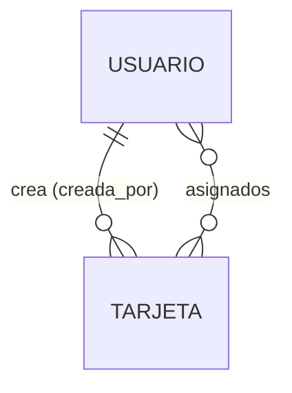

# TaskFlow — Propuesta de arquitectura y esquema de datos

> **Estado:** v1. Etapa 1 (esqueleto) implementada el 2026-10-01: modelos `Usuario` y `Tarjeta`,
> admin de Django y `/healthz/`. Sin vistas, API ni frontend. CI (GitHub Actions + ghcr.io) y
> despliegue en `https://sistemas.reduaz.mx/taskflow/` preparados el 2026-10-01.
> **Fecha:** 2026-10-01
> **Alcance:** describe el funcionamiento general y el esquema. Lo pendiente de decidir está en
> [§10](#10-preguntas-abiertas); los ajustes hechos al implementar, en [§11](#11-notas-de-implementación).

---

## 1. Resumen

**TaskFlow** es un gestor de tarjetas para organizar actividades. Cada tarjeta representa una
actividad, tiene uno de tres estatus (**Pendiente**, **En curso**, **Finalizada**) y puede asignarse
a una o más personas.

| Frente | Usuarios | Tecnología | Ruta | Estado |
| --- | --- | --- | --- | --- |
| Administración del sistema | Superadministrador | Django admin | `/taskflow/django-admin/` | ✅ |
| Aplicación (tablero de tarjetas) | Usuarios con cuenta | *por definir* (§5) | *por definir* | Pendiente |

## 2. Stack

Python 3.13 · Django 5.2 LTS · PostgreSQL 18 · uv · Docker (dev y producción con gunicorn +
WhiteNoise). Mismo stack y convenciones que mi-campus, sin Wagtail ni multi-tenant: TaskFlow no
tiene sitios públicos ni unidades, así que esas piezas solo agregarían complejidad.

## 3. Aplicaciones

```
apps/
├── core/        TimeStampedModel, /healthz/
├── usuarios/    Usuario (AUTH_USER_MODEL)
└── tarjetas/    Tarjeta
```

## 4. Esquema de datos

### 4.1 Diagrama entidad-relación



### 4.2 Campos comunes

`TimeStampedModel` (abstracto): `creado_en` (auto al crear) y `actualizado_en` (auto al guardar).

### 4.3 `usuarios`

#### `Usuario` — la cuenta (`AUTH_USER_MODEL`)

| Campo | Tipo | Notas |
| --- | --- | --- |
| `email` | Email, único | Credencial de acceso. Se guarda en minúsculas y hay restricción única sin distinguir mayúsculas (`usuario_email_unico_ci`). |
| `nombre`, `apellidos` | Texto, opcionales | Para mostrar a quién está asignada una tarjeta. |
| `is_active`, `is_staff`, permisos | | Los de Django. |

Extiende `AbstractBaseUser` y no `AbstractUser` para no arrastrar `username`: una sola credencial
(el correo) evita que dos campos digan cosas distintas. Se definió desde la primera migración porque
cambiar `AUTH_USER_MODEL` después es muy costoso.

### 4.4 `tarjetas`

#### `Tarjeta`

| Campo | Tipo | Notas |
| --- | --- | --- |
| `titulo` | Texto (200), obligatorio | |
| `descripcion` | Texto largo, obligatorio | |
| `estatus` | `pendiente` · `en_curso` · `finalizada` | Por omisión `pendiente`. Indexado (los tableros filtran por estatus). `CheckConstraint` `tarjeta_estatus_valido` para que la BD rechace valores fuera de las tres opciones aunque se escriba sin pasar por Django. |
| `fecha_fin` | Fecha, **opcional** | Muchas actividades no tienen fecha comprometida; un valor inventado ensuciaría los vencimientos. |
| `asignados` | M2M a `Usuario` | Una o más personas. Hoy admite cero (ver §10). |
| `creada_por` | FK a `Usuario`, opcional | `SET_NULL`: borrar una cuenta no debe borrar las tarjetas que creó. |

Orden por omisión: más recientes primero (`-creado_en`).

## 5. Vistas de la aplicación

*Pendiente.* Antes de implementar, explorar con maquetas en `docs/_mockups/` y aprobar aquí la
navegación y las pantallas.

## 6. API

*Pendiente.* No hay API todavía.

## 7. Acceso y seguridad

- Hoy solo existe el admin de Django (`is_staff`).
- Producción: `https://sistemas.reduaz.mx/taskflow/` (§9). HTTPS lo termina el nginx del servidor;
  Django confía en `X-Forwarded-Proto` (`SECURE_PROXY_SSL_HEADER`), cookies `Secure` y `Lax`.
- Cookies propias (`taskflow_sessionid`, `taskflow_csrftoken`) con ruta `/taskflow/`: el dominio lo
  comparte actividades-uaz, que usa los nombres por omisión en `/`.
- `SECURE_HSTS_SECONDS = 0` mientras `sistemas.reduaz.mx` conserve el 8080 de actividades-uaz.
- Reglas de visibilidad de tarjetas para usuarios normales: *pendiente* (ver §10).

## 8. Plan por etapas

| Etapa | Contenido | Estado |
| --- | --- | --- |
| 1 | Esqueleto: Docker, settings, `Usuario`, `Tarjeta`, admin, pruebas básicas | ✅ 2026-10-01 |
| 1.5 | CI (GitHub Actions + ghcr.io) y despliegue en el servidor compartido (docs/operacion.md) | ✅ 2026-10-01 (preparado; primera instalación pendiente) |
| 2 | Maquetas y aprobación de vistas (§5) | Pendiente |
| 3 | Vistas del tablero (listar, crear, editar, cambiar estatus, asignar) | Pendiente |

## 9. Decisiones de diseño

- **Sin Wagtail ni multi-tenant** (2026-10-01): TaskFlow no publica contenido ni separa datos por
  unidad. Si en el futuro hiciera falta separar tableros por equipo, se modelaría con una FK
  explícita, no con multi-site.

- **Publicación bajo `/taskflow/` de `sistemas.reduaz.mx` en vez de dominio propio** (2026-10-01):
  no se pueden pedir más dominios por ahora. Se descartó entrar por IP y puerto
  (`http://148.217.94.155:8082`) porque dejaría la aplicación sin HTTPS (contraseñas en claro) y
  obligaría a abrir un puerto en el firewall. La ruta reutiliza el certificado existente; el costo
  es `FORCE_SCRIPT_NAME`, cookies con nombre y ruta propios y la regla de no escribir URLs a mano.
  Pasar a dominio propio después es cambiar dos variables y el `server{}` (docs/operacion.md).
- **Sin nginx interno** (2026-10-01), a diferencia de mi-campus: no hay archivos privados que
  entregar con `X-Accel-Redirect` y WhiteNoise sirve los estáticos. `web` se publica directo en
  `127.0.0.1:8082`.

## 10. Preguntas abiertas

1. ¿Qué tarjetas ve un usuario normal: todas, solo las que creó o las que tiene asignadas?
2. ¿Una tarjeta puede quedar **sin asignados**, o se exige al menos uno al crearla? (La BD no puede
   exigir un mínimo en un M2M; habría que validarlo en el formulario.)
3. ¿Se permite regresar de *Finalizada* a *En curso*? ¿Se registra cuándo cambió el estatus
   (p. ej. `finalizada_en`)?
4. ¿Hace falta agrupar tarjetas en tableros o proyectos?

## 11. Notas de implementación

- (2026-10-01) Las migraciones de `tarjetas` quedaron en `0001_initial` y `0002_initial` porque se
  generaron en la misma corrida que `usuarios`. Es válido; si se prefiere una sola, borrar ambas y
  regenerar antes del primer despliegue.
