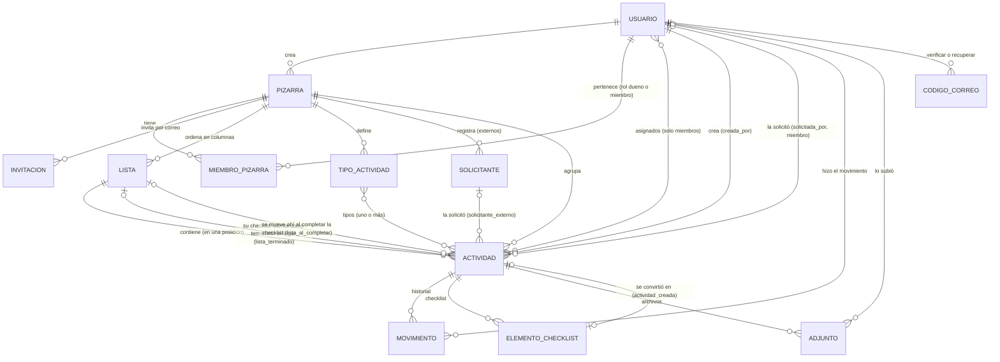

# TaskFlow — Propuesta de arquitectura y esquema de datos

> **Estado:** v3. Etapa 1 (esqueleto) y Etapa 2 (backend de proyectos, miembros, permisos,
> invitaciones, tipos e historial, §4.5) implementadas el 2026-10-01. **Etapa 3 (API `/api/v1/`,
> PWA y portada de instalación, §5–§7) implementada el 2026-10-01**. **Cuentas con correo
> verificado, recuperación de contraseña y apellidos separados** implementados el 2026-10-02
> (§4.3, §7), en producción desde el 2026-10-02 (`3b54d39`) en `https://taskflow.rourendev.com/`,
> servidor propio en Hetzner (§9). La instalación anterior en `sistemas.reduaz.mx/taskflow/` (solo
> Etapa 1) se retiró el 2026-10-03.
> **Etapa 3.6 implementada y en producción el 2026-10-05 (`90939ed`):** «proyecto» pasa a **«pizarra»** en todo
> el sistema, **listas libres** por pizarra en lugar de los tres estatus, listas de cierre,
> arrastrar y soltar, checklist con elementos convertibles en tarjetas enlazadas, descripción
> opcional y fecha de inicio (§4.4–§4.6, maqueta `app-v3.html`).
> **Ajuste del 2026-10-06 (implementado, sin desplegar):** la pizarra nace **sin listas**, se
> **quitan las listas de cierre** y «Lo que llega a [lista] cuenta como terminado» pasa a ser
> **una sola lista por tarjeta**, bajo su checklist (§4.4, §4.6, §11).
> **Etapa 3.8 decidida e implementada el 2026-10-06, sin desplegar (§4.7):** «tarjeta» pasa a
> **«actividad»** en todo el sistema, se **quita la prioridad**, «Fecha de inicio» pasa a
> **«Solicitada el»** (opcional) y «Fecha límite» a **«Vence el»**, **solicitante** por actividad,
> **adjuntos**, «Mover a … al completar» la checklist, formulario único de alta y edición, filtro
> por varios tipos y ajustes de la interfaz (§4.4–§4.7, §5–§7, §11).
> **Fecha:** 2026-10-06
> **Alcance:** describe el funcionamiento general y el esquema. Lo pendiente de decidir está en
> [§10](#10-preguntas-abiertas); los ajustes hechos al implementar, en [§11](#11-notas-de-implementación).

---

## 1. Resumen

**TaskFlow** es un gestor de actividades al estilo de un tablero de tarjetas. Las actividades
viven en **pizarras** (de un evento, un área o un equipo) y, dentro de cada pizarra, en **listas**
con nombre libre que se ordenan como trabaje cada equipo («Pendiente», «Esperando compra»,
«Finalizada»…). Cada actividad se ve como una tarjeta en el tablero, puede asignarse a una o más
personas, decir quién la solicitó, llevar una checklist y archivos adjuntos. *(Hasta la Etapa 3.8,
2026-10-06, se llamaban «tarjetas»; §4.7.)*

| Frente | Usuarios | Tecnología | Ruta | Estado |
| --- | --- | --- | --- | --- |
| Administración del sistema | Superadministrador | Django admin | `/django-admin/` | ✅ en producción |
| Portada de instalación | Cualquiera | Plantilla de Django | `/` | ✅ en producción |
| Aplicación (pizarras de actividades) | Usuarios con cuenta | PWA: Vue 3 + Vite (§5) | `/app/` | ✅ en producción |
| API de la PWA | La PWA (misma sesión) | Django REST Framework (§6) | `/api/v1/` | ✅ en producción |

Las rutas son relativas a `https://taskflow.rourendev.com`. El código funciona también bajo una
ruta de otro dominio (`/taskflow/…`, como hasta 2026-10-03; §9).

## 2. Stack

Python 3.13 · Django 5.2 LTS · Django REST Framework 3.18 · PostgreSQL 18 · uv · Docker (dev y
producción con gunicorn + WhiteNoise). PWA: Vue 3.5 + vue-router 5 + Vite 8 + vite-plugin-pwa
(Workbox) + TypeScript; Inter empaquetada (`static/fonts/`, licencia OFL). Mismo stack y convenciones que mi-campus, sin Wagtail ni multi-tenant: TaskFlow no
tiene sitios públicos ni unidades, así que esas piezas solo agregarían complejidad.

## 3. Aplicaciones

```
apps/
├── core/        TimeStampedModel, /healthz/, portada (/), entrega de la PWA (/app/), `migrate`
│                con el paso previo que renombra apps (`proyectos` → `pizarras`, 2026-10-05;
│                `tarjetas` → `actividades`, Etapa 3.8; §11)
├── usuarios/    Usuario (AUTH_USER_MODEL), CodigoCorreo + servicios (verificar, recuperar)
├── pizarras/    Pizarra, MiembroPizarra, Invitacion, Lista, TipoActividad, Solicitante
│                + servicios (reglas) (hasta 2026-10-05: `proyectos/`, con Proyecto y
│                MiembroProyecto; `TipoActividad` era `TipoTarjeta` hasta la Etapa 3.8)
├── actividades/ Actividad, Movimiento (historial), ElementoChecklist, Adjunto + servicios
│                (reglas) (hasta la Etapa 3.8: `tarjetas/`, con `Tarjeta`)
└── api/         /api/v1/: vistas finas que llaman a los servicios; sin reglas propias
frontend/        PWA (Vue + Vite). `npm run build` la deja en pwa/app/ (no se versiona)
static/          tema.css (paleta), fuentes.css + fonts/ (Inter), portada.css/js, marca/
```

## 4. Esquema de datos

### 4.1 Diagrama entidad-relación



### 4.2 Campos comunes

`TimeStampedModel` (abstracto): `creado_en` (auto al crear) y `actualizado_en` (auto al guardar).

### 4.3 `usuarios`

#### `Usuario` — la cuenta (`AUTH_USER_MODEL`)

| Campo | Tipo | Notas |
| --- | --- | --- |
| `email` | Email, único | Credencial de acceso. Se guarda en minúsculas y hay restricción única sin distinguir mayúsculas (`usuario_email_unico_ci`). |
| `nombre` | Texto | Obligatorio al registrarse y en el perfil (lo exige la API). |
| `primer_apellido` | Texto (100) | Obligatorio al registrarse y en el perfil. |
| `segundo_apellido` | Texto (100), opcional | Hay personas con un solo apellido (y extranjeros). |
| `correo_verificado_en` | Fecha y hora, nula | Nula = la cuenta no ha confirmado su correo y **no puede entrar a la app**. Fecha y no booleano, para saber desde cuándo (igual que `archivado_en`). |
| `is_active`, `is_staff`, permisos | | Los de Django. |

Extiende `AbstractBaseUser` y no `AbstractUser` para no arrastrar `username`: una sola credencial
(el correo) evita que dos campos digan cosas distintas. Se definió desde la primera migración porque
cambiar `AUTH_USER_MODEL` después es muy costoso.

Los nombres van en la base **por separado y sin obligatoriedad** (`blank=True`): el superusuario
se crea sin nombre y el admin no debe exigirlo. La obligatoriedad de nombre y primer apellido la
aplica la API al registrarse y al editar el perfil. `nombre_completo` = nombre + primer apellido
+ segundo apellido, omitiendo los vacíos.

**Quién queda verificado sin código:** quien se registra desde una **invitación** (el enlace llegó
a ese correo), el **superusuario** (`create_superuser`), las cuentas **creadas desde el admin** y
las que **ya existían** al agregar la verificación (la migración `usuarios.0002` les pone su
`creado_en`, para no cerrarles la puerta por una regla nueva).

#### `CodigoCorreo` — código de un solo uso *(2026-10-02)*

| Campo | Tipo | Notas |
| --- | --- | --- |
| `usuario` | FK `Usuario`, `CASCADE` | |
| `proposito` | `verificar` · `recuperar` | `CheckConstraint`. |
| `codigo_hash` | Texto (64) | HMAC-SHA256 con la `SECRET_KEY` (`salted_hmac`), **nunca el código en claro**: quien lea la base o un respaldo no puede usarlo. |
| `intentos` | Entero | Intentos fallidos con este código. |
| `creado_en` | Fecha y hora (`default=timezone.now`) | De ahí sale el vencimiento. No `auto_now_add`, para poder simular un código vencido en las pruebas. |

Reglas (`apps/usuarios/servicios.py`): 6 dígitos (`secrets`), **vence a los 15 min**, **5
intentos**, solo vale **el más reciente** de cada propósito, **un minuto entre envíos** y **5
envíos por hora**. Con eso, adivinar uno de un millón no es práctico. Al usarlo bien se borran
los códigos de ese propósito; los vencidos o sin usar se quedan (son pocos y cuentan para el tope
por hora). *Pendiente:* limpiar los viejos con un comando periódico si la tabla creciera.
El correo sale con `transaction.on_commit` (plantillas en
`apps/usuarios/templates/usuarios/correos/`).

### 4.4 `actividades` *(esquema v4: Etapa 3.8, decidido e implementado 2026-10-06, sin desplegar; antes app `tarjetas`, v3 del 2026-10-05)*

#### `Actividad` *(hasta la Etapa 3.8, `Tarjeta`)*

| Campo | Tipo | Notas |
| --- | --- | --- |
| `pizarra` | FK `Pizarra`, obligatoria, `CASCADE` | Eliminar la pizarra borra sus actividades. |
| `lista` | FK `Lista`, obligatoria, **`RESTRICT`** | Debe ser de la misma pizarra (servicio). `RESTRICT` y no `PROTECT`: una lista con actividades no se puede borrar sola (§4.6), pero sí junto con su pizarra; `PROTECT` lo impediría también ahí. |
| `posicion` | Entero | Orden manual dentro de la lista (0 arriba). Una actividad nueva va al final, o **arriba** si se crea con el «+» del encabezado de la lista (§4.7). Al mover, el servicio renumera las listas afectadas: son pocas actividades por lista y no hace falta un orden fraccionario. Índice `(lista, posicion)`. |
| `titulo` | Texto (200), obligatorio | Lo único obligatorio al capturar (además de la lista donde vive). |
| `descripcion` | Texto largo, **opcional** *(2026-10-05)* | Muchas actividades se explican con el título; exigirla solo provocaba textos de relleno. |
| ~~`prioridad`~~ | — | **Se quita en la Etapa 3.8** (Ernesto, 2026-10-06), con sus datos: quien la necesite crea un tipo o una lista «Urgente» (§4.7, §9). |
| `fecha_solicitud` *(antes `fecha_inicio`)* | Fecha, **opcional** *(2026-10-06; antes obligatoria con hoy por omisión)* | **Cuándo se solicitó la actividad**, que no siempre es cuándo se capturó (`creado_en`, que se guarda solo): si piden algo el lunes y se anota el jueves, se pone el lunes. Opcional y vacía por omisión porque, si se llenara con hoy, no se distinguiría de la fecha de captura y diría algo que nadie afirmó. Solo fecha: la hora casi nunca se sabe. En la interfaz, **«Solicitada el»**. |
| `fecha_fin` | Fecha, **opcional** | En la interfaz, **«Vence el»** *(2026-10-06; antes «Fecha límite»)*. Muchas actividades no tienen fecha comprometida; un valor inventado ensuciaría los vencimientos. Si las dos fechas están, no puede ser anterior a `fecha_solicitud` (servicio y `CheckConstraint` `actividad_fechas_en_orden`, que deja pasar las nulas). |
| `asignados` | M2M a `Usuario`, opcional | Solo miembros de la pizarra (servicio). |
| `tipos` | M2M a `TipoActividad`, opcional | Solo tipos de la misma pizarra (servicio). |
| `solicitada_por` *(2026-10-06)* | FK `Usuario`, nula, `SET_NULL` | Quién la solicitó, **si es miembro** de la pizarra (servicio, al elegirlo). Si después sale de la pizarra se conserva: la actividad sigue diciendo quién la pidió. |
| `solicitante_externo` *(2026-10-06)* | FK `Solicitante`, nula, `SET_NULL` | Quién la solicitó, **si no es miembro** (catálogo de la pizarra, §4.5). Misma pizarra (servicio). **A lo más uno** de `solicitada_por` y `solicitante_externo` (`CheckConstraint` `actividad_un_solicitante`); los dos nulos = sin solicitante. Por qué dos FK y no una, en §9. |
| `creada_por` | FK a `Usuario`, opcional | `SET_NULL`: borrar una cuenta no debe borrar las actividades que creó. |
| `lista_terminado` *(2026-10-06)* | FK `Lista`, nula, `SET_NULL` | «**Lo que llega a [lista] cuenta como terminado**» para los elementos de **su** checklist que se convirtieron en actividades: cada uno está hecho cuando su actividad está en esa lista. Una por actividad (no por elemento ni por lista de la pizarra). Debe ser de la misma pizarra y **distinta de la lista donde está la actividad al elegirla** (servicio): sus hijas nacen ahí y se darían por hechas al crearlas. Nula = palomeo manual (también si esa lista se elimina). Ver §4.6. |
| `lista_al_completar` *(2026-10-06)* | FK `Lista`, nula, `SET_NULL` | «**Mover a [lista] al completar**»: cuando su checklist **pasa de incompleta a completa**, la actividad se mueve sola al final de esa lista (con `mover_actividad`, así que queda en el historial a nombre de quien palomeó el último elemento). Misma pizarra (servicio). Nula = no se mueve. Despalomear después **no la regresa**. Ver §4.7. |

Orden por omisión: `posicion`. **Vencida** = `fecha_fin` pasada, **en cualquier lista** (sin
listas de cierre desde 2026-10-06, §4.6).

#### `Movimiento` — historial *(reemplaza a `CambioEstatus`, 2026-10-05)*

| Campo | Tipo | Notas |
| --- | --- | --- |
| `actividad` | FK, `CASCADE` | Si se elimina la actividad, su historial se va con ella. |
| `lista_anterior`, `lista_nueva` | Texto (50) | El **nombre** de la lista en ese momento, no una FK: las listas se renombran y se eliminan, y el historial debe seguir diciendo lo que pasó. `lista_anterior` vacía = la creación. |
| `nota` | Texto (300) | Un evento que no es un movimiento: «convirtió «…» de la checklist en actividad» / «la creó desde la checklist de «…»». |
| `usuario` | FK `Usuario`, `SET_NULL` | Si se borra la cuenta, la entrada sigue y se muestra «Usuario eliminado». |
| `fecha` | Fecha y hora, `default=timezone.now` | No `auto_now_add`, para que la migración copie las fechas del historial anterior. UTC en la base, `America/Mexico_City` en pantalla. |

Solo se agregan filas, en la **misma transacción** que el cambio, desde los servicios
(`crear_actividad`, `mover_actividad`, `convertir_elemento`) y el admin, para que ningún cambio de
lista quede sin rastro. Reordenar dentro de la misma lista **no** se registra (sería ruido).
Índice `(actividad, -fecha)`.

#### `ElementoChecklist` *(2026-10-05)*

| Campo | Tipo | Notas |
| --- | --- | --- |
| `actividad` | FK, `CASCADE`, `related_name="checklist"` | Una checklist por actividad. |
| `texto` | Texto (**400**) *(2026-10-06; antes 200)* | Ernesto pidió el doble porque hay pasos que necesitan una explicación. Al convertir uno más largo que el título (200), el título se corta en el último espacio antes de 200 y **el resto** va a la descripción (`partir_titulo`, §4.7). **Convertido, dice lo mismo que el título de su actividad** *(2026-10-06)*: toma el título al convertir y lo sigue al editarlo; por su lado ya no se edita. |
| `hecho` | Booleano | Solo cuenta si se palomea a mano: si el elemento se convirtió en actividad y **su actividad** tiene `lista_terminado`, está hecho cuando `actividad_creada.lista == actividad.lista_terminado` y `hecho` se ignora. Al quitar esa lista (o eliminarse), cada elemento conserva en `hecho` el estado que tenía. |
| `posicion` | Entero | Orden manual (se arrastra por la manija). |
| `actividad_creada` | **`OneToOneField`** a `Actividad`, nula, `SET_NULL`, `related_name="elemento_origen"` | La actividad en que se convirtió. El enlace vive en un solo lado y la actividad nueva lo lee por la relación inversa: dos FK, una en cada lado, podrían quedar desincronizadas. `OneToOne` porque un elemento se convierte en una sola actividad y una actividad viene de un solo elemento. Debe ser de la misma pizarra (servicio). |

#### `Adjunto` *(2026-10-06)*

| Campo | Tipo | Notas |
| --- | --- | --- |
| `actividad` | FK, `CASCADE`, `related_name="adjuntos"` | Al borrar la actividad (o su pizarra) se borran las filas **y los archivos del disco** (señal `post_delete` con `transaction.on_commit`, para no borrar un archivo si la transacción se revierte). |
| `archivo` | `FileField`, `upload_to="adjuntos/<pizarra>/<uuid4>"` | El nombre en disco es aleatorio: el original puede traer caracteres raros o repetirse, y no debe poder adivinarse. Fuera de `MEDIA_URL`: se descarga **solo por la API**, que revisa que el usuario sea miembro (§7). |
| `nombre` | Texto (255) | Nombre original, para mostrarlo y para la descarga. |
| `tamano` | Entero (bytes) | El del archivo guardado (ya comprimido). De aquí sale el espacio usado por la pizarra (`Sum`), sin recorrer el disco. |
| `tipo` | Texto (100) | Tipo MIME detectado al subir. Decide si se muestra en línea (imágenes y PDF) o se descarga. |
| `subido_por` | FK `Usuario`, nula, `SET_NULL` | |
| `creado_en` | Fecha y hora | `TimeStampedModel`. |

Reglas (`apps/actividades/servicios.py`): cualquier tipo de archivo; **10 MB por archivo** y **500 MB
por pizarra** (`TASKFLOW_ADJUNTO_MAX_MB`, `TASKFLOW_ADJUNTOS_PIZARRA_MB`); adjuntar y quitar =
permiso «Editar»; pizarra archivada, solo descarga. **Compresión:** las imágenes (JPEG, PNG, WebP)
se reducen en el navegador antes de subir (lado mayor 2000 px, JPEG o WebP de calidad 0.8; si
sale más grande, se sube el original), así el límite cuenta sobre lo ya reducido y no se gasta
ancho de banda del teléfono. Los **PDF de más de 1 MB** se comprimen en el servidor con
Ghostscript (`-dPDFSETTINGS=/ebook`) y se guarda el más chico de los dos. El resto se guarda tal
cual. Ver §4.7 y §9.

### 4.5 Pizarras y miembros *(Etapa 2 — decidido e implementado el 2026-10-01 como «proyectos»; renombrado y ampliado el 2026-10-05)*

Código: `apps/pizarras/` (`Pizarra`, `MiembroPizarra`, `Invitacion`, `Lista`, `TipoActividad`,
`Solicitante`) y `apps/actividades/` (`Actividad`, `Movimiento`, `ElementoChecklist`, `Adjunto`). **Las reglas viven en
`servicios.py` de cada app** (no en los modelos ni en las vistas): `PermisoDenegado` cuando el
usuario no puede (no es miembro, no es dueño, le falta el permiso o la pizarra está archivada) y
`ValidationError` cuando los datos son inválidos. La API (`apps/api/`, §6) solo traduce peticiones
a esas funciones.

Reglas decididas (Ernesto, 2026-10-01; con los nombres y permisos de 2026-10-05 y la Etapa 3.8):

- Cualquier usuario puede **crear pizarras**; las **actividades pertenecen a una pizarra**.
- Un usuario puede pertenecer a **una o varias** pizarras.
- Solo el **dueño** invita gente a su pizarra (y quita personas o cancela invitaciones).
- **Todos los miembros ven todas las actividades** de la pizarra; quien no es miembro no ve la pizarra.
- Las actividades pueden quedar **sin asignar** y **sin solicitante**.
- **Crear, editar, mover y eliminar** actividades, y **gestionar listas** y **gestionar tipos**, son
  permisos que el **dueño asigna a cada miembro**; el dueño siempre puede todo. Quien acepta una
  invitación entra con crear, editar y mover (sin eliminar ni gestionar).
- Las invitaciones se pueden **reenviar** y **no vencen**.
- Si la cuenta del dueño se desactiva sin haber transferido, un **administrador** transfiere la
  pizarra desde el admin de Django.
- Cada pizarra tiene **tipos de actividad** (nombre, descripción opcional y color configurable). Una
  actividad puede tener **uno o más** tipos.
- Cada pizarra tiene un **catálogo de solicitantes externos** *(2026-10-06)*; una actividad dice
  quién la solicitó (un miembro, uno del catálogo o nadie). Los agrega desde el combo, y los renombra
  o elimina en «Miembros y ajustes», quien tenga «Crear» o «Editar»: es un dato de captura, no una
  configuración de la pizarra.
- La pizarra se puede **transferir** a otro miembro (un solo dueño a la vez), **archivar** y
  **eliminar**.

| Modelo | Campos | Notas |
| --- | --- | --- |
| `Pizarra` | `nombre`, `creado_por` (FK `Usuario`, `PROTECT`), `archivada_en` (fecha, nula), fechas | Quien la crea queda como miembro con rol `dueno`, y la pizarra nace **sin listas** *(2026-10-06; antes traía «Pendiente», «En curso» y «Finalizada»)*: cada quien agrega las suyas. Archivada = solo lectura para todos; nulo = activa. Fecha y no booleano para saber desde cuándo. |
| `MiembroPizarra` | `pizarra` (FK, `CASCADE`), `usuario` (FK, `CASCADE`), `rol` (`dueno` · `miembro`), `puede_crear` (por omisión `True`), `puede_editar` (`True`), `puede_mover` (`True`), `puede_eliminar` (`False`), `puede_gestionar_listas` (`False`), `puede_gestionar_tipos` (`False`), `unido_en` | `UniqueConstraint(pizarra, usuario)` y **un solo dueño por pizarra** (`pizarra_un_solo_dueno`, condicional). Los permisos son columnas y no un sistema genérico porque son seis, fijos, y el dueño los marca por persona; para el dueño se ignoran. «Gestionar listas» va aparte de «Gestionar tipos» porque reorganizar el tablero afecta a todos más que agregar una etiqueta. Transferir = cambiar los dos roles en una transacción. |
| `Invitacion` | `pizarra` (FK), `correo`, `invitada_por` (FK `Usuario`), `token` (único), `estado` (`pendiente` · `aceptada` · `cancelada`), `creada_en`, `enviada_en` (último envío), `veces_enviada`, `respondida_en`, `aceptada_por` | **Sin vencimiento** (decidido). **Reenviar** manda otra vez el mismo enlace y actualiza `enviada_en`; `veces_enviada` pone un tope. Una pendiente por pizarra y correo (`UniqueConstraint` condicional). Se invita por correo porque la persona puede no tener cuenta todavía. |
| `Lista` *(2026-10-05)* | `pizarra` (FK, `CASCADE`), `nombre` (50), `posicion` (entero), fechas | `UniqueConstraint(pizarra, Lower(nombre))`: en «Mover a» dos listas con el mismo nombre serían indistinguibles. Orden por `posicion`. Sin color: se distinguen por su nombre, y la paleta reserva los colores para alertas y tipos. **Sin `es_cierre`** *(quitado 2026-10-06)*: ninguna lista significa «terminado» por sí misma; eso lo elige cada actividad para su checklist (`Actividad.lista_terminado`, §4.6). Solo se elimina vacía (`Actividad.lista` es `RESTRICT`). |
| `TipoActividad` *(hasta la Etapa 3.8, `TipoTarjeta`)* | `pizarra` (FK, `CASCADE`), `nombre` (50), `descripcion` (opcional), `color` (7, `#rrggbb`), fechas | `UniqueConstraint(pizarra, Lower(nombre))`. `color` validado con `RegexValidator(^#[0-9a-f]{6}$)` y `CheckConstraint`, guardado en minúsculas: es el único color que viene del usuario. Eliminar un tipo lo quita de las actividades (el M2M se borra solo) sin borrarlas. |
| `Solicitante` *(2026-10-06)* | `pizarra` (FK, `CASCADE`), `nombre` (100), fechas | Personas **que no son miembros** y piden actividades (un director, otra área). Solo el nombre: se captura al vuelo desde el combo y más datos lo harían lento. `UniqueConstraint(pizarra, Lower(nombre))`: escribir «juan pérez» reutiliza a «Juan Pérez». Por pizarra, no por usuario, porque todos los miembros comparten las actividades. Eliminarlo deja sus actividades sin solicitante (`SET_NULL`), sin borrarlas. Los miembros no se copian aquí: se eligen directo (`Actividad.solicitada_por`). |

Migraciones: `tarjetas.0003`–`0005` (2026-10-01) pasaron las tarjetas que ya existían a un
proyecto **«Tarjetas anteriores»** y sembraron su historial; `pizarras.0002`–`0003` y
`tarjetas.0007`–`0009` (2026-10-05) hacen el cambio a pizarras y listas (§4.6 y §11).

Decisiones tomadas al implementar (2026-10-01):

- **Una invitación solo la acepta una cuenta con el mismo correo invitado.** El enlace llega a ese
  correo; si alguien lo reenvía, la otra persona no entra a la pizarra. Quien tenga cuenta con otro
  correo pide que lo inviten con ese.
- **Transferir** baja al dueño actual y sube al nuevo en una transacción, en ese orden (la
  restricción «un solo dueño» no puede diferirse porque es condicional). En el admin de Django no se
  edita el rol: el formulario de la pizarra tiene «Transferir a», que llama al mismo servicio.
- **El admin también deja rastro:** cambiar la lista de una tarjeta desde el admin escribe en
  `Movimiento`.
- **Tope de 10 envíos por invitación** (`MAX_ENVIOS_INVITACION`): no vencen y se pueden reenviar,
  pero el tope evita usar TaskFlow para mandar correo masivo.
- **El enlace de invitación** apunta a `TASKFLOW_URL/app/#/invitacion/<token>`, la pantalla de la
  PWA que la acepta (§5). El correo sale por SMTP (`DJANGO_EMAIL_*`); sin configurar, se imprime en el
  registro del contenedor.

### 4.6 Listas en lugar de estatus *(decidido 2026-10-02 a 2026-10-05 · implementado y en producción 2026-10-05, `90939ed`)*

*Se conserva como se decidió, con la palabra «tarjeta»; desde la Etapa 3.8 son «actividades»,
`Tarjeta.*` es `Actividad.*`, «Agregar tarjeta» y el botón flotante cambiaron, y la prioridad ya no
existe (§4.7).*

**Qué cambia.** Ernesto pidió (2026-10-02) que las tarjetas se manejen como en Trello y quitar los
estatus. Cada pizarra tiene **sus propias listas** (columnas con nombre libre: «Ideas»,
«Esperando compra», «Finalizada»…), que se crean, renombran, ordenan y eliminan; las tarjetas se
mueven entre ellas y se ordenan a mano dentro de cada una. Maqueta aprobada:
`docs/_mockups/app-v3.html`. Esquema resultante en §4.4 y §4.5.

Decisiones (Ernesto, 2026-10-02):

- **Sin listas de cierre** *(Ernesto, 2026-10-06; reemplaza lo de 2026-10-05)*. Ninguna lista
  significa «terminado» por sí misma: no hay estatus, casilla «completada» ni marca en la lista.
  Una tarjeta con fecha límite pasada **sale vencida en cualquier lista**, y **«Mis tarjetas»
  muestra todas las asignadas**. «Terminado» solo existe para la checklist enlazada, y lo elige
  cada tarjeta debajo de su checklist (ver abajo). *Historia:* el 2026-10-02 no existía
  «terminada»; el 2026-10-05 se agregaron las **listas de cierre** (casilla «Lo que llega aquí
  cuenta como terminado» en cada lista, que sacaba sus tarjetas de vencidas y de «Mis tarjetas»);
  el 2026-10-06 Ernesto pidió quitarlas: el check aparecía en todas las listas aunque solo
  importa en las tarjetas con checklist convertida, y qué cuenta como terminado depende de lo que
  se esté siguiendo, no de la lista (§9, §11).
- **Descripción opcional** *(Ernesto, 2026-10-05)*: una tarjeta se crea con el puro título. Muchas
  actividades se explican solas («Asignar salas»), y exigir una descripción solo provocaba textos
  de relleno. `Tarjeta.descripcion` pasó a `blank=True` (antes era obligatoria); la tarjeta
  del tablero no muestra el renglón si está vacía y el detalle dice «Sin descripción».
- **Checklist por tarjeta, con elementos convertibles en tarjetas enlazadas** *(Ernesto,
  2026-10-05)*:
  - **Una checklist por tarjeta** (no varias como Trello: casi nunca se usan y complican la
    pantalla). Elementos con texto y casilla; se agregan escribiendo y con Enter, y se reordenan
    arrastrando. En la tarjeta del tablero, un indicador «3/5» (verde al completarse); en el
    detalle, barra de avance.
  - **Convertir en tarjeta:** abre el formulario de tarjeta nueva prellenado (título = texto del
    elemento, misma pizarra y lista que la original, sus asignados, inicio hoy), editable antes de
    guardar. **Quedan enlazadas en los dos sentidos:** el elemento se vuelve un enlace a la tarjeta
    nueva con la lista donde está («Tarjeta en «En curso»»), y la nueva muestra «Viene de la
    checklist de …». Solo dentro de la misma pizarra (entre pizarras habría que resolver quién ve
    qué). Queda en el historial de ambas.
  - **«Lo que llega a [lista] cuenta como terminado»** *(Ernesto, 2026-10-06; reemplaza la
    lista por elemento del 2026-10-05)*: **debajo de la checklist de la tarjeta original**, y
    **solo si algún elemento ya se convirtió en tarjeta**, una línea con un combo de las listas
    de la pizarra **menos la lista donde está esta tarjeta** (sus hijas nacen ahí y se darían por
    hechas al crearlas), más «ninguna (a mano)». Es **una para toda la checklist**
    (`Tarjeta.lista_terminado`): cada elemento convertido se palomea solo cuando su tarjeta está
    en esa lista y se despalomea si sale; con «ninguna», se palomean a mano. Se guarda al elegir
    (permiso «Editar»); al pasar a «ninguna», cada elemento conserva el estado que tenía. Al
    convertir ya no se pregunta nada, y el elemento solo dice en qué lista está su tarjeta («En
    «En curso»»). *Antes (2026-10-05):* se elegía por elemento al convertir («Marcar como terminado
    cuando pase a…», preseleccionada la lista de cierre) y se cambiaba con un botón de bandera;
    Ernesto lo simplificó a una sola lista porque en la práctica todos los pasos de una checklist
    terminan en el mismo punto, y una decisión por elemento era una pregunta más en cada
    conversión.
  - **Al eliminar:** si se elimina la tarjeta nueva, el elemento vuelve a ser texto y conserva si
    estaba hecho; si se elimina la original, la nueva se queda sin el «Viene de». Si se elimina la
    lista elegida (solo se puede vacía), la checklist pasa a palomeo manual y sus elementos
    convertidos quedan sin palomear (ninguna tarjeta estaba en ella).
  - **Permisos:** palomear, agregar, editar y quitar elementos = «Editar»; convertir = «Crear». Sin
    permiso nuevo.
  - Los elementos **no llevan fechas ni asignados**: si una parte los necesita, es la señal para
    convertirla en tarjeta.
- **Mover:** **arrastrar y soltar en computadora y en teléfono** (entre listas y para ordenar
  dentro de una). En teléfono se **mantiene presionada** la tarjeta (~0.35 s; si el dedo se mueve
  antes, es un desplazamiento normal), la tarjeta se levanta con una vibración breve y sigue al
  dedo, y cerca del borde el tablero pasa solo a la lista de al lado. Además, en el detalle, una
  fila de botones con las listas mueve la tarjeta **al final** de la elegida con un toque (sirve
  para teclado y lector de pantalla). Ernesto descartó (2026-10-03) el selector de posición
  «Arriba / Posición n / Abajo» por poco profesional: el orden se cambia arrastrando. Todo esto
  reemplaza la decisión de 2026-10-01 de no arrastrar.
- **Historial de movimientos:** se conserva como «quién la movió de qué lista a cuál, fecha y
  hora»; la creación es la primera entrada. Ordenar dentro de la misma lista **no** se registra
  (sería ruido).
- **«Proyecto» pasa a llamarse «Pizarra» en todo el sistema** (Ernesto, 2026-10-05): en la
  interfaz, los correos y la portada, **y también** en modelos, app (`apps/pizarras/`, etiqueta
  `pizarras`), API (`/api/v1/pizarras/…`) y rutas de la PWA (`#/pizarras/…`; los enlaces viejos
  `#/proyectos/…` redirigen). «Proyecto» suena a algo con inicio y fin, y TaskFlow también se usa
  para áreas o equipos permanentes. Se probaron «Espacio» (2026-10-02, abstracto: no dice qué hay
  adentro) y «Tablero» (se confundía con las listas, que Ernesto llamaba así); se descartaron
  también «Área», «Equipo», «Grupo» y «Carpeta». Ernesto pidió renombrar también el código «para
  que todo cuadre»: el costo fue el paso previo de `migrate` (§11).
- **«Mis pizarras»** (2026-10-02, Ernesto): cada pizarra se muestra con un **resumen de tamaño
  fijo** («8 tarjetas · 5 listas · 3 tuyas», miembros y vencidas). Antes había un chip por lista,
  y con muchas listas la tarjeta crecía hacia abajo.

Cómo quedó (2026-10-05):

- **Pizarra nueva:** empieza **sin listas** *(Ernesto, 2026-10-06)*; el tablero muestra un aviso
  («Esta pizarra aún no tiene listas. Agrega la primera…») y «Agregar lista». Antes (2026-10-05)
  nacía con «Pendiente», «En curso» y «Finalizada» porque un tablero vacío no dice por dónde
  empezar; Ernesto prefirió que lo escoja el usuario, porque cada pizarra organiza su trabajo
  distinto y borrar listas impuestas es trabajo de más. Se descartaron una casilla «Crear listas
  sugeridas» y escribir los nombres al crear la pizarra (§9).
- **Migración de datos** (`tarjetas.0008`): cada pizarra recibe esas tres listas y cada tarjeta va
  a la de su estatus, en el orden del tablero de antes (prioridad, fecha de fin, más nuevas
  primero); `fecha_inicio` = el día de creación en hora de México (o la fecha de fin, si era
  anterior); el historial pasa de `CambioEstatus` a `Movimiento` con los nombres de los estatus.
  No se pierde nada y las finalizadas siguen sin salir vencidas. Es reversible (§11).
- **Servicios** (`apps/pizarras/servicios.py`): `crear_lista`, `editar_lista` (nombre),
  `ordenar_listas`, `eliminar_lista` (rechaza si tiene tarjetas). En
  `apps/tarjetas/servicios.py`: `mover_tarjeta(tarjeta, lista, posicion)`, que reemplaza a
  `cambiar_estatus` y es la única vía para cambiar `Tarjeta.lista`; `editar_tarjeta` también
  recibe `lista_terminado` (2026-10-06); checklist: `agregar_elemento`, `editar_elemento` (texto
  y `hecho` solo si es manual), `ordenar_checklist`, `quitar_elemento` y
  `convertir_elemento(elemento, datos de la tarjeta)`, que crea la tarjeta y el enlace en una
  transacción y escribe en el historial de las dos.
- **API:** ver §6.
- **PWA (§5):** el tablero es una fila de listas con desplazamiento horizontal. En teléfono, una
  lista por pantalla, con **pestañas subrayadas** arriba para saltar entre listas y un solo botón
  **«Filtrar»** que abre una hoja con «Solo mías» y el tipo (el 2026-10-02 Ernesto pidió quitar
  las dos filas de chips, que ocupaban media pantalla). En computadora, columnas de 284 px con los
  filtros a la vista. «Agregar tarjeta» al pie de cada lista y «Agregar lista» al final; opciones
  de la lista (renombrar, mover a la izquierda o derecha, eliminar si está vacía)
  en su «⋯». El orden del tablero es **manual**; la prioridad sigue como badge y como indicador
  lateral de urgente. Se quitaron la barra de avance y los conteos por estatus, los badges de
  estatus, el botón flotante «+» y las variables `--tf-status-*` (entran `.chip.nombre-lista`,
  neutro en navy suave, y `--tf-success*` para la checklist completa y el ícono de «Lo que llega
  a … cuenta como terminado»; la marca de lista de cierre se quitó el 2026-10-06).
- **Arrastre: SortableJS directo** (`frontend/src/arrastre.ts`, directiva `v-arrastrable`), no
  `vue-draggable-plus` como se había pensado: su `v-model` reordena el arreglo que se le da, y el
  tablero pinta listas filtradas y calculadas, así que habría que traducir índices igual. Con
  SortableJS directo, al soltar se devuelve el nodo a su lugar, se calcula la posición sobre la
  lista completa (aunque haya filtros) y Vue repinta desde los datos. Opciones: espera de 350 ms
  solo en táctil (`delayOnTouchOnly`), arrastre propio (`forceFallback`) para que la tarjeta
  levantada se vea igual en todos lados, y desplazamiento automático en los bordes.

### 4.7 Etapa 3.8: actividades, solicitantes y adjuntos *(decidido e implementado 2026-10-06, sin desplegar)*

Ernesto revisó la Etapa 3.7 en uso y pidió (2026-10-06) una lista de cambios. Esquema resultante en
§4.4 y §4.5; pantallas en §5; API en §6. Se implementa en este orden, cada parte revisable por
separado: (1) renombre y prioridad, (2) fechas, formulario y botones, (3) checklist y (4) filtros y
solicitantes y (5) adjuntos (**implementados 2026-10-06, sin desplegar**).

- **«Tarjeta» pasa a «Actividad» en todo el sistema** *(implementado 2026-10-06)*: interfaz («Nueva actividad», «Mis
  actividades», «Agregar actividad», «Se creó la actividad.»), correos, portada, modelos
  (`Actividad`, `TipoActividad`; campos `actividad`, `actividad_creada`), app `apps/actividades/`
  (etiqueta `actividades`), API (`/api/v1/actividades/…`, `yo/actividades/`) y rutas de la PWA
  (`#/mis-actividades`; `#/mis-tarjetas` redirige). Motivo: Ernesto organiza **actividades**; la
  tarjeta es solo cómo se ven en el tablero. Pidió renombrar también la base y el código, como con
  «pizarra», para que todo cuadre. Lo visual sigue llamándose tarjeta donde es la forma y no el
  dato: la clase CSS del componente pasa a `.actividad` igual, para no tener dos nombres. Las notas
  del historial ya guardadas («…en tarjeta») las reescribe la migración. Etapas e historia de este
  documento conservan la palabra «tarjeta» donde cuentan lo que pasó.
- **Sin prioridad** *(implementado 2026-10-06)*: se quitan el campo, sus datos (sin convertirlos; Ernesto lo eligió así), el
  badge, el selector, el indicador lateral rojo de «urgente» y las variables `--tf-priority-*`.
  Motivo: con tipos y listas libres, quien necesite «Urgente» lo crea como tipo o como lista; un
  campo fijo duplicaba eso y obligaba a todas las pizarras a la misma escala.
- **Fechas** *(implementado 2026-10-06)*: «Fecha de inicio» pasa a **«Solicitada el»** (`fecha_solicitud`), **opcional** y
  vacía por omisión, porque la fecha de captura ya se guarda sola (`creado_en`) y llenarla con hoy
  repetía ese dato. «Fecha límite» pasa a **«Vence el»** (se descartó «Vence en», que no se lee
  bien con una fecha). Las fechas existentes de `fecha_inicio` se conservan.
- **Obligatorios con `*`** *(implementado 2026-10-06)*: se quitan todos los «(opcional)» de la app y los campos obligatorios
  llevan un asterisco (clase `.obligatorio`). En una actividad solo son obligatorios el **título**
  y la **lista** (que ya viene elegida si se crea desde una lista).
- **Sin textos de ayuda** *(implementado 2026-10-06)* en la app («Toca una lista para moverla…», «Ordenarla dentro de la misma
  lista no se registra.», «Con 🔗 conviertes…», «Se agrega al final de la lista.», etc.): Ernesto
  prefiere una pantalla limpia y, más adelante, un manual o tutoriales aparte. Se conservan los
  estados vacíos («Sin descripción», «Sin asignar»), los errores y los avisos de solo lectura.
- **Detalle sin «Pizarra: … · Creada por … el …»** *(implementado 2026-10-06)*: el historial ya dice quién la creó y cuándo
  («X la creó en … · fecha y hora»).
- **Un solo formulario de alta y edición** *(implementado 2026-10-06; solicitante y adjuntos, cuando existan)* con los mismos campos en el mismo orden: título*,
  lista*, descripción, solicitada por, tipos, solicitada el, vence el, asignados, checklist (con
  «Mover a … al completar» y «Lo que llega a … cuenta como terminado») y adjuntos. Antes la lista
  solo se elegía al crear y la checklist solo existía en el detalle. Al **crear**, la checklist y
  los archivos se juntan en el formulario y se guardan con la actividad; al **editar**, se guardan
  al momento, como en el detalle. Cambiar la lista al editar la mueve al final de la nueva (con
  `mover_actividad`; requiere también el permiso «Mover»). El detalle sigue siendo de solo lectura
  con acciones directas (mover, palomear) y «Editar» arriba: se descartó editar campo por campo en
  el detalle (§9).
- **Agregar actividad** *(implementado 2026-10-06)*: en computadora, un **«+» en el encabezado de cada lista** (la agrega
  **arriba**) y **«Agregar actividad» fijo al pie** (al final); la lista se desplaza por dentro, así
  que los dos quedan a la vista aunque crezca. En teléfono, un **botón flotante «Agregar
  actividad»** que crea en la lista de la pestaña abierta. Motivo: con listas largas había que
  bajar hasta el final para agregar.
- **Checklist** *(implementado 2026-10-06)*:
  - **Editar el texto en su lugar**: se toca el texto y se vuelve un campo; Enter o salir guarda,
    Esc cancela (permiso «Editar»; ya existía en la API).
  - **Elementos de hasta 400 caracteres** (antes 200). Al convertir uno más largo que el título,
    el título se corta en el último espacio antes de 200 (corte duro si no hay espacio en el
    último 40 %) y **el resto** va a la descripción *(Ernesto, 2026-10-06; antes la descripción
    repetía el texto completo)*. Lo hace la PWA al prellenar el formulario y el servidor si la
    conversión llega sin título.
  - **El elemento convertido sigue el título de su actividad** *(Ernesto, 2026-10-06)*: al
    convertir toma su título, y editar el título de la actividad cambia el elemento en la
    checklist de la madre. Su texto ya no se edita por su lado (la API responde 400): así el
    elemento y la actividad nunca dicen cosas distintas.
  - **Copiar**: un ícono junto al título de la checklist copia su contenido como texto, una línea
    por elemento, `✓` hecho y `•` pendiente. Sirve para pegarlo en un correo o un chat.
  - **«Mover a [lista] al completar»** junto a «Checklist · n/m»: combo con las listas de la
    pizarra y «ninguna» (por omisión). Cuando la checklist pasa de incompleta a completa (palomeo a
    mano, palomeo automático por una actividad enlazada o al quitar el último pendiente), la
    actividad se mueve al final de esa lista si no estaba ya ahí. Despalomear después no la
    regresa: devolverla sola sorprendería y podría deshacer un movimiento hecho a mano. Puede
    encadenarse (la hija llega a su lista, se palomea en la madre, la madre se completa y se mueve),
    y es lo deseado. Se guarda al elegir (permiso «Editar»); el movimiento automático no exige
    «Mover» a quien palomea, porque lo decidió quien eligió la lista.
- **Filtro por varios tipos** *(implementado 2026-10-06)*: en el tablero se eligen uno o varios tipos y salen las actividades
  con **cualquiera** de ellos. Se agrega el filtro **«Solicitada por»**.
- **Solicitada por** *(implementado 2026-10-06)*: opcional, una persona por actividad: un **miembro** de la pizarra o un
  **externo** del catálogo de la pizarra (`Solicitante`, solo nombre). En el formulario, un combo
  con búsqueda que muestra miembros y externos; si se escribe un nombre que no existe, ofrece
  «Agregar «…»» y lo crea al guardar. El catálogo se administra (renombrar, eliminar) en «Miembros y
  ajustes». Agregar, renombrar y eliminar externos = permiso «Crear» o «Editar».
- **Adjuntos** *(implementado 2026-10-06)*: cualquier tipo de archivo, 10 MB por archivo y 500 MB por pizarra, en el disco de
  `srv-01` (volumen `media`). Imágenes reducidas en el navegador y PDF de más de 1 MB comprimidos
  con Ghostscript en el servidor (§4.4). Se descargan por la API con revisión de permisos (§7).
  Adjuntar y quitar = «Editar». Se borran del disco con su actividad o su pizarra.

## 5. Vistas de la aplicación

*Aprobadas el 2026-10-01* con las maquetas `docs/_mockups/app-v2.html` y
`docs/_mockups/instalacion-v2.html`, y el 2026-10-05 con `docs/_mockups/app-v3.html` (pizarras,
listas, checklist), con los ajustes de la Etapa 3.8 (§4.7, 2026-10-06). Paleta y
componentes en `docs/identidad-visual.md`. **Sin textos de ayuda** en pantalla desde la Etapa 3.8;
los campos obligatorios llevan `*`.

### 5.1 Portada de instalación — `/`

Plantilla de Django (`apps/core/templates/core/portada.html`, sin la PWA): qué es TaskFlow y cómo
instalarla. Detecta iPhone/iPad, Android o computadora (`static/js/portada.js`) y resalta los pasos
de esa plataforma. Botones: **Abrir e instalar** (`/app/?instalar=1`: la PWA muestra el aviso de
instalación aunque se haya descartado), **Crear mi cuenta** (`/app/#/registro`, solo si
`TASKFLOW_REGISTRO_ABIERTO`) y **Entrar**.

### 5.2 PWA — `/app/`

Código en `frontend/`. Rutas con `#` (decisión en §9):

| Ruta | Pantalla | Notas |
| --- | --- | --- |
| `#/entrar`, `#/registro` | Acceso | Sin armazón. `?siguiente=` regresa a donde iba. Registro: nombre*, primer apellido*, segundo apellido, correo* y contraseña*; al enviarlo pasa a `#/verificar`. Entrar con una cuenta sin confirmar también pasa ahí. Enlace «¿Olvidaste tu contraseña?». |
| `#/verificar?correo=` | Confirmar correo | Código de 6 dígitos (`autocomplete="one-time-code"` para que el teléfono lo sugiera) y «Reenviar código», habilitado tras 60 s, lo mismo que exige el servidor. Al confirmar, entra. |
| `#/recuperar` | Recuperar contraseña | Paso 1: correo. Paso 2: código y contraseña nueva; al guardar, entra. El paso 2 aparece siempre, exista o no la cuenta (§7). |
| `#/invitacion/<token>` | Aceptar invitación | Pública. Ver §7. |
| `#/pizarras` | Mis pizarras | Activas con un resumen de una línea (actividades · listas · tuyas), miembros y vencidas; archivadas aparte. Aviso de instalación. (`#/proyectos…` redirige aquí.) |
| `#/pizarras/<id>` | Tablero | Listas en fila (§4.6). Teléfono: pestañas por lista, «Filtrar» y botón flotante «Agregar actividad» (en la lista abierta); arrastrar manteniendo presionada. Computadora (≥ 900 px): columnas que se desplazan por dentro, con «+» en el encabezado (agrega arriba) y «Agregar actividad» fijo al pie; «Solo mías», tipos (uno o varios) y «Solicitada por» a la vista; arrastrar con el mouse. «Agregar lista» al final, «⋯» por lista. Sin listas (pizarra nueva), un aviso que invita a agregar la primera. Banner de solo lectura si está archivada. |
| `#/pizarras/<id>/ajustes` | Miembros y ajustes | Invitar, reenviar/cancelar, seis permisos por miembro, «Hacer dueño», quitar, tipos, solicitantes externos (renombrar, eliminar), espacio usado por los adjuntos, renombrar, archivar/restaurar, eliminar, salir. |
| `#/mis-actividades` | Mis actividades | (`#/mis-tarjetas` redirige.) Asignadas a mí en mis pizarras activas, en cualquier lista (sin listas de cierre desde 2026-10-06), con pizarra y lista; vencidas primero, luego por fecha límite y, a igual fecha, las capturadas antes (hasta la Etapa 3.8 desempataba la prioridad). |
| `#/perfil` | Perfil | Nombre y apellidos, contraseña, instalar, cerrar sesión. |

- **Detalle de actividad** en hoja inferior (teléfono) o panel lateral (computadora): arriba,
  bajo el título, «Editar» y «Eliminar» *(movidos 2026-10-06: al final quedaban debajo del
  historial, que crece con cada movimiento, y había que desplazarse cada vez más para alcanzarlos;
  se descartó unir detalle y edición en una sola vista porque el detalle ya tiene acciones
  directas —mover de lista, palomear la checklist— y un formulario siempre abierto invita a
  cambios accidentales)*; luego «Viene de»
  (si nació de una checklist), lista (cambiarla con un toque; queda al final), solicitada por,
  tipos, descripción, «Solicitada el» y «Vence el», checklist (con copiar, edición del texto en su
  lugar y «Mover a … al completar»), adjuntos, asignados e historial (quién, de qué lista a cuál,
  fecha y hora). *(Etapa 3.8: sin prioridad ni «Creada por … el …», que ya dice el historial.)*
  Lo que el usuario no tiene permitido no aparece o queda deshabilitado, con una nota que remite
  al dueño. El mismo panel tiene **un solo formulario** para alta, edición y convertir un elemento
  de la checklist en actividad, con los mismos campos (§4.7).
- **Orden** dentro de cada lista: manual (arrastrando); una actividad nueva va al final, o arriba con el «+» del encabezado.
- **Confirmaciones** en un diálogo propio que nombra lo afectado y la consecuencia (nunca
  `window.confirm`); **avisos** breves en pasado («Se creó la actividad.»).
- **Sin conexión:** el service worker (Workbox, `registerType: "prompt"`) guarda la app y, con
  `NetworkFirst`, las últimas respuestas `GET` de `auth/csrf`, `yo`, `pizarras` y `actividades` (no los adjuntos); se ve
  lo último cargado. Las escrituras requieren conexión. Al cerrar sesión se borra esa caché.
  **Versión nueva** *(cambiado 2026-10-02)*: la app la busca al abrirse, al volver al frente y cada
  hora; al encontrarla avisa «TaskFlow se actualizará en 15 s. Guarda lo que estés escribiendo.»
  con «Actualizar ahora», y al llegar a cero se recarga sola (`frontend/src/App.vue`).
- **Instalación:** Chrome/Edge/Android usan `beforeinstallprompt` (botón «Instalar»); iOS muestra
  los pasos de Safari. El aviso se puede descartar (`localStorage`).
- **Entrega:** `npm run build` deja la app en `pwa/app/`; WhiteNoise la sirve en `/app/`
  (`WHITENOISE_ROOT`). Si no está compilada, `/app/` responde 503 con la instrucción. En la imagen
  de producción la compila la etapa `pwa` del Dockerfile.

## 6. API

Privada para la PWA, en `/api/v1/` (`apps/api/`), JSON, vistas de función de DRF. Cada acción llama
a un servicio de `apps/*/servicios.py`; la API no tiene reglas propias. Salida armada en
`apps/api/representacion.py`.

| Método y ruta | Qué hace |
| --- | --- |
| `GET auth/csrf/` | Deja la cookie CSRF; devuelve `registro_abierto` y el `usuario` de la sesión (o `null`). |
| `POST auth/entrar/` · `auth/salir/` | Sesión. Entrar con una cuenta sin confirmar responde **403** `{detalle, verificar: true, correo}`, sin sesión, y reenvía el código (si no se mandó uno en el último minuto). |
| `POST auth/registro/` | Crea la cuenta **sin sesión** y manda el código: `201 {verificar: true, correo}`. Pide `nombre`, `primer_apellido`, `segundo_apellido` (opcional), `correo`, `password`. |
| `POST auth/verificar/` · `auth/verificar/reenviar/` | Confirmar con `{correo, codigo}` (abre la sesión y devuelve el usuario) · reenviar con `{correo}`. |
| `POST auth/recuperar/` · `auth/recuperar/confirmar/` | Pedir el código con `{correo}` (siempre `{ok: true}`) · `{correo, codigo, password}` cambia la contraseña, verifica el correo y abre la sesión. |
| `GET, PATCH yo/` · `POST yo/password/` | Mi cuenta (`nombre_pila`, `primer_apellido`, `segundo_apellido`; contraseña). |
| `GET yo/actividades/` | Mis actividades asignadas, en cualquier lista, de pizarras activas. |
| `GET, POST pizarras/` | Mis pizarras (resumen con `conteos: {actividades, listas, mias, vencidas}` y mis permisos) · crear (nace sin listas, 2026-10-06). |
| `GET, PATCH, DELETE pizarras/<id>/` | Detalle (miembros, listas con `n_actividades`, tipos, solicitantes, espacio de adjuntos usado y disponible, invitaciones si soy dueño) · renombrar · eliminar. |
| `POST pizarras/<id>/{archivar,restaurar,salir,transferir}/` | Acciones de la pizarra. |
| `PATCH, DELETE pizarras/<id>/miembros/<usuario>/` | Permisos de un miembro (`crear`, `editar`, `mover`, `eliminar`, `gestionar_listas`, `gestionar_tipos`) · quitarlo. |
| `POST pizarras/<id>/invitaciones/` · `…/<inv>/{reenviar,cancelar}/` | Invitaciones. |
| `POST pizarras/<id>/listas/` · `POST …/listas/orden/` | Crear lista `{nombre}` (al final) · ordenar `{ids: […]}` (todas). Devuelven la pizarra. |
| `PATCH, DELETE listas/<id>/` | `{nombre}` · eliminar (solo vacía). Devuelven la pizarra. |
| `POST pizarras/<id>/tipos/` · `PATCH, DELETE …/tipos/<tipo>/` | Tipos de actividad. |
| `POST pizarras/<id>/solicitantes/` · `PATCH, DELETE solicitantes/<id>/` | Solicitantes externos `{nombre}` (si ya existe con otras mayúsculas, devuelve ese) · renombrar · eliminar (sus actividades quedan sin solicitante). Devuelven la pizarra. *(Etapa 3.8)* |
| `GET, POST pizarras/<id>/actividades/` | Actividades de la pizarra (por lista y posición) · crear: `titulo` y `lista` obligatorios; opcionales `descripcion`, `fecha_solicitud`, `fecha_fin`, `tipos`, `asignados`, `solicitada_por` (id de miembro) **o** `solicitante_externo` (id) **o** `solicitante_nuevo` (nombre: lo crea o reutiliza), `checklist` (lista de textos), `lista_terminado`, `lista_al_completar` y `arriba` (`true` = posición 0). |
| `GET, PATCH, DELETE actividades/<id>/` | Detalle con checklist, adjuntos, historial, `viene_de`, `solicitante` (`{tipo: "miembro" o "externo", id, nombre}` o `null`), `lista_terminado` y `lista_al_completar` (id o `null`) · editar (los mismos campos que al crear salvo `checklist` y `arriba`; una `lista` distinta la mueve al final de la nueva) · eliminar. |
| `POST actividades/<id>/mover/` | `{lista, posicion}` (sin posición, al final). Cambiar de lista queda en el historial. |
| `POST actividades/<id>/checklist/` · `POST …/checklist/orden/` | Agregar elemento `{texto}` (hasta 400) · ordenar `{ids}`. Devuelven la actividad. |
| `PATCH, DELETE checklist/<id>/` | `{texto, hecho}` · quitar. Devuelven la actividad (ya movida si se completó y tiene `lista_al_completar`). |
| `POST checklist/<id>/convertir/` | Crea la actividad enlazada (campos de alta de actividad; cuándo se palomea lo dice `lista_terminado` de la actividad original). Devuelve `{actividad, nueva}`. |
| `POST actividades/<id>/adjuntos/` | Multipart, campo `archivo`. 400 si pasa de 10 MB o del espacio de la pizarra. Devuelve la actividad. *(Etapa 3.8)* |
| `GET adjuntos/<id>/` · `DELETE adjuntos/<id>/` | Descarga (imágenes y PDF en línea, lo demás como descarga) · quitar (devuelve la actividad). *(Etapa 3.8)* |
| `GET invitaciones/<token>/` | Pública: pizarra, correo, quién invitó, estado y si ya hay cuenta. |
| `POST invitaciones/<token>/aceptar/` · `…/registro/` | Aceptar con sesión · crear cuenta con el correo invitado (ya verificada) y aceptar. Devuelven `{pizarra}`. |

Errores: `{"detalle": "…"}` o un mensaje por campo (`{"titulo": ["…"]}`); 400 validación, 403 sin
permiso, 404 lo que no existe **o no es tuyo** (§7). Todo lo de `auth/` exige CSRF y tiene el
límite `acceso`.

## 7. Acceso y seguridad

- **Sesión de Django + CSRF** en el mismo origen; nada de tokens en `localStorage`. La PWA manda
  `X-CSRFToken` leído de la cookie `taskflow_csrftoken`. Entrar y registrarse también exigen CSRF
  (`SesionConCsrf`) y tienen límite de intentos (`TASKFLOW_LIMITE_ACCESO`, 20/min por omisión).
- **Registro abierto** (`TASKFLOW_REGISTRO_ABIERTO`, `True` por omisión): cualquiera crea su cuenta
  y sus pizarras. Si se cierra, solo entra quien recibe una invitación.
- **Correo verificado** *(2026-10-02)*: quien se registra solo recibe un código de 6 dígitos y
  **no tiene sesión hasta capturarlo**; así no se llenan pizarras e invitaciones con correos
  ajenos o inventados. Reglas del código en §4.3.
- **Recuperar contraseña** *(2026-10-02)* con el mismo código. `auth/recuperar/` responde igual
  exista o no la cuenta, y un código equivocado, vencido o de un correo sin cuenta dan el mismo
  mensaje. Usar el código **también verifica el correo**: así, si alguien registró primero un
  correo ajeno sin poder confirmarlo, el dueño real recupera la cuenta y pone su contraseña. Las
  cuentas desactivadas no reciben códigos.
  Límite conocido: «Espera un minuto…» al reenviar sí delata que hay una cuenta con ese correo; el
  registro ya lo delata («Ya existe una cuenta…»), así que no se gana nada ocultándolo aquí.
- **Invitaciones:** solo la cuenta con el correo invitado puede aceptarla. Sin cuenta, la crea desde
  el enlace con ese correo (no se puede cambiar) y queda dentro de la pizarra. Con sesión de otra
  cuenta, se le pide salir y entrar con la correcta.
- **Lo ajeno responde 404, no 403**, para no revelar que una pizarra, lista, actividad, elemento de
  checklist, solicitante o adjunto existe. Las reglas (dueño, permisos, archivada) las aplican los servicios y responden
  403.
- **Adjuntos** *(Etapa 3.8)*: no se publican en `MEDIA_URL` (nginx no sirve el
  volumen `media`); se entregan por `GET adjuntos/<id>/` con `FileResponse`, solo a miembros de la
  pizarra (404 si no). Imágenes (JPEG, PNG, WebP, GIF) y PDF van `inline`; todo lo demás, incluidos
  SVG y HTML, como `attachment`, para que un archivo subido no pueda ejecutar código en el dominio
  de TaskFlow. Siempre con `X-Content-Type-Options: nosniff` y `Content-Security-Policy: sandbox`.
  El nombre en disco es aleatorio y el original solo se usa en `Content-Disposition` (lo escapa
  Django). El tope por archivo lo revisa el servicio antes de guardar (§4.4).
- Admin de Django en `/django-admin/` (`is_staff`).
- Producción: `https://taskflow.rourendev.com/` (§9). HTTPS lo termina el nginx del servidor con un
  certificado propio de Let's Encrypt; Django confía en `X-Forwarded-Proto`
  (`SECURE_PROXY_SSL_HEADER`), cookies `Secure` y `Lax`. Solo entran 22, 80 y 443 (firewall de
  Hetzner); SSH solo con llave y sin `root`.
- Cookies con nombre propio (`taskflow_sessionid`, `taskflow_csrftoken`) y ruta `RUTA_BASE`: no
  pisan las de otra app del mismo dominio o de `localhost` en desarrollo.
- HSTS solo para `taskflow.rourendev.com` (sin subdominios): `300` desde 2026-10-02, *pendiente*
  subirlo a un año. En `sistemas.reduaz.mx` estaba en 0 porque el dominio conservaba el 8080 de
  actividades-uaz.
- Visibilidad (§4.5): un usuario ve solo las pizarras de las que es miembro y todas sus tarjetas.
  Cada endpoint tiene prueba de que un no miembro no puede leer ni modificar
  (`apps/api/tests/test_api.py`), incluidos los de solicitantes y adjuntos (también la descarga).

## 8. Plan por etapas

| Etapa | Contenido | Estado |
| --- | --- | --- |
| 1 | Esqueleto: Docker, settings, `Usuario`, `Tarjeta`, admin, pruebas básicas | ✅ 2026-10-01 |
| 1.5 | CI (GitHub Actions + ghcr.io) y despliegue en el servidor compartido de la UAZ | ✅ 2026-10-01 · `f6d2e40` · retirado 2026-10-03 |
| 1.6 | Servidor propio `srv-01` (Hetzner), dominio `rourendev.com`, correo por Resend (docs/operacion.md, docs/despliegue-actual.md) | ✅ 2026-10-02 · `3b54d39`; hoy `90939ed` |
| 2 | Proyectos (hoy pizarras), miembros, permisos, invitaciones, tipos e historial (§4.5): modelos, migraciones, servicios, admin y pruebas | ✅ 2026-10-01 (maquetas en `docs/_mockups/`) |
| 3 | API `/api/v1/`, PWA (tablero, tarjetas, miembros, invitaciones, tipos, perfil) y portada de instalación (§5–§7) | ✅ 2026-10-01 · en producción 2026-10-02 |
| 3.5 | Correo verificado con código, recuperar contraseña y apellidos separados (§4.3, §7) | ✅ 2026-10-02 · en producción 2026-10-02 |
| 3.6 | «Proyecto» → «Pizarra» en todo el sistema; listas libres en lugar de estatus, listas de cierre, arrastrar y soltar, historial de movimientos, checklist con tarjetas enlazadas, descripción opcional y fecha de inicio (§4.4–§4.6) | ✅ 2026-10-05 · en producción `90939ed` |
| 3.7 | Ajustes de uso: pizarra nueva sin listas, sin listas de cierre, «Lo que llega a … cuenta como terminado» una por tarjeta bajo su checklist, «Editar» y «Eliminar» arriba del detalle (§4.4–§4.6, §5) | ✅ 2026-10-06 · **sin desplegar** |
| 3.8 | «Tarjeta» → «Actividad» en todo el sistema, sin prioridad, «Solicitada el» y «Vence el», solicitantes, adjuntos, formulario único, checklist editable con copiar y «Mover a … al completar», filtro por varios tipos, «+» y «Agregar actividad» fijos, sin textos de ayuda (§4.7) | ✅ 2026-10-06 · **sin desplegar** |
| 4 | Por definir: avisos por correo de asignación o vencimiento, búsqueda, comentarios en actividades, manual de usuario o tutoriales (en lugar de los textos de ayuda quitados en la 3.8) | — |

## 9. Decisiones de diseño

- **Sin Wagtail ni multi-tenant** (2026-10-01): TaskFlow no publica contenido ni separa datos por
  unidad. Si en el futuro hiciera falta separar tableros por equipo, se modelaría con una FK
  explícita, no con multi-site.

- **Servidor propio en Hetzner con dominio propio** (2026-10-02, Ernesto; sustituye a la decisión
  siguiente): TaskFlow pasa a `https://taskflow.rourendev.com/`, en `srv-01` (Hetzner Cloud, 2 vCPU,
  4 GB), servidor pensado para alojar varias apps propias, una por subdominio de `rourendev.com`
  (dominio en Cloudflare). Motivos: dejar de compartir el servidor de la UAZ (y sus restricciones:
  sin HSTS, 2 workers, ruta en vez de dominio) y poder publicar y monetizar apps personales.
  Descartados: **Vercel** (serverless: sin Docker, sin procesos permanentes ni disco persistente;
  habría que rehacer el despliegue y mover los archivos a S3), **DigitalOcean** (mismo esquema pero
  el doble de precio por la mitad de RAM), **Clouding** (1 GB de RAM y 0.5 vCPU por el mismo precio)
  y **Render/Railway/Fly** (más caros y dejan sin uso `desplegar.sh` y los respaldos). Correo por
  **Resend** (SMTP; gratis hasta 3,000 al mes) porque no requiere código y la verificación del
  dominio se hizo con Cloudflare en un paso. No se contrataron los Backups de Hetzner ni se instaló
  el respaldo diario (riesgo aceptado, docs/despliegue-actual.md §4).
- **Publicación bajo `/taskflow/` de `sistemas.reduaz.mx` en vez de dominio propio** (2026-10-01;
  *sustituida el 2026-10-02 por la anterior; se conserva el razonamiento*):
  no se pueden pedir más dominios por ahora. Se descartó entrar por IP y puerto
  (`http://148.217.94.155:8082`) porque dejaría la aplicación sin HTTPS (contraseñas en claro) y
  obligaría a abrir un puerto en el firewall. La ruta reutiliza el certificado existente; el costo
  es `FORCE_SCRIPT_NAME`, cookies con nombre y ruta propios y la regla de no escribir URLs a mano.
  Pasar a dominio propio después es cambiar dos variables y el `server{}` (docs/operacion.md).
- **PWA con rutas `#` y `base: "./"`** (2026-10-01): la misma build funciona en `/app/` y bajo una
  ruta (`/taskflow/app/`, producción hasta 2026-10-03) sin recompilar, y el servidor solo entrega `index.html`; no hace
  falta un *catch-all* en Django ni en nginx. La raíz de la API se calcula de la URL
  (`frontend/src/api.ts`). Costo: URLs con `#`, sin importancia en una app instalada.
- **API con vistas de función de DRF y salida a mano** (2026-10-01), no `ViewSet` ni `Serializer`:
  la salida mezcla datos calculados (mis permisos, conteos, vencidas) y la validación de entrada ya
  vive en los servicios. Se usa DRF por sesión, CSRF, límites de intentos y manejo de errores.
- **Registro abierto por omisión** (2026-10-01): cualquier persona puede crear su cuenta y sus
  proyectos (§4.5: «cada usuario podrá crear un proyecto»). Se puede cerrar con una variable.
- **Código de 6 dígitos y no enlace mágico para verificar y recuperar** (2026-10-02): en la app
  instalada, un enlace del correo se abre en el navegador y no en la PWA, así que la persona
  terminaría en otra ventana sin su sesión; el código se escribe donde ya está, y el teléfono lo
  sugiere solo (`one-time-code`). Se descartó también `PasswordResetTokenGenerator` de Django por
  la misma razón (es un enlace) y porque no limita intentos.
- **El código se guarda como HMAC, no en claro ni con el hasher de contraseñas** (2026-10-02): un
  respaldo filtrado no debe servir para entrar; el HMAC basta porque el código vive 15 minutos y
  tiene 5 intentos, y no paga el costo de PBKDF2 en cada intento.
- **La PWA se actualiza sola con cuenta regresiva** (2026-10-02, Ernesto): con el aviso que
  esperaba a que alguien tocara «Actualizar», una app instalada podía quedarse días en una versión
  vieja, con pantallas que ya no coinciden con la API (p. ej. un registro sin el campo de primer
  apellido que el servidor ahora exige). Se descartó recargar al instante, porque perdería lo que
  alguien estuviera escribiendo, y esperar a que no hubiera formularios abiertos, por complejo:
  15 s de aviso bastan para guardar. Los datos no corren riesgo con una versión vieja (las reglas
  viven en el servidor); el riesgo era de pantallas rotas. Los despliegues se hacen en horas de
  poco uso.
- **Listas libres en lugar de estatus fijos** (2026-10-02, Ernesto; implementado 2026-10-05, §4.6): los tres
  estatus obligaban a todos los proyectos a la misma forma de trabajo, y los equipos tienen etapas
  propias («Esperando compra», «Revisión con dirección»). Se descartaron: **estatus configurables
  con una casilla «es final»** (mantiene el concepto de terminada pero agrega una regla que nadie
  pidió; Ernesto prefirió que «Finalizada» sea solo una lista), **una casilla «Completada» aparte
  de la lista** (dos formas de decir lo mismo), **archivar tarjetas al terminar** (otra
  pantalla más para algo que una lista ya resuelve) y **quitar las columnas** y dejar una sola
  lista filtrable (pierde la vista de etapas, que es lo que se quería). *Reconsiderado el
  2026-10-05:* la «casilla es final» volvió como **lista de cierre** (§4.6), porque la checklist
  enlazada necesita saber cuándo terminó una tarjeta y porque así se resolvieron las vencidas en
  «Finalizada» (§10.11). A diferencia de lo descartado, es opcional y no reintroduce estatus.
  *Quitada el 2026-10-06 (Ernesto):* el check en cada lista confundía (aparecía en todas, aunque
  solo importa a las tarjetas con checklist convertida) y «terminado» depende de lo que sigue
  cada tarjeta, no de la lista; ahora lo elige la tarjeta (`Tarjeta.lista_terminado`). Se aceptó
  a cambio que las vencidas en «Finalizada» vuelvan a salir y que «Mis tarjetas» muestre todas
  las asignadas (Ernesto eligió quitarla del todo; se descartó conservarla oculta, solo para
  vencidas y «Mis tarjetas», porque una regla invisible sorprende).
- **Pizarra nueva sin listas** (2026-10-06, Ernesto): cada quien arma las suyas; borrar o
  renombrar listas impuestas era trabajo de más. Se descartaron una casilla «Crear listas
  sugeridas» al crear la pizarra y escribir los nombres en el formulario de alta (más campos
  para algo que el tablero ya resuelve con «Agregar lista»).
- **Checklist enlazada: cada elemento convertido elige en qué lista se da por terminado**
  (2026-10-05, Ernesto): primero se propuso que lo decidiera la lista de cierre de la
  pizarra, pero Ernesto prefirió elegirlo al convertir, porque no todos los pasos terminan en el
  mismo punto. El palomeo manual queda como opción explícita («Ninguna») y no por omisión, porque
  el elemento y su tarjeta podían decir cosas distintas («hecho» con la tarjeta en «En curso»).
  *Cambiado el 2026-10-06 (Ernesto):* **una sola lista por tarjeta**, elegida debajo de su
  checklist («Lo que llega a [lista] cuenta como terminado»), que aplica a todos sus elementos
  convertidos; la lista de la propia tarjeta no se ofrece. Se descartó conservar una por
  elemento (aunque fuera con el combo a la vista junto a cada uno): en la práctica todos los
  pasos terminan en el mismo punto y era una pregunta más en cada conversión. Ahora el palomeo
  manual es lo que hay mientras no se elija lista. Se descartaron
  también **subtareas como tarjetas hijas sin checklist** (cada paso chico sería una tarjeta en el
  tablero) y **varias checklists por tarjeta** (casi no se usan y complican la pantalla).
- **Arrastrar y soltar en todos los dispositivos, más «Mover a» en el detalle** (2026-10-02,
  ajustado 2026-10-03; implementado 2026-10-05): con listas libres y orden manual, arrastrar es la forma
  natural. El 2026-10-01 se había descartado porque en teléfono es torpe: se resuelve con
  **mantener presionado** para levantar la tarjeta, como las apps nativas, para no confundirlo
  con desplazar el tablero. Se descartó un selector de lista y posición en el detalle como
  única vía en teléfono (Ernesto, 2026-10-03: poco vistoso); queda solo el cambio de lista con un
  toque, como alternativa accesible. Librería: SortableJS directo, no `vue-draggable-plus` (por
  qué, en §4.6).
- **Renombrar también la etiqueta de la app con un `migrate` propio** (2026-10-05): Django no sabe
  cambiar la etiqueta de una app (`proyectos` → `pizarras`); con la etiqueta nueva, el historial
  diría que `pizarras` nunca se aplicó. Se descartaron: **dejar la etiqueta `proyectos`** con
  modelos `Pizarra` (no «cuadra», que era lo pedido), **una app nueva con copia de datos** (dos
  juegos de tablas y una migración de datos más arriesgada) y **un paso manual con SQL al
  desplegar** (fácil de olvidar). `apps/core/management/commands/migrate.py` reemplaza al de Django
  y, si encuentra la etiqueta vieja, renombra tablas, `django_migrations` y `django_content_type`
  en una transacción antes de migrar; corre solo en cada arranque del contenedor.
- **Paleta y tipografía compartidas** (2026-10-01): la PWA importa `static/css/tema.css` y
  `static/css/fuentes.css`, los mismos que la portada; no hay una segunda copia de los colores.
- **Sin nginx interno** (2026-10-01), a diferencia de mi-campus: no hay archivos privados que
  entregar con `X-Accel-Redirect` y WhiteNoise sirve los estáticos. `web` se publica directo en
  `127.0.0.1:8082`. *Revisado el 2026-10-06 (Etapa 3.8):* los adjuntos sí son archivos privados,
  pero se siguen sin nginx interno: con 10 MB por archivo y pocos usuarios, entregarlos con
  `FileResponse` desde gunicorn basta. Si las descargas llegaran a ocupar los workers, el paso
  siguiente es `X-Accel-Redirect` en el nginx del servidor, sin cambiar la API.
- **«Tarjeta» pasa a «Actividad» también en el código y la base** (2026-10-06, Ernesto): igual
  que con «pizarra», se descartó cambiar solo la interfaz porque deja dos nombres para lo mismo.
  La etiqueta de la app (`tarjetas` → `actividades`) se cambia con el mismo paso previo de
  `migrate` de `apps.core` (generalizado para más de una app).
- **Sin prioridad** (2026-10-06, Ernesto): tipos y listas libres ya expresan urgencia como cada
  pizarra quiera. Se descartaron **conservarla oculta** (datos que nadie ve) y **convertir «Alta» y
  «Urgente» en tipos** al migrar (Ernesto prefirió borrarla sin más).
- **«Solicitada el» opcional y vacía** (2026-10-06, Ernesto): con hoy por omisión repetía
  `creado_en`. Se descartó conservar el nombre «Fecha de inicio» porque lo que se quiere registrar
  es cuándo lo pidieron, no cuándo se empezó.
- **Formulario único de alta y edición; detalle de solo lectura** (2026-10-06, Ernesto): crear y
  editar muestran los mismos campos. Se descartó **editar cada campo en el detalle** (como Trello):
  más trabajo y, como ya se anotó en §5, un formulario siempre abierto invita a cambios
  accidentales.
- **Solicitante: dos FK (`solicitada_por` a `Usuario` y `solicitante_externo` a `Solicitante`)**
  (2026-10-06): los miembros ya existen como usuarios y copiarlos al catálogo los dejaría
  desactualizados al cambiar su nombre o salir. Se descartaron **un `Solicitante` con FK opcional a
  `Usuario`** (una fila por miembro que hay que crear y sincronizar) y **texto libre sin catálogo**
  (cada quien escribiría distinto el mismo nombre y no se podría filtrar). Un solo solicitante por
  actividad y solo el nombre, porque se captura al vuelo; catálogo por pizarra porque las
  actividades se comparten entre sus miembros.
- **«Mover a … al completar» no regresa al despalomear** (2026-10-06, Ernesto): devolverla sola
  sorprendería y podría deshacer un movimiento hecho a mano después.
- **Elementos de 400 caracteres con el título en 200** (2026-10-06, Ernesto): al convertir, título
  recortado y el resto en la descripción. Se descartó subir el título a 400, que en el
  tablero haría tarjetas enormes.
- **El elemento convertido muestra el título de su actividad, guardado en `texto`** (2026-10-06):
  se copia al convertir y al editar el título. Se descartó leerlo siempre de la actividad enlazada
  (sin copia) porque el historial, «copiar» y el palomeo manual ya trabajan con `texto`, y al
  quitar el enlace (eliminar la hija) el elemento debe conservar un texto propio.
- **Adjuntos en el disco de `srv-01`, con tope y compresión** (2026-10-06, Ernesto): 10 MB por
  archivo y 500 MB por pizarra para no llenar el disco de 40 GB que comparten las apps. Se
  descartó **Hetzner Object Storage** por ahora (costo aparte y otra pieza que configurar); si el
  espacio no alcanza, se cambia el `STORAGES` sin tocar la API. Imágenes comprimidas en el
  navegador (ahorra datos del teléfono y el servidor no gasta CPU) y PDF con Ghostscript en el
  servidor (el navegador no puede); Office y demás no se comprimen porque ya vienen comprimidos
  (son ZIP). Cualquier tipo de archivo, a pedido de Ernesto; la seguridad se resuelve al
  entregarlos (§7), no prohibiendo tipos.

## 10. Preguntas abiertas

1. ~~¿Qué tarjetas ve un usuario normal?~~ **Resuelta (2026-10-01):** las tarjetas se agrupan en
   proyectos y cada miembro ve todas las de sus proyectos (§4.5).
2. ~~¿Una tarjeta puede quedar sin asignados?~~ **Resuelta (2026-10-01):** sí, asignar es opcional.
3. ~~¿Se permite regresar de Finalizada? ¿Se registra cuándo cambió?~~ **Resuelta (2026-10-01):**
   se mueve entre todos los estatus en cualquier dirección, y cada cambio queda en el historial
   (`CambioEstatus`: quién, de qué estatus a cuál, fecha y hora). No hace falta `finalizada_en`: se
   obtiene del historial.
4. ~~¿Hace falta agrupar tarjetas en tableros o proyectos?~~ **Resuelta (2026-10-01):** sí, en
   proyectos (§4.5).
5. ~~¿Quién invita?~~ **Resuelta (2026-10-01):** solo el dueño.
6. ~~¿Varios dueños o transferir?~~ **Resuelta (2026-10-01):** un dueño, el proyecto se puede
   transferir; si la cuenta del dueño se desactiva sin transferir, lo transfiere un administrador
   desde el admin de Django.
7. ~~Permisos sobre tarjetas~~ **Resuelta (2026-10-01):** crear, editar, cambiar estatus y eliminar
   son permisos que el dueño asigna a cada miembro; quien acepta una invitación entra con crear,
   editar y cambiar estatus.
8. ~~¿Vencen las invitaciones?~~ **Resuelta (2026-10-01):** no vencen y se pueden reenviar.
9. ~~¿Archivar o eliminar proyectos?~~ **Resuelta (2026-10-01):** ambos, solo el dueño; archivado =
   solo lectura y se puede restaurar.

10. ~~¿Cómo recupera alguien su contraseña?~~ **Resuelta (2026-10-02):** con un código por
    correo (§7), el mismo mecanismo que verifica la cuenta al registrarse.

11. ~~Sin «terminada» (§4.6), una tarjeta con fecha pasada en «Finalizada» seguía saliendo
    «Vencida» y en «Mis tarjetas».~~ **Resuelta (2026-10-05, Ernesto):** con **listas de cierre**
    (§4.6). Se descartó archivar tarjetas. **Reabierta y decidida de nuevo (2026-10-06,
    Ernesto):** se quitaron las listas de cierre; se acepta que una tarjeta con fecha pasada salga
    «Vencida» en cualquier lista y aparezca en «Mis tarjetas» (§9).
12. ~~¿Las tarjetas se arrastran?~~ **Resuelta (2026-10-02, ampliada 2026-10-03):** sí, en
    computadora y en teléfono (mantener presionada), más cambio de lista con un toque en el
    detalle (§9). Antes (2026-10-01) se había decidido que no.

## 11. Notas de implementación

- (2026-10-01) Las migraciones de `tarjetas` quedaron en `0001_initial` y `0002_initial` porque se
  generaron en la misma corrida que `usuarios`. Es válido; si se prefiere una sola, borrar ambas y
  regenerar antes del primer despliegue.
- (2026-10-01) **Estilos del admin rotos en producción** (versión `2df6d82`): `STATIC_URL` relativa
  (`static/`) quedaba en caché sin el prefijo porque gunicorn la lee al cargar WhiteNoise, antes de
  fijar `FORCE_SCRIPT_NAME`; el HTML pedía `/static/…` y caía en actividades-uaz. Se arma ahora con
  el prefijo explícito (`RUTA_BASE + "static/"`); WhiteNoise le quita `FORCE_SCRIPT_NAME` para
  servirla. Prueba: `apps/core/tests/test_smoke.py::test_estaticos_con_prefijo`.
- (2026-10-01) **Etapa 2 implementada.** App nueva `proyectos`; `Tarjeta` gana `proyecto`
  (obligatorio) y `tipos`; nuevo `CambioEstatus`. 44 pruebas (servicios, permisos, invitaciones,
  tipos, historial y admin) en verde con SQLite y PostgreSQL. Al desplegar, la tarjeta de prueba de
  producción pasa sola a «Tarjetas anteriores» (migración `tarjetas.0004`).
- (2026-10-01) **Identidad visual navy + coral** adoptada (el coral se retiró después; ver la
  nota de abajo) (`docs/identidad-visual.md`,
  `static/css/tema.css`, logo en `static/img/marca/`), con ajustes de contraste a la guía original.
  Trae un cambio al modelo: **`Tarjeta.prioridad`** (migración `tarjetas.0006`), editable con
  `editar_tarjeta`. Maquetas vigentes: `app-v2.html` e `instalacion-v2.html`.
- (2026-10-01) **Etapa 3 implementada.** App `api` (DRF 3.18) con 23 pruebas; PWA en `frontend/`
  probada de punta a punta con Playwright en teléfono y computadora, también bajo el prefijo
  `/taskflow/` (registro, proyecto, tipos, invitación, tarjetas, estatus e historial, edición,
  eliminación, aceptación de invitación con cuenta nueva). Cambios menores al backend:
  `auth/csrf/` devuelve el usuario de la sesión (la PWA arranca con una sola llamada), `yo/` trae
  `nombre_pila` y `apellidos` por separado, `.webmanifest` se sirve como
  `application/manifest+json`, y el enlace de invitación pasó a `/app/#/invitacion/<token>`. Las
  pruebas de Django apuntan `PWA_DIR` a una carpeta vacía para no depender de que la PWA esté
  compilada.
- (2026-10-01) **Se retira el coral** a pedido de Ernesto (se leía como alerta): acento y «En curso»
  en petróleo (`#0E7490`; el azul se descartó por genérico), prioridad baja y media en grises,
  botón principal navy, portada sin ilustración del teléfono. Rojo y ámbar quedan solo para
  alertas (`docs/identidad-visual.md`).
- (2026-10-01) **Primera prueba local de la Etapa 3** (Ernesto, Windows + Docker Desktop):
  - `docker compose run` no ejecuta el `npm install` del servicio `frontend` y su volumen de
    `node_modules` empieza vacío: la compilación es `docker compose run --rm frontend sh -c "npm ci
    && npm run build"` (corregido en README, skill, `compose.yaml` y el mensaje de `/app/`).
  - Tras agregar DRF a `pyproject.toml`, `web` fallaba con `No module named 'rest_framework'`: las
    dependencias viven en la imagen, hay que `docker compose build web`.
  - `PWA_DIR` con `env.path()` daba un `environ.Path`, que no admite `/` con texto: ahora es
    `Path(env(...))`. Las pruebas no lo detectaron porque `test.py` lo reemplaza.
  - En la portada, `.btn` le ganaba al atributo `hidden` y en computadora se veía también «Ver
    cómo instalar en iPhone»: `[hidden]{display:none!important}` en `portada.css`.
- (2026-10-02) **Cambio al esquema aprobado: apellidos separados y correo verificado.**
  `Usuario.apellidos` (opcional) pasa a `primer_apellido` (obligatorio en la API) y
  `segundo_apellido` (opcional), a pedido de Ernesto: en México se usan dos apellidos y
  ordenarlos o buscarlos por separado es lo normal. Se agregan `correo_verificado_en` y el modelo
  `CodigoCorreo`. La migración `usuarios.0002` parte `apellidos` en la primera palabra y el resto
  (falla con apellidos compuestos como «De la Torre»: cada quien lo corrige en su perfil) y marca
  como verificadas las cuentas existentes; es reversible. `auth/registro/` ya no abre sesión
  (antes devolvía el usuario). Las pruebas que mandan el código usan
  `django_db(transaction=True)` porque el correo sale en `on_commit`, y `conftest.py` limpia la
  caché antes de cada prueba (ahí cuenta DRF los intentos de `acceso`); el fixture `crear_usuario`
  crea cuentas verificadas.
- (2026-10-02) **Cambio a lo aprobado: actualización automática de la PWA.** Antes (§5, v3) la
  versión nueva esperaba a que el usuario tocara «Actualizar»; ahora se instala sola tras 15 s
  de aviso, y la app busca versiones al volver al frente y cada hora (antes, solo al abrirse).
  `registerType` sigue en `"prompt"`: es lo que deja controlar el momento de la recarga. Motivo
  y alternativas en §9.
- (2026-10-02) **Cambio al esquema aprobado (implementado el 2026-10-05): listas en lugar
  de estatus.** Contradice lo aprobado el 2026-10-01 en §1, §4.4 (`Tarjeta.estatus`), §4.5
  (`CambioEstatus`, permiso «cambiar estatus», mover entre los tres estatus), §5 (pestañas por
  estatus, tres columnas, orden por prioridad), §6 (`tarjetas/<id>/estatus/`) y la tabla de
  badges de CLAUDE.md. Motivo: Ernesto quiere organizar las tarjetas como en Trello, con listas
  propias de cada proyecto, sin el concepto de terminada. Diseño en §4.6, alternativas en §9,
  maqueta `docs/_mockups/app-v3.html`. Esas secciones ya describen lo implementado.
- (2026-10-05) **Cambio al esquema aprobado (implementado el mismo día): descripción
  opcional, listas de cierre y checklist.** Contradice §4.4 (`descripcion` obligatoria) y la
  regla de 2026-10-02 de que no existe «terminada» (§4.6). Motivo: Ernesto quiere crear
  tarjetas con el puro título y una checklist cuyos elementos se conviertan en tarjetas
  enlazadas, lo que pide saber cuándo una tarjeta terminó. Modelos nuevos `ElementoChecklist` y
  `Lista.es_cierre` (§4.6); alternativas en §9. Al implementar: §3 y §4.1 (diagrama ER) también
  cambian, y `--tf-status-done*` de `tema.css` pasa a `--tf-success*` (checklist completa y marca
  de lista de cierre).
- (2026-10-03) **Cambio a lo aprobado: producción en servidor y dominio propios.** Antes (§7, §9)
  TaskFlow vivía en `sistemas.reduaz.mx/taskflow/` con `DJANGO_FORCE_SCRIPT_NAME=/taskflow`; desde
  el 2026-10-02 vive en la raíz de `taskflow.rourendev.com` (`srv-01`, Hetzner) con
  `DJANGO_FORCE_SCRIPT_NAME` vacío, y el 2026-10-03 se retiró la instalación de la UAZ sin
  conservar datos (solo tenía la Etapa 1). Motivo y alternativas en §9; inventario y riesgos en
  docs/despliegue-actual.md. Se conserva el soporte para publicar bajo una ruta (cookies con
  nombre propio, `RUTA_BASE`, rutas `#` en la PWA). Cambios de código: la portada ya no escribe el
  dominio a mano (usa `request.get_host`; prueba
  `test_portada_muestra_el_dominio_desde_el_que_se_abre`) y su pregunta frecuente dice que llega
  un **código** (no un enlace) para recuperar la contraseña; `desplegar.sh` prueba la salud con
  `taskflow.rourendev.com`; `docker/nginx/taskflow.conf` pasa de snippet a sitio propio. Se
  agregan `docker/respaldo-diario.sh` y `docker/systemd/` (respaldo diario, *pendiente* de
  instalar).
- (2026-10-05) **Etapa 3.6 implementada y desplegada** (`90939ed`): «proyecto» → «pizarra» en todo el
  sistema, listas, listas de cierre, arrastre, checklist enlazada, descripción opcional y fecha de
  inicio (§4.4–§4.6, §5, §6). Notas:
  - **Renombre de la app:** `apps/proyectos` → `apps/pizarras` (etiqueta `pizarras`). Las
    migraciones viejas se editaron solo en la etiqueta (`('pizarras', '0001_initial')`,
    `to='pizarras.proyecto'`): su contenido no cambió. En bases existentes, el `migrate` de
    `apps.core` pasa la etiqueta y las tablas antes de migrar (§9; prueba
    `apps/core/tests/test_migrate.py`). Probado sobre una copia de la base de desarrollo con
    tarjetas en los tres estatus, historial y una fecha de fin anterior a la creación.
  - **`pizarras.0002` depende de `tarjetas.0006`:** en una base nueva, Django podía aplicar los
    renombres antes que `tarjetas.0003`, que aún crea la FK hacia `pizarras.proyecto`, y fallaba
    con «Related model 'pizarras.proyecto' cannot be resolved». El mismo orden hacía fallar la
    vuelta atrás; con la dependencia, ida, vuelta (`migrate pizarras 0001`) e ida otra vez
    funcionan. Aun así, en producción la vuelta atrás es **restaurar el respaldo**: tras volver,
    la base conserva la etiqueta `pizarras` y el código anterior no la reconoce.
  - **Tres migraciones de tarjetas** (`0007` esquema con campos opcionales, `0008` datos, `0009`
    obligatorios y limpieza) porque PostgreSQL no deja alterar una tabla en la misma transacción
    en la que se actualizaron sus filas con restricciones diferidas pendientes.
  - **`Movimiento.nota`** (no estaba en el diseño): el historial también registra convertir un
    elemento de la checklist, que no es un movimiento entre listas.
  - **`Tarjeta.lista` es `RESTRICT`** (el diseño decía `PROTECT`): ver §4.4.
  - Error encontrado por las pruebas: al pasar un elemento a palomeo manual, el servicio tomaba la
    lista de la tarjeta enlazada del objeto en memoria (podía ser vieja); ahora la lee de la base.
  - Pruebas: 114 (servicios de listas, mover, checklist y conversión; acceso 404/403 de cada
    endpoint nuevo; migración de etiqueta). PWA probada con Playwright en teléfono (390 px, con
    toques reales: mantener presionado y arrastrar, y que un deslizamiento normal no levante la
    tarjeta) y en computadora (arrastre con mouse entre listas y dentro de una lista, checklist,
    conversión enlazada y su palomeo automático, listas de cierre, ajustes y «Mis tarjetas»).
    Dos choques de nombres de clase CSS se corrigieron así: el chip de lista heredaba los estilos
    de la columna `.lista` y el de checklist los de `.checklist`; ahora son `.chip.nombre-lista` y
    `.chip.avance-checklist`.
  - La caché sin conexión de la PWA (`vite.config.ts`) apuntaba a `/api/v1/proyectos`: ahora a
    `pizarras`.
- (2026-10-06) **Cambio al esquema aprobado (implementado el mismo día, sin desplegar):
  pizarra sin listas iniciales, sin listas de cierre y lista de terminado por tarjeta.**
  Contradice lo aprobado el 2026-10-05 en §4.5 (`Lista.es_cierre`, listas iniciales) y §4.6
  (lista de terminado por elemento). Motivo (Ernesto): las listas las debe escoger el usuario, y
  el check «Lo que llega aquí cuenta como terminado» no debe estar en cada lista sino solo en las
  tarjetas cuya checklist tiene elementos convertidos, debajo de la checklist y sin ofrecer la
  lista donde está la propia tarjeta. Alternativas en §9. Al implementar:
  - **Migraciones:** `tarjetas.0010` agrega `Tarjeta.lista_terminado` y le copia, por tarjeta, la
    lista que más usaban sus elementos convertidos (si empatan, la del primero en la checklist);
    `tarjetas.0011` quita `ElementoChecklist.lista_terminado` (aparte, por la misma restricción
    de PostgreSQL que en `0007`–`0009`); `pizarras.0004` quita `Lista.es_cierre` y depende de
    `tarjetas.0011` porque `tarjetas.0008` todavía lee `es_cierre` en una base nueva. Las tres
    son reversibles (la vuelta copia a cada elemento convertido la lista de su tarjeta; las
    marcas de cierre no se recuperan). Prueba en `apps/tarjetas/tests/test_migraciones.py`.
  - Efecto en datos existentes: un elemento convertido que se palomeaba a mano, en una tarjeta
    que hereda lista de terminado de otro elemento, pasa a palomearse solo. Las tarjetas en una
    lista que era de cierre («Finalizada») vuelven a salir vencidas si su fecha pasó, y en «Mis
    tarjetas».
  - `eliminar_lista` deja sin palomear los elementos convertidos cuya tarjeta tenía esa lista
    como de terminado (pasan a manual por `SET_NULL`; ninguna tarjeta estaba ahí, porque solo se
    elimina vacía).
  - El fixture `pizarra` de las pruebas crea sus tres listas a mano. Pruebas: 116. PWA probada
    con Playwright a 390 px y 1280 px: pizarra nueva vacía con su aviso, agregar listas, convertir
    un elemento, el combo sin la lista de la tarjeta, palomeo automático al mover la tarjeta hija
    y la hoja de la lista sin «Lista de cierre».
- (2026-10-06) **Cambio al esquema aprobado (implementado el mismo día, sin desplegar): Etapa 3.8.**
  Contradice lo aprobado en §1 y §4.4 (`Tarjeta`, `prioridad` con su `CheckConstraint`,
  `fecha_inicio` obligatoria con hoy por omisión, checklist de 200 caracteres), §4.5
  (`TipoTarjeta`), §4.6 (detalle con «Creada por», «Agregar tarjeta» solo al pie, sin botón
  flotante, la prioridad como badge), §5 (detalle de solo lectura distinto del formulario de alta,
  textos de ayuda, «(opcional)», filtro por un tipo), §6 (`tarjetas/…`, `yo/tarjetas/`,
  `fecha_inicio`) y §9 («Sin nginx interno»: ahora hay archivos privados), además de la tabla de
  badges de CLAUDE.md (prioridad). Motivo: observaciones de Ernesto tras usar la Etapa 3.7 (§4.7).
  Modelos nuevos: `Solicitante` y `Adjunto` (§4.4, §4.5). Al desplegar hacen falta Ghostscript en
  la imagen y que el respaldo incluya el volumen `media` (docs/operacion.md); la vuelta atrás
  pierde los adjuntos, los solicitantes y la prioridad (ya borrada), así que es **restaurar el
  respaldo**.
- (2026-10-06) **Etapa 3.8, parte 1 implementada (sin desplegar): renombre y prioridad.**
  - **App:** `apps/tarjetas` → `apps/actividades` (etiqueta `actividades`). Como con `pizarras`,
    las migraciones viejas se editaron solo en la etiqueta (`("actividades", "0007_…")`,
    `to="actividades.tarjeta"`, `get_model("actividades", "Tarjeta")`); su contenido y sus nombres
    de archivo no cambiaron (`django_migrations` los guarda por nombre). El `migrate` de
    `apps.core` se generalizó a una lista `RENOMBRES`; para `tarjetas` renombra **todas las tablas
    con el prefijo** `tarjetas_` (también las M2M), sin lista fija.
  - **Migraciones:** `pizarras.0005` (`RenameModel` de `TipoTarjeta`) y `actividades.0012`
    (quita `prioridad` con su restricción, `RenameModel` de `Tarjeta`, `RenameField` de
    `tarjeta` y `tarjeta_creada`, y renombra la restricción de fechas y los dos índices) se
    escribieron a mano porque `makemigrations` no detecta renombres sin preguntar;
    `actividades.0013` reescribe las notas del historial, aparte por la restricción de PostgreSQL
    de `0007`–`0009`; `pizarras.0006` y `actividades.0014` (nombres para mostrar y `related_name`)
    las generó `makemigrations`. Probado sobre la base de desarrollo, que seguía **antes de la
    Etapa 3.6** (con `proyectos` y `tarjetas`): pasó por los dos renombres y todas las migraciones.
    Ida y vuelta con datos en `apps/actividades/tests/test_migraciones.py`.
  - **API:** las claves cambian igual que las rutas (`actividad`, `n_actividades`,
    `conteos.actividades`, el elemento de checklist trae `actividad` y convertir devuelve
    `{actividad, nueva}`); como la PWA se actualiza sola en 15 s (§9), no se dejaron alias de las
    rutas viejas de la API. La clase CSS `.tarjeta` pasó a `.actividad`; `.tarjeta-blanca` (un
    recuadro genérico) y `data-tarjeta-plat` de la portada (las tarjetas de cada plataforma) no son
    actividades y se quedaron.
  - Pruebas: 118.
- (2026-10-06) **Etapa 3.8, parte 2 implementada (sin desplegar): fechas, formulario único, ayudas,
  asteriscos y botones de agregar.**
  - **`actividades.0015`** (a mano: `RenameField` de `fecha_inicio`) deja `fecha_solicitud` nula
    y sin valor por omisión, y rehace `actividad_fechas_en_orden` para que deje pasar una fecha de
    solicitud vacía. Las fechas existentes se conservan. Al revertir, las vacías toman el día de
    captura (como hacía `0008`); probado en la prueba de ida y vuelta.
  - **Servicios:** `crear_actividad` recibe `checklist` (textos, con el permiso «Crear»: es parte
    de la captura, no una edición) y `arriba` (corre las demás una posición); `editar_actividad`
    acepta `lista` y, si cambia, llama a `mover_actividad` **después** de guardar los demás campos
    (si no, el `save()` pisaría la lista nueva con la vieja), con el permiso «Mover».
  - **PWA:** el formulario es el mismo para alta, edición y conversión. Al editar, la checklist es
    el componente del detalle (`Checklist` con `sinConvertir`, porque convertir abre otro
    formulario y se perderían los cambios); como ahora vive dentro de un `<form>`, su «Agregar»
    dejó de ser un formulario propio (no se anidan) y sus botones son `type="button"`. Clases
    nuevas: `.obligatorio` (asterisco, sin color de alerta) y `.btn-flotante`; `.opcional` se
    quitó. En computadora cada lista tiene `max-height` y su cuerpo se desplaza (con
    `flex-shrink:0` en las actividades, que si no se aplastaban en lugar de desplazarse).
  - **Ayudas que se quedaron** por no ser instrucciones: los estados vacíos, el aviso de pizarra
    sin listas, los de solo lectura y permisos, y «Tiene N actividades: muévelas o elimínalas
    antes» bajo el botón deshabilitado de eliminar una lista (dice por qué no se puede). Se
    quitaron también las de registro y recuperación («Al menos 8 caracteres…», «Vence en 15
    minutos»): el servidor sigue explicando el error si la contraseña no sirve.
  - Pruebas: 121. PWA probada con Playwright a 390 px y 1280 px (y 1280 × 560 para el desplazamiento
    de las listas): asteriscos, sin «opcional» ni ayudas, alta con «+» arriba y checklist, edición
    con la checklist y cambio de lista (queda en el historial), botón flotante en teléfono.
- (2026-10-06) **Etapa 3.8, parte 3 implementada (sin desplegar): checklist.**
  - **`actividades.0016`** (generada): `ElementoChecklist.texto` a 400 y `Actividad.lista_al_completar`.
  - **«Mover a … al completar»:** `_al_completar(actividad, usuario)` es un `contextmanager` que mide
    si la checklist estaba completa antes del cambio y, si al terminar lo está, mueve la actividad
    con `_mover` (sin pedir «Mover»). Envuelve todo lo que puede completar una checklist:
    `editar_elemento` (palomear), `quitar_elemento` (el último pendiente), `convertir_elemento` (la
    hija puede nacer en la lista de terminado), `editar_actividad` (cambiar `lista_terminado`) y
    `_mover` de una actividad que viene de una checklist (la cascada: mover a la hija completa a la
    madre, que se mueve a su vez, y así hacia arriba; no hay ciclos porque convertir siempre crea
    una actividad nueva). `mover_actividad` quedó como la puerta con permiso de `_mover`.
  - **Error encontrado en el recorrido:** convertir un elemento de más de ~260 caracteres daba
    error 500, porque la nota del historial («convirtió «…» de la checklist en actividad») tiene
    300. La cita se recorta a 200 con «…» (`_cita`).
  - **PWA:** el texto se edita en un `textarea` (Enter guarda; los textos no llevan saltos de
    línea); los elementos convertidos no se editan en su lugar, porque tocarlos abre su actividad.
    Copiar usa `navigator.clipboard` y, si el navegador no lo permite, un `textarea` oculto con
    `execCommand("copy")`. Al palomear o quitar, si la respuesta trae otra lista, avisa «Se
    completó la checklist y se movió a «…»». Al editar la actividad, el formulario no manda
    `lista_al_completar` (la checklist ya la guardó al momento y se pisaría con el valor viejo).
    Ícono nuevo `copiar`; clases nuevas `.checklist-cab`, `.al-completar`, `.elemento`,
    `.texto.editable` y `.editar-texto`. Títulos y descripciones cortan palabras largas
    (`overflow-wrap:anywhere`): uno sin espacios se salía de la tarjeta.
  - Pruebas: 129 (400 caracteres, al completar una vez y sin regresar, sin permiso «Mover»,
    elegir la lista con la checklist ya completa no mueve, quitar el último pendiente, cascada por
    actividades enlazadas, lista de otra pizarra, la nota del historial con un elemento largo y la
    respuesta de la API ya movida). PWA probada con Playwright a 390 px y 1280 px: corregir un
    elemento en el alta, editar en su lugar en el detalle, copiar (con el portapapeles), convertir
    un elemento de 300 caracteres (título de 200 y descripción completa) y completar la checklist
    (se mueve, avisa y queda en el historial).
  - **Ajuste del mismo día (Ernesto):** al convertir, la descripción recibe solo **el resto** del
    texto (antes, el texto completo) y el corte respeta palabras (`partir_titulo` en el servicio,
    `partirTitulo` en la PWA); el servidor también lo aplica si la conversión llega sin título,
    que antes daba error 500 con un elemento de más de 200 caracteres. `_validar_titulo` ahora
    rechaza más de 200 con un mensaje, en lugar de llegar a la base. El elemento convertido sigue
    el título de su actividad (§4.7). Pruebas: 133.
- (2026-10-06) **Etapa 3.8, parte 4 implementada (sin desplegar): solicitantes y filtros.**
  - **Migraciones** (generadas): `pizarras.0007` crea `Solicitante`; `actividades.0017` agrega
    `solicitada_por`, `solicitante_externo` y la restricción `actividad_un_solicitante`.
  - **Servicios:** `crear_solicitante` reutiliza uno con el mismo nombre sin distinguir
    mayúsculas y junta espacios («Juan  Pérez» = «Juan Pérez»); `renombrar_solicitante` y
    `eliminar_solicitante`; los tres piden «Crear» o «Editar» (`exigir_crear_o_editar`). En
    actividades, `_solicitante` resuelve los tres campos de entrada (`solicitada_por`,
    `solicitante_externo`, `solicitante_nuevo`; a lo más uno, error en `solicitante`). Si llega
    cualquiera de los tres al editar, se reemplaza el solicitante (la PWA manda siempre los tres).
    Un miembro que ya era el solicitante se puede conservar aunque haya salido.
  - **API:** la actividad trae `solicitante` (`{tipo, id, nombre}` o `null`); la pizarra,
    `solicitantes` con `n_actividades`. Endpoints `POST pizarras/<id>/solicitantes/` y
    `PATCH, DELETE solicitantes/<id>/`, que devuelven la pizarra.
  - **PWA:** combo propio `ElegirSolicitante.vue` (sin librería): busca sin mayúsculas ni acentos
    («lopez» encuentra a «López»), agrupa «Miembros de la pizarra» y «Otras personas», y ofrece
    «Agregar «…»» solo si lo escrito no coincide con nadie (así no se duplican nombres con otro
    acento); al salir sin elegir vuelve lo que estaba y el ✕ lo deja sin solicitante. Atributos
    ARIA de combobox. En «Miembros y ajustes», sección «Solicitantes» con nuevo, editar y eliminar
    (`FormSolicitante.vue`). En el tablero, los tipos se eligen varios (chips que se alternan en
    computadora; casillas en la hoja «Filtrar» del teléfono) y «Solicitada por» es un `select` con
    los miembros y los externos. Clases nuevas: `.combo`, `.combo-lista`, `.combo-grupo`,
    `.combo-opcion`, `.filtro-solicitante` y `.persona-texto`.
  - Pruebas: 138 (miembro, externo o nuevo; reutilizar con otras mayúsculas; uno solo; solo de la
    pizarra; el miembro que sale sigue como solicitante; renombrar sin repetir y eliminar sin borrar
    actividades; 404 a quien no es miembro y 403 sin «Crear» ni «Editar»). PWA probada con
    Playwright a 390 px y 1280 px: agregar un solicitante en Ajustes, uno nuevo desde el combo, elegir
    un miembro con el teclado buscando sin acento, filtrar por dos tipos y por solicitante.
- (2026-10-06) **Etapa 3.8, parte 5 implementada (sin desplegar): adjuntos.** Con esto la Etapa
  3.8 queda completa.
  - **`actividades.0018`** (generada) crea `Adjunto`. `apps/actividades/almacen.py` tiene el
    almacén (`AlmacenAdjuntos`: un `FileSystemStorage` que lee `TASKFLOW_ADJUNTOS_ROOT` en cada
    uso, para que las pruebas lo cambien, y cuyo `url()` falla a propósito), la ruta aleatoria
    (`<pizarra>/<uuid4><ext>`, la extensión solo si es `[a-z0-9]{1,8}`) y `comprimir_pdf`.
    `TASKFLOW_ADJUNTOS_ROOT` es por omisión `MEDIA_ROOT/adjuntos`: queda dentro del volumen
    `media`, que ya respaldan `taskflow desplegar` y `respaldo-diario.sh`. Se arma con `Path()` y
    no con `env.path()`, que devuelve un `environ.Path` que no admite `/` con texto (mismo error
    que `PWA_DIR`, 2026-10-01).
  - **Servicios:** `adjuntar` revisa el tamaño, detecta el tipo por la extensión (`mimetypes`; el
    que manda el navegador no se usa), comprime el PDF si pasa de
    `TASKFLOW_PDF_COMPRIMIR_DESDE_MB` (y se queda con el más chico) y revisa el tope de la pizarra
    con la pizarra bloqueada (`select_for_update`), sobre el tamaño ya comprimido. `quitar_adjunto`
    borra la fila; el archivo lo borra una señal `post_delete` con `transaction.on_commit`, que
    también corre al borrar la actividad o la pizarra (CASCADE).
  - **API:** `POST actividades/<id>/adjuntos/` declara su propio `MultiPartParser` (la API solo
    acepta JSON); `GET, DELETE adjuntos/<id>/` descarga con `FileResponse` y los encabezados de
    §7, o quita. La actividad trae `n_adjuntos` (clip en la tarjeta) y, en el detalle,
    `adjuntos`; la pizarra, `adjuntos_espacio` (usado, límite y máximo por archivo).
  - **Docker y servidor:** Ghostscript en las etapas `base` (desarrollo) y `production` de la
    imagen (`apt-get`); el `timeout` de gunicorn sube de 60 a 90 s porque comprimir un PDF puede
    tardar hasta 60. En `docker/nginx/taskflow.conf`, `client_max_body_size` pasa de 10m a 12m:
    un archivo de 10 MB más el envoltorio multipart no cabía. Ese archivo se instala a mano en el
    servidor (docs/operacion.md, «Pasos propios»).
  - **PWA:** `frontend/src/adjuntos.ts` reduce JPEG, PNG y WebP con un `canvas` (lado mayor 2000 px,
    JPEG o WebP a 0.8; WebP para PNG porque puede traer transparencia; si sale más grande, el
    original). Componente `Adjuntos.vue` en el detalle y en el formulario de edición (se guarda al
    momento); en el alta, los archivos se juntan y se suben después de crear la actividad (si uno
    falla, la actividad se queda y se avisa cuál). `subir()` y `rutaApi()` en `api.ts` (la
    descarga es un enlace que funciona también bajo `/taskflow/`). Ajustes muestra el espacio
    usado con la barra `.avance`. Clases nuevas: `.adjuntos`, `.espacio-adjuntos`; ícono `clip`.
  - Pruebas: 147 (subir y descargar con `inline`, `nosniff` y `sandbox`; HTML, SVG y XLSX como
    descarga; límite por archivo y por pizarra; quitar y eliminar la actividad borran el archivo
    del disco; 404 a quien no es miembro, 403 sin «Editar» y en pizarra archivada, que sí
    descarga; PDF comprimido solo si sale más chico; Ghostscript real con un PDF mínimo). Imagen
    de producción construida y `healthy`. PWA probada con Playwright a 390 px y 1280 px: un PNG
    de 11 MB se subió como WebP de 1.5 MB, descarga en línea y como archivo, adjuntar en el
    detalle, quitar con confirmación, clip en la tarjeta y espacio en Ajustes.
