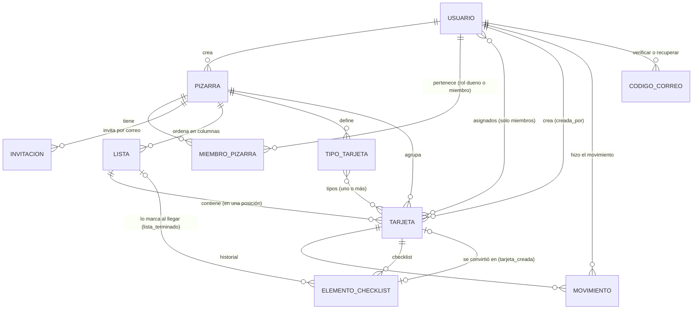

# TaskFlow — Propuesta de arquitectura y esquema de datos

> **Estado:** v3. Etapa 1 (esqueleto) y Etapa 2 (backend de proyectos, miembros, permisos,
> invitaciones, tipos e historial, §4.5) implementadas el 2026-10-01. **Etapa 3 (API `/api/v1/`,
> PWA y portada de instalación, §5–§7) implementada el 2026-10-01**. **Cuentas con correo
> verificado, recuperación de contraseña y apellidos separados** implementados el 2026-10-02
> (§4.3, §7). **En producción todo lo anterior (`3b54d39`) desde el 2026-10-02 en
> `https://taskflow.rourendev.com/`**, servidor propio en Hetzner (§9). La instalación anterior en
> `sistemas.reduaz.mx/taskflow/` (solo Etapa 1) se retiró el 2026-10-03.
> **Etapa 3.6 implementada el 2026-10-05, sin desplegar:** «proyecto» pasa a **«pizarra»** en todo
> el sistema, **listas libres** por pizarra en lugar de los tres estatus, listas de cierre,
> arrastrar y soltar, checklist con elementos convertibles en tarjetas enlazadas, descripción
> opcional y fecha de inicio (§4.4–§4.6, maqueta `app-v3.html`).
> **Fecha:** 2026-10-05
> **Alcance:** describe el funcionamiento general y el esquema. Lo pendiente de decidir está en
> [§10](#10-preguntas-abiertas); los ajustes hechos al implementar, en [§11](#11-notas-de-implementación).

---

## 1. Resumen

**TaskFlow** es un gestor de tarjetas para organizar actividades. Las tarjetas viven en
**pizarras** (de un evento, un área o un equipo) y, dentro de cada pizarra, en **listas** con nombre
libre que se ordenan como trabaje cada equipo («Pendiente», «Esperando compra», «Finalizada»…). Cada
tarjeta representa una actividad, puede asignarse a una o más personas y llevar una checklist.

| Frente | Usuarios | Tecnología | Ruta | Estado |
| --- | --- | --- | --- | --- |
| Administración del sistema | Superadministrador | Django admin | `/django-admin/` | ✅ en producción |
| Portada de instalación | Cualquiera | Plantilla de Django | `/` | ✅ en producción |
| Aplicación (pizarras de tarjetas) | Usuarios con cuenta | PWA: Vue 3 + Vite (§5) | `/app/` | ✅ en producción |
| API de la PWA | La PWA (misma sesión) | Django REST Framework (§6) | `/api/v1/` | ✅ en producción |

Las rutas son relativas a `https://taskflow.rourendev.com`. El código funciona también bajo una
ruta de otro dominio (`/taskflow/…`, como hasta 2026-10-03; §9).

## 2. Stack

Python 3.13 · Django 5.2 LTS · Django REST Framework 3.18 · PostgreSQL 18 · uv · Docker (dev y
producción con gunicorn + WhiteNoise). PWA: Vue 3.5 + vue-router 5 + Vite 8 + vite-plugin-pwa
(Workbox) + TypeScript; Inter empaquetada (`static/fonts/`, licencia OFL). Mismo stack y convenciones que mi-campus, sin Wagtail ni multi-tenant: TaskFlow no
tiene sitios públicos ni unidades, así que esas piezas solo agregarían complejidad.

## 3. Aplicaciones

```
apps/
├── core/        TimeStampedModel, /healthz/, portada (/), entrega de la PWA (/app/), `migrate`
│                con el paso previo que pasa la app `proyectos` a `pizarras` (§11, 2026-10-05)
├── usuarios/    Usuario (AUTH_USER_MODEL), CodigoCorreo + servicios (verificar, recuperar)
├── pizarras/    Pizarra, MiembroPizarra, Invitacion, Lista, TipoTarjeta + servicios (reglas)
│                (hasta 2026-10-05: `proyectos/`, con Proyecto y MiembroProyecto)
├── tarjetas/    Tarjeta, Movimiento (historial), ElementoChecklist + servicios (reglas)
└── api/         /api/v1/: vistas finas que llaman a los servicios; sin reglas propias
frontend/        PWA (Vue + Vite). `npm run build` la deja en pwa/app/ (no se versiona)
static/          tema.css (paleta), fuentes.css + fonts/ (Inter), portada.css/js, marca/
```

## 4. Esquema de datos

### 4.1 Diagrama entidad-relación



### 4.2 Campos comunes

`TimeStampedModel` (abstracto): `creado_en` (auto al crear) y `actualizado_en` (auto al guardar).

### 4.3 `usuarios`

#### `Usuario` — la cuenta (`AUTH_USER_MODEL`)

| Campo | Tipo | Notas |
| --- | --- | --- |
| `email` | Email, único | Credencial de acceso. Se guarda en minúsculas y hay restricción única sin distinguir mayúsculas (`usuario_email_unico_ci`). |
| `nombre` | Texto | Obligatorio al registrarse y en el perfil (lo exige la API). |
| `primer_apellido` | Texto (100) | Obligatorio al registrarse y en el perfil. |
| `segundo_apellido` | Texto (100), opcional | Hay personas con un solo apellido (y extranjeros). |
| `correo_verificado_en` | Fecha y hora, nula | Nula = la cuenta no ha confirmado su correo y **no puede entrar a la app**. Fecha y no booleano, para saber desde cuándo (igual que `archivado_en`). |
| `is_active`, `is_staff`, permisos | | Los de Django. |

Extiende `AbstractBaseUser` y no `AbstractUser` para no arrastrar `username`: una sola credencial
(el correo) evita que dos campos digan cosas distintas. Se definió desde la primera migración porque
cambiar `AUTH_USER_MODEL` después es muy costoso.

Los nombres van en la base **por separado y sin obligatoriedad** (`blank=True`): el superusuario
se crea sin nombre y el admin no debe exigirlo. La obligatoriedad de nombre y primer apellido la
aplica la API al registrarse y al editar el perfil. `nombre_completo` = nombre + primer apellido
+ segundo apellido, omitiendo los vacíos.

**Quién queda verificado sin código:** quien se registra desde una **invitación** (el enlace llegó
a ese correo), el **superusuario** (`create_superuser`), las cuentas **creadas desde el admin** y
las que **ya existían** al agregar la verificación (la migración `usuarios.0002` les pone su
`creado_en`, para no cerrarles la puerta por una regla nueva).

#### `CodigoCorreo` — código de un solo uso *(2026-10-02)*

| Campo | Tipo | Notas |
| --- | --- | --- |
| `usuario` | FK `Usuario`, `CASCADE` | |
| `proposito` | `verificar` · `recuperar` | `CheckConstraint`. |
| `codigo_hash` | Texto (64) | HMAC-SHA256 con la `SECRET_KEY` (`salted_hmac`), **nunca el código en claro**: quien lea la base o un respaldo no puede usarlo. |
| `intentos` | Entero | Intentos fallidos con este código. |
| `creado_en` | Fecha y hora (`default=timezone.now`) | De ahí sale el vencimiento. No `auto_now_add`, para poder simular un código vencido en las pruebas. |

Reglas (`apps/usuarios/servicios.py`): 6 dígitos (`secrets`), **vence a los 15 min**, **5
intentos**, solo vale **el más reciente** de cada propósito, **un minuto entre envíos** y **5
envíos por hora**. Con eso, adivinar uno de un millón no es práctico. Al usarlo bien se borran
los códigos de ese propósito; los vencidos o sin usar se quedan (son pocos y cuentan para el tope
por hora). *Pendiente:* limpiar los viejos con un comando periódico si la tabla creciera.
El correo sale con `transaction.on_commit` (plantillas en
`apps/usuarios/templates/usuarios/correos/`).

### 4.4 `tarjetas` *(esquema actual: v3, 2026-10-05)*

#### `Tarjeta`

| Campo | Tipo | Notas |
| --- | --- | --- |
| `pizarra` | FK `Pizarra`, obligatoria, `CASCADE` | Eliminar la pizarra borra sus tarjetas. |
| `lista` | FK `Lista`, obligatoria, **`RESTRICT`** | Debe ser de la misma pizarra (servicio). `RESTRICT` y no `PROTECT`: una lista con tarjetas no se puede borrar sola (§4.6), pero sí junto con su pizarra; `PROTECT` lo impediría también ahí. |
| `posicion` | Entero | Orden manual dentro de la lista (0 arriba). Una tarjeta nueva va al final. Al mover, el servicio renumera las listas afectadas: son pocas tarjetas por lista y no hace falta un orden fraccionario. Índice `(lista, posicion)`. |
| `titulo` | Texto (200), obligatorio | |
| `descripcion` | Texto largo, **opcional** *(2026-10-05)* | Muchas actividades se explican con el título; exigirla solo provocaba textos de relleno. |
| `prioridad` | `baja` · `media` · `alta` · `urgente` | Por omisión `media`. Fija para todas las pizarras (a diferencia de los tipos), decidida el 2026-10-01 al adoptar la identidad visual (`docs/identidad-visual.md`). `CheckConstraint` `tarjeta_prioridad_valida`. |
| `fecha_inicio` | Fecha, obligatoria; por omisión hoy en `America/Mexico_City` *(2026-10-05)* | **Cuándo empezó o se encargó**, que no siempre es cuándo se capturó (`creado_en`): si piden algo el lunes y se anota el jueves, se pone el lunes. Solo fecha: la hora casi nunca se sabe. En la interfaz, «Fecha de inicio». |
| `fecha_fin` | Fecha, **opcional** | En la interfaz, **«Fecha límite»**. Muchas actividades no tienen fecha comprometida; un valor inventado ensuciaría los vencimientos. No puede ser anterior a `fecha_inicio` (servicio y `CheckConstraint` `tarjeta_fechas_en_orden`). |
| `asignados` | M2M a `Usuario`, opcional | Solo miembros de la pizarra (servicio). |
| `tipos` | M2M a `TipoTarjeta`, opcional | Solo tipos de la misma pizarra (servicio). |
| `creada_por` | FK a `Usuario`, opcional | `SET_NULL`: borrar una cuenta no debe borrar las tarjetas que creó. |

Orden por omisión: `posicion`. **Vencida** = fecha límite pasada y la tarjeta **fuera de una lista
de cierre** (§4.6).

#### `Movimiento` — historial *(reemplaza a `CambioEstatus`, 2026-10-05)*

| Campo | Tipo | Notas |
| --- | --- | --- |
| `tarjeta` | FK, `CASCADE` | Si se elimina la tarjeta, su historial se va con ella. |
| `lista_anterior`, `lista_nueva` | Texto (50) | El **nombre** de la lista en ese momento, no una FK: las listas se renombran y se eliminan, y el historial debe seguir diciendo lo que pasó. `lista_anterior` vacía = la creación. |
| `nota` | Texto (300) | Un evento que no es un movimiento: «convirtió «…» de la checklist en tarjeta» / «la creó desde la checklist de «…»». |
| `usuario` | FK `Usuario`, `SET_NULL` | Si se borra la cuenta, la entrada sigue y se muestra «Usuario eliminado». |
| `fecha` | Fecha y hora, `default=timezone.now` | No `auto_now_add`, para que la migración copie las fechas del historial anterior. UTC en la base, `America/Mexico_City` en pantalla. |

Solo se agregan filas, en la **misma transacción** que el cambio, desde los servicios
(`crear_tarjeta`, `mover_tarjeta`, `convertir_elemento`) y el admin, para que ningún cambio de
lista quede sin rastro. Reordenar dentro de la misma lista **no** se registra (sería ruido).
Índice `(tarjeta, -fecha)`.

#### `ElementoChecklist` *(2026-10-05)*

| Campo | Tipo | Notas |
| --- | --- | --- |
| `tarjeta` | FK, `CASCADE`, `related_name="checklist"` | Una checklist por tarjeta. |
| `texto` | Texto (200) | |
| `hecho` | Booleano | Solo cuenta si se palomea a mano (ver abajo). |
| `posicion` | Entero | Orden manual (se arrastra por la manija). |
| `tarjeta_creada` | **`OneToOneField`** a `Tarjeta`, nula, `SET_NULL`, `related_name="elemento_origen"` | La tarjeta en que se convirtió. El enlace vive en un solo lado y la tarjeta nueva lo lee por la relación inversa: dos FK, una en cada lado, podrían quedar desincronizadas. `OneToOne` porque un elemento se convierte en una sola tarjeta y una tarjeta viene de un solo elemento. Debe ser de la misma pizarra (servicio). |
| `lista_terminado` | FK `Lista`, nula, `SET_NULL` | «Se marca al pasar a»: con ella y `tarjeta_creada`, el elemento está hecho cuando `tarjeta_creada.lista == lista_terminado` y `hecho` se ignora. Nula = palomeo manual (también si esa lista se elimina). |

### 4.5 Pizarras y miembros *(Etapa 2 — decidido e implementado el 2026-10-01 como «proyectos»; renombrado y ampliado el 2026-10-05)*

Código: `apps/pizarras/` (`Pizarra`, `MiembroPizarra`, `Invitacion`, `Lista`, `TipoTarjeta`) y
`apps/tarjetas/` (`Tarjeta`, `Movimiento`, `ElementoChecklist`). **Las reglas viven en
`servicios.py` de cada app** (no en los modelos ni en las vistas): `PermisoDenegado` cuando el
usuario no puede (no es miembro, no es dueño, le falta el permiso o la pizarra está archivada) y
`ValidationError` cuando los datos son inválidos. La API (`apps/api/`, §6) solo traduce peticiones
a esas funciones.

Reglas decididas (Ernesto, 2026-10-01; con los nombres y permisos de 2026-10-05):

- Cualquier usuario puede **crear pizarras**; las **tarjetas pertenecen a una pizarra**.
- Un usuario puede pertenecer a **una o varias** pizarras.
- Solo el **dueño** invita gente a su pizarra (y quita personas o cancela invitaciones).
- **Todos los miembros ven todas las tarjetas** de la pizarra; quien no es miembro no ve la pizarra.
- Las tarjetas pueden quedar **sin asignar**.
- **Crear, editar, mover y eliminar** tarjetas, y **gestionar listas** y **gestionar tipos**, son
  permisos que el **dueño asigna a cada miembro**; el dueño siempre puede todo. Quien acepta una
  invitación entra con crear, editar y mover (sin eliminar ni gestionar).
- Las invitaciones se pueden **reenviar** y **no vencen**.
- Si la cuenta del dueño se desactiva sin haber transferido, un **administrador** transfiere la
  pizarra desde el admin de Django.
- Cada pizarra tiene **tipos de tarjeta** (nombre, descripción opcional y color configurable). Una
  tarjeta puede tener **uno o más** tipos.
- La pizarra se puede **transferir** a otro miembro (un solo dueño a la vez), **archivar** y
  **eliminar**.

| Modelo | Campos | Notas |
| --- | --- | --- |
| `Pizarra` | `nombre`, `creado_por` (FK `Usuario`, `PROTECT`), `archivada_en` (fecha, nula), fechas | Quien la crea queda como miembro con rol `dueno`, y la pizarra nace con las listas «Pendiente», «En curso» y «Finalizada» (esta, de cierre). Archivada = solo lectura para todos; nulo = activa. Fecha y no booleano para saber desde cuándo. |
| `MiembroPizarra` | `pizarra` (FK, `CASCADE`), `usuario` (FK, `CASCADE`), `rol` (`dueno` · `miembro`), `puede_crear` (por omisión `True`), `puede_editar` (`True`), `puede_mover` (`True`), `puede_eliminar` (`False`), `puede_gestionar_listas` (`False`), `puede_gestionar_tipos` (`False`), `unido_en` | `UniqueConstraint(pizarra, usuario)` y **un solo dueño por pizarra** (`pizarra_un_solo_dueno`, condicional). Los permisos son columnas y no un sistema genérico porque son seis, fijos, y el dueño los marca por persona; para el dueño se ignoran. «Gestionar listas» va aparte de «Gestionar tipos» porque reorganizar el tablero afecta a todos más que agregar una etiqueta. Transferir = cambiar los dos roles en una transacción. |
| `Invitacion` | `pizarra` (FK), `correo`, `invitada_por` (FK `Usuario`), `token` (único), `estado` (`pendiente` · `aceptada` · `cancelada`), `creada_en`, `enviada_en` (último envío), `veces_enviada`, `respondida_en`, `aceptada_por` | **Sin vencimiento** (decidido). **Reenviar** manda otra vez el mismo enlace y actualiza `enviada_en`; `veces_enviada` pone un tope. Una pendiente por pizarra y correo (`UniqueConstraint` condicional). Se invita por correo porque la persona puede no tener cuenta todavía. |
| `Lista` *(2026-10-05)* | `pizarra` (FK, `CASCADE`), `nombre` (50), `posicion` (entero), `es_cierre` (booleano, `False`), fechas | `UniqueConstraint(pizarra, Lower(nombre))`: en «Mover a» dos listas con el mismo nombre serían indistinguibles. Orden por `posicion`. Sin color: se distinguen por su nombre, y la paleta reserva los colores para alertas y tipos. `es_cierre` = lo que llega aquí cuenta como terminado (§4.6). Solo se elimina vacía (`Tarjeta.lista` es `RESTRICT`). |
| `TipoTarjeta` | `pizarra` (FK, `CASCADE`), `nombre` (50), `descripcion` (opcional), `color` (7, `#rrggbb`), fechas | `UniqueConstraint(pizarra, Lower(nombre))`. `color` validado con `RegexValidator(^#[0-9a-f]{6}$)` y `CheckConstraint`, guardado en minúsculas: es el único color que viene del usuario. Eliminar un tipo lo quita de las tarjetas (el M2M se borra solo) sin borrarlas. |

Migraciones: `tarjetas.0003`–`0005` (2026-10-01) pasaron las tarjetas que ya existían a un
proyecto **«Tarjetas anteriores»** y sembraron su historial; `pizarras.0002`–`0003` y
`tarjetas.0007`–`0009` (2026-10-05) hacen el cambio a pizarras y listas (§4.6 y §11).

Decisiones tomadas al implementar (2026-10-01):

- **Una invitación solo la acepta una cuenta con el mismo correo invitado.** El enlace llega a ese
  correo; si alguien lo reenvía, la otra persona no entra a la pizarra. Quien tenga cuenta con otro
  correo pide que lo inviten con ese.
- **Transferir** baja al dueño actual y sube al nuevo en una transacción, en ese orden (la
  restricción «un solo dueño» no puede diferirse porque es condicional). En el admin de Django no se
  edita el rol: el formulario de la pizarra tiene «Transferir a», que llama al mismo servicio.
- **El admin también deja rastro:** cambiar la lista de una tarjeta desde el admin escribe en
  `Movimiento`.
- **Tope de 10 envíos por invitación** (`MAX_ENVIOS_INVITACION`): no vencen y se pueden reenviar,
  pero el tope evita usar TaskFlow para mandar correo masivo.
- **El enlace de invitación** apunta a `TASKFLOW_URL/app/#/invitacion/<token>`, la pantalla de la
  PWA que la acepta (§5). El correo sale por SMTP (`DJANGO_EMAIL_*`); sin configurar, se imprime en el
  registro del contenedor.

### 4.6 Listas en lugar de estatus *(decidido 2026-10-02 a 2026-10-05 · implementado 2026-10-05, sin desplegar)*

**Qué cambia.** Ernesto pidió (2026-10-02) que las tarjetas se manejen como en Trello y quitar los
estatus. Cada pizarra tiene **sus propias listas** (columnas con nombre libre: «Ideas»,
«Esperando compra», «Finalizada»…), que se crean, renombran, ordenan y eliminan; las tarjetas se
mueven entre ellas y se ordenan a mano dentro de cada una. Maqueta aprobada:
`docs/_mockups/app-v3.html`. Esquema resultante en §4.4 y §4.5.

Decisiones (Ernesto, 2026-10-02):

- **«Terminada» = estar en una lista de cierre** *(cambiado 2026-10-05)*. No hay estatus ni
  casilla «completada»: cualquier lista se puede marcar como **lista de cierre** («Lo que llega
  aquí cuenta como terminado»), y puede haber varias («Finalizada», «Cancelada»). Una tarjeta en
  una lista de cierre **no sale vencida** y **no aparece en «Mis tarjetas»**. (No decide la
  checklist: eso se elige por elemento al convertirlo, ver abajo.) Una pizarra nueva trae
  «Finalizada» marcada; una sin listas de cierre funciona sin el concepto. Antes (2026-10-02) no existía «terminada» y
  «Vencida» era cualquier fecha pasada; se cambió al agregar la checklist enlazada, que necesita
  saber cuándo una tarjeta terminó (§9, §10.11).
- **Descripción opcional** *(Ernesto, 2026-10-05)*: una tarjeta se crea con el puro título. Muchas
  actividades se explican solas («Asignar salas»), y exigir una descripción solo provocaba textos
  de relleno. `Tarjeta.descripcion` pasó a `blank=True` (antes era obligatoria); la tarjeta
  del tablero no muestra el renglón si está vacía y el detalle dice «Sin descripción».
- **Checklist por tarjeta, con elementos convertibles en tarjetas enlazadas** *(Ernesto,
  2026-10-05)*:
  - **Una checklist por tarjeta** (no varias como Trello: casi nunca se usan y complican la
    pantalla). Elementos con texto y casilla; se agregan escribiendo y con Enter, y se reordenan
    arrastrando. En la tarjeta del tablero, un indicador «3/5» (verde al completarse); en el
    detalle, barra de avance.
  - **Convertir en tarjeta:** abre el formulario de tarjeta nueva prellenado (título = texto del
    elemento, misma pizarra y lista que la original, sus asignados, inicio hoy), editable antes de
    guardar. **Quedan enlazadas en los dos sentidos:** el elemento se vuelve un enlace a la tarjeta
    nueva con la lista donde está («Tarjeta en «En curso»»), y la nueva muestra «Viene de la
    checklist de …». Solo dentro de la misma pizarra (entre pizarras habría que resolver quién ve
    qué). Queda en el historial de ambas.
  - **«Marcar como terminado cuando pase a…»** *(Ernesto, 2026-10-05)*: al convertir, el
    formulario muestra las listas de la pizarra y se elige **una**; viene preseleccionada la primera
    lista de cierre (o la última, si no hay). El elemento se palomea solo cuando su tarjeta está en
    esa lista y se despalomea si sale. La opción «Ninguna: lo palomeo a mano» lo deja manual. En
    la checklist se lee «En «En curso» · se marca al pasar a «Finalizada»». Se eligió por
    elemento y no con la lista de cierre global porque cada paso puede «terminar» en un punto
    distinto (p. ej. «Revisión con dirección» basta para dar por hecho un borrador). **Se puede
    cambiar después** (Ernesto, 2026-10-05) con el botón de bandera del elemento (permiso
    «Editar»): se despliega bajo el elemento un selector con las listas, señalada en cuál está la
    tarjeta ahora. Se aplica al guardar; al pasar a «Ninguna», el elemento conserva el estado que tenía.
  - **Al eliminar:** si se elimina la tarjeta nueva, el elemento vuelve a ser texto y conserva si
    estaba hecho; si se elimina la original, la nueva se queda sin el «Viene de». Si se elimina la
    lista elegida, el elemento pasa a palomeo manual.
  - **Permisos:** palomear, agregar, editar y quitar elementos = «Editar»; convertir = «Crear». Sin
    permiso nuevo.
  - Los elementos **no llevan fechas ni asignados**: si una parte los necesita, es la señal para
    convertirla en tarjeta.
- **Mover:** **arrastrar y soltar en computadora y en teléfono** (entre listas y para ordenar
  dentro de una). En teléfono se **mantiene presionada** la tarjeta (~0.35 s; si el dedo se mueve
  antes, es un desplazamiento normal), la tarjeta se levanta con una vibración breve y sigue al
  dedo, y cerca del borde el tablero pasa solo a la lista de al lado. Además, en el detalle, una
  fila de botones con las listas mueve la tarjeta **al final** de la elegida con un toque (sirve
  para teclado y lector de pantalla). Ernesto descartó (2026-10-03) el selector de posición
  «Arriba / Posición n / Abajo» por poco profesional: el orden se cambia arrastrando. Todo esto
  reemplaza la decisión de 2026-10-01 de no arrastrar.
- **Historial de movimientos:** se conserva como «quién la movió de qué lista a cuál, fecha y
  hora»; la creación es la primera entrada. Ordenar dentro de la misma lista **no** se registra
  (sería ruido).
- **«Proyecto» pasa a llamarse «Pizarra» en todo el sistema** (Ernesto, 2026-10-05): en la
  interfaz, los correos y la portada, **y también** en modelos, app (`apps/pizarras/`, etiqueta
  `pizarras`), API (`/api/v1/pizarras/…`) y rutas de la PWA (`#/pizarras/…`; los enlaces viejos
  `#/proyectos/…` redirigen). «Proyecto» suena a algo con inicio y fin, y TaskFlow también se usa
  para áreas o equipos permanentes. Se probaron «Espacio» (2026-10-02, abstracto: no dice qué hay
  adentro) y «Tablero» (se confundía con las listas, que Ernesto llamaba así); se descartaron
  también «Área», «Equipo», «Grupo» y «Carpeta». Ernesto pidió renombrar también el código «para
  que todo cuadre»: el costo fue el paso previo de `migrate` (§11).
- **«Mis pizarras»** (2026-10-02, Ernesto): cada pizarra se muestra con un **resumen de tamaño
  fijo** («8 tarjetas · 5 listas · 3 tuyas», miembros y vencidas). Antes había un chip por lista,
  y con muchas listas la tarjeta crecía hacia abajo.

Cómo quedó (2026-10-05):

- **Pizarra nueva:** empieza con las listas «Pendiente», «En curso» y «Finalizada» (esta última
  de cierre), editables; un tablero vacío no le dice a nadie por dónde empezar, y esos nombres son
  los que ya conocen.
- **Migración de datos** (`tarjetas.0008`): cada pizarra recibe esas tres listas y cada tarjeta va
  a la de su estatus, en el orden del tablero de antes (prioridad, fecha de fin, más nuevas
  primero); `fecha_inicio` = el día de creación en hora de México (o la fecha de fin, si era
  anterior); el historial pasa de `CambioEstatus` a `Movimiento` con los nombres de los estatus.
  No se pierde nada y las finalizadas siguen sin salir vencidas. Es reversible (§11).
- **Servicios** (`apps/pizarras/servicios.py`): `crear_lista`, `editar_lista` (nombre y
  `es_cierre`), `ordenar_listas`, `eliminar_lista` (rechaza si tiene tarjetas). En
  `apps/tarjetas/servicios.py`: `mover_tarjeta(tarjeta, lista, posicion)`, que reemplaza a
  `cambiar_estatus` y es la única vía para cambiar `Tarjeta.lista`; checklist: `agregar_elemento`,
  `editar_elemento` (texto, `hecho` solo si es manual, `lista_terminado` solo si ya es tarjeta),
  `ordenar_checklist`, `quitar_elemento` y `convertir_elemento(elemento, lista_terminado=…, datos
  de la tarjeta)`, que crea la tarjeta y el enlace en una transacción y escribe en el historial de
  las dos.
- **API:** ver §6.
- **PWA (§5):** el tablero es una fila de listas con desplazamiento horizontal. En teléfono, una
  lista por pantalla, con **pestañas subrayadas** arriba para saltar entre listas y un solo botón
  **«Filtrar»** que abre una hoja con «Solo mías» y el tipo (el 2026-10-02 Ernesto pidió quitar
  las dos filas de chips, que ocupaban media pantalla). En computadora, columnas de 284 px con los
  filtros a la vista. «Agregar tarjeta» al pie de cada lista y «Agregar lista» al final; opciones
  de la lista (renombrar, lista de cierre, mover a la izquierda o derecha, eliminar si está vacía)
  en su «⋯». El orden del tablero es **manual**; la prioridad sigue como badge y como indicador
  lateral de urgente. Se quitaron la barra de avance y los conteos por estatus, los badges de
  estatus, el botón flotante «+» y las variables `--tf-status-*` (entran `.chip.nombre-lista`,
  neutro en navy suave, y `--tf-success*` para la checklist completa y la marca de cierre).
- **Arrastre: SortableJS directo** (`frontend/src/arrastre.ts`, directiva `v-arrastrable`), no
  `vue-draggable-plus` como se había pensado: su `v-model` reordena el arreglo que se le da, y el
  tablero pinta listas filtradas y calculadas, así que habría que traducir índices igual. Con
  SortableJS directo, al soltar se devuelve el nodo a su lugar, se calcula la posición sobre la
  lista completa (aunque haya filtros) y Vue repinta desde los datos. Opciones: espera de 350 ms
  solo en táctil (`delayOnTouchOnly`), arrastre propio (`forceFallback`) para que la tarjeta
  levantada se vea igual en todos lados, y desplazamiento automático en los bordes.

## 5. Vistas de la aplicación

*Aprobadas el 2026-10-01* con las maquetas `docs/_mockups/app-v2.html` y
`docs/_mockups/instalacion-v2.html`, y el 2026-10-05 con `docs/_mockups/app-v3.html` (pizarras,
listas, checklist). Paleta y componentes en `docs/identidad-visual.md`.

### 5.1 Portada de instalación — `/`

Plantilla de Django (`apps/core/templates/core/portada.html`, sin la PWA): qué es TaskFlow y cómo
instalarla. Detecta iPhone/iPad, Android o computadora (`static/js/portada.js`) y resalta los pasos
de esa plataforma. Botones: **Abrir e instalar** (`/app/?instalar=1`: la PWA muestra el aviso de
instalación aunque se haya descartado), **Crear mi cuenta** (`/app/#/registro`, solo si
`TASKFLOW_REGISTRO_ABIERTO`) y **Entrar**.

### 5.2 PWA — `/app/`

Código en `frontend/`. Rutas con `#` (decisión en §9):

| Ruta | Pantalla | Notas |
| --- | --- | --- |
| `#/entrar`, `#/registro` | Acceso | Sin armazón. `?siguiente=` regresa a donde iba. Registro: nombre, primer apellido, segundo apellido (opcional), correo y contraseña; al enviarlo pasa a `#/verificar`. Entrar con una cuenta sin confirmar también pasa ahí. Enlace «¿Olvidaste tu contraseña?». |
| `#/verificar?correo=` | Confirmar correo | Código de 6 dígitos (`autocomplete="one-time-code"` para que el teléfono lo sugiera) y «Reenviar código», habilitado tras 60 s, lo mismo que exige el servidor. Al confirmar, entra. |
| `#/recuperar` | Recuperar contraseña | Paso 1: correo. Paso 2: código y contraseña nueva; al guardar, entra. El paso 2 aparece siempre, exista o no la cuenta (§7). |
| `#/invitacion/<token>` | Aceptar invitación | Pública. Ver §7. |
| `#/pizarras` | Mis pizarras | Activas con un resumen de una línea (tarjetas · listas · tuyas), miembros y vencidas; archivadas aparte. Aviso de instalación. (`#/proyectos…` redirige aquí.) |
| `#/pizarras/<id>` | Tablero | Listas en fila (§4.6). Teléfono: pestañas por lista y «Filtrar»; arrastrar manteniendo presionada. Computadora (≥ 900 px): columnas, «Solo mías» y tipos a la vista; arrastrar con el mouse. «Agregar tarjeta» en cada lista, «Agregar lista» al final, «⋯» por lista. Banner de solo lectura si está archivada. |
| `#/pizarras/<id>/ajustes` | Miembros y ajustes | Invitar, reenviar/cancelar, seis permisos por miembro, «Hacer dueño», quitar, tipos, renombrar, archivar/restaurar, eliminar, salir. |
| `#/mis-tarjetas` | Mis tarjetas | Asignadas a mí, fuera de listas de cierre, de mis pizarras activas, con pizarra y lista; vencidas primero, luego por fecha límite. |
| `#/perfil` | Perfil | Nombre y apellidos, contraseña, instalar, cerrar sesión. |

- **Detalle de tarjeta** en hoja inferior (teléfono) o panel lateral (computadora): «Viene de»
  (si nació de una checklist), lista (cambiarla con un toque; queda al final), prioridad, tipos,
  descripción, fecha de inicio y fecha límite, checklist, asignados, historial (quién, de qué lista
  a cuál, fecha y hora) y «Creada por … el …». Lo que el usuario no tiene permitido no aparece o
  queda deshabilitado, con una nota que remite al dueño. El mismo panel tiene el formulario de
  alta/edición y el de convertir un elemento de la checklist en tarjeta.
- **Orden** dentro de cada lista: manual (arrastrando); una tarjeta nueva va al final.
- **Confirmaciones** en un diálogo propio que nombra lo afectado y la consecuencia (nunca
  `window.confirm`); **avisos** breves en pasado («Se creó la tarjeta.»).
- **Sin conexión:** el service worker (Workbox, `registerType: "prompt"`) guarda la app y, con
  `NetworkFirst`, las últimas respuestas `GET` de `auth/csrf`, `yo`, `pizarras` y `tarjetas`; se ve
  lo último cargado. Las escrituras requieren conexión. Al cerrar sesión se borra esa caché.
  **Versión nueva** *(cambiado 2026-10-02)*: la app la busca al abrirse, al volver al frente y cada
  hora; al encontrarla avisa «TaskFlow se actualizará en 15 s. Guarda lo que estés escribiendo.»
  con «Actualizar ahora», y al llegar a cero se recarga sola (`frontend/src/App.vue`).
- **Instalación:** Chrome/Edge/Android usan `beforeinstallprompt` (botón «Instalar»); iOS muestra
  los pasos de Safari. El aviso se puede descartar (`localStorage`).
- **Entrega:** `npm run build` deja la app en `pwa/app/`; WhiteNoise la sirve en `/app/`
  (`WHITENOISE_ROOT`). Si no está compilada, `/app/` responde 503 con la instrucción. En la imagen
  de producción la compila la etapa `pwa` del Dockerfile.

## 6. API

Privada para la PWA, en `/api/v1/` (`apps/api/`), JSON, vistas de función de DRF. Cada acción llama
a un servicio de `apps/*/servicios.py`; la API no tiene reglas propias. Salida armada en
`apps/api/representacion.py`.

| Método y ruta | Qué hace |
| --- | --- |
| `GET auth/csrf/` | Deja la cookie CSRF; devuelve `registro_abierto` y el `usuario` de la sesión (o `null`). |
| `POST auth/entrar/` · `auth/salir/` | Sesión. Entrar con una cuenta sin confirmar responde **403** `{detalle, verificar: true, correo}`, sin sesión, y reenvía el código (si no se mandó uno en el último minuto). |
| `POST auth/registro/` | Crea la cuenta **sin sesión** y manda el código: `201 {verificar: true, correo}`. Pide `nombre`, `primer_apellido`, `segundo_apellido` (opcional), `correo`, `password`. |
| `POST auth/verificar/` · `auth/verificar/reenviar/` | Confirmar con `{correo, codigo}` (abre la sesión y devuelve el usuario) · reenviar con `{correo}`. |
| `POST auth/recuperar/` · `auth/recuperar/confirmar/` | Pedir el código con `{correo}` (siempre `{ok: true}`) · `{correo, codigo, password}` cambia la contraseña, verifica el correo y abre la sesión. |
| `GET, PATCH yo/` · `POST yo/password/` | Mi cuenta (`nombre_pila`, `primer_apellido`, `segundo_apellido`; contraseña). |
| `GET yo/tarjetas/` | Mis tarjetas fuera de listas de cierre, en pizarras activas. |
| `GET, POST pizarras/` | Mis pizarras (resumen con `conteos: {tarjetas, listas, mias, vencidas}` y mis permisos) · crear (nace con sus tres listas). |
| `GET, PATCH, DELETE pizarras/<id>/` | Detalle (miembros, listas con `n_tarjetas`, tipos, invitaciones si soy dueño) · renombrar · eliminar. |
| `POST pizarras/<id>/{archivar,restaurar,salir,transferir}/` | Acciones de la pizarra. |
| `PATCH, DELETE pizarras/<id>/miembros/<usuario>/` | Permisos de un miembro (`crear`, `editar`, `mover`, `eliminar`, `gestionar_listas`, `gestionar_tipos`) · quitarlo. |
| `POST pizarras/<id>/invitaciones/` · `…/<inv>/{reenviar,cancelar}/` | Invitaciones. |
| `POST pizarras/<id>/listas/` · `POST …/listas/orden/` | Crear lista `{nombre}` (al final) · ordenar `{ids: […]}` (todas). Devuelven la pizarra. |
| `PATCH, DELETE listas/<id>/` | `{nombre, es_cierre}` · eliminar (solo vacía). Devuelven la pizarra. |
| `POST pizarras/<id>/tipos/` · `PATCH, DELETE …/tipos/<tipo>/` | Tipos de tarjeta. |
| `GET, POST pizarras/<id>/tarjetas/` | Tarjetas de la pizarra (por lista y posición) · crear (`lista`, `fecha_inicio`; descripción opcional). |
| `GET, PATCH, DELETE tarjetas/<id>/` | Detalle con checklist, historial y `viene_de` · editar · eliminar. |
| `POST tarjetas/<id>/mover/` | `{lista, posicion}` (sin posición, al final). Cambiar de lista queda en el historial. |
| `POST tarjetas/<id>/checklist/` · `POST …/checklist/orden/` | Agregar elemento `{texto}` · ordenar `{ids}`. Devuelven la tarjeta. |
| `PATCH, DELETE checklist/<id>/` | `{texto, hecho, lista_terminado}` · quitar. Devuelven la tarjeta. |
| `POST checklist/<id>/convertir/` | Crea la tarjeta enlazada (campos de alta de tarjeta + `lista_terminado`, nula = palomeo manual; sin indicar, la primera lista de cierre). Devuelve `{tarjeta, nueva}`. |
| `GET invitaciones/<token>/` | Pública: pizarra, correo, quién invitó, estado y si ya hay cuenta. |
| `POST invitaciones/<token>/aceptar/` · `…/registro/` | Aceptar con sesión · crear cuenta con el correo invitado (ya verificada) y aceptar. Devuelven `{pizarra}`. |

Errores: `{"detalle": "…"}` o un mensaje por campo (`{"titulo": ["…"]}`); 400 validación, 403 sin
permiso, 404 lo que no existe **o no es tuyo** (§7). Todo lo de `auth/` exige CSRF y tiene el
límite `acceso`.

## 7. Acceso y seguridad

- **Sesión de Django + CSRF** en el mismo origen; nada de tokens en `localStorage`. La PWA manda
  `X-CSRFToken` leído de la cookie `taskflow_csrftoken`. Entrar y registrarse también exigen CSRF
  (`SesionConCsrf`) y tienen límite de intentos (`TASKFLOW_LIMITE_ACCESO`, 20/min por omisión).
- **Registro abierto** (`TASKFLOW_REGISTRO_ABIERTO`, `True` por omisión): cualquiera crea su cuenta
  y sus pizarras. Si se cierra, solo entra quien recibe una invitación.
- **Correo verificado** *(2026-10-02)*: quien se registra solo recibe un código de 6 dígitos y
  **no tiene sesión hasta capturarlo**; así no se llenan pizarras e invitaciones con correos
  ajenos o inventados. Reglas del código en §4.3.
- **Recuperar contraseña** *(2026-10-02)* con el mismo código. `auth/recuperar/` responde igual
  exista o no la cuenta, y un código equivocado, vencido o de un correo sin cuenta dan el mismo
  mensaje. Usar el código **también verifica el correo**: así, si alguien registró primero un
  correo ajeno sin poder confirmarlo, el dueño real recupera la cuenta y pone su contraseña. Las
  cuentas desactivadas no reciben códigos.
  Límite conocido: «Espera un minuto…» al reenviar sí delata que hay una cuenta con ese correo; el
  registro ya lo delata («Ya existe una cuenta…»), así que no se gana nada ocultándolo aquí.
- **Invitaciones:** solo la cuenta con el correo invitado puede aceptarla. Sin cuenta, la crea desde
  el enlace con ese correo (no se puede cambiar) y queda dentro de la pizarra. Con sesión de otra
  cuenta, se le pide salir y entrar con la correcta.
- **Lo ajeno responde 404, no 403**, para no revelar que una pizarra, lista, tarjeta o elemento de
  checklist existe. Las reglas (dueño, permisos, archivada) las aplican los servicios y responden
  403.
- Admin de Django en `/django-admin/` (`is_staff`).
- Producción: `https://taskflow.rourendev.com/` (§9). HTTPS lo termina el nginx del servidor con un
  certificado propio de Let's Encrypt; Django confía en `X-Forwarded-Proto`
  (`SECURE_PROXY_SSL_HEADER`), cookies `Secure` y `Lax`. Solo entran 22, 80 y 443 (firewall de
  Hetzner); SSH solo con llave y sin `root`.
- Cookies con nombre propio (`taskflow_sessionid`, `taskflow_csrftoken`) y ruta `RUTA_BASE`: no
  pisan las de otra app del mismo dominio o de `localhost` en desarrollo.
- HSTS solo para `taskflow.rourendev.com` (sin subdominios): `300` desde 2026-10-02, *pendiente*
  subirlo a un año. En `sistemas.reduaz.mx` estaba en 0 porque el dominio conservaba el 8080 de
  actividades-uaz.
- Visibilidad (§4.5): un usuario ve solo las pizarras de las que es miembro y todas sus tarjetas.
  Cada endpoint tiene prueba de que un no miembro no puede leer ni modificar
  (`apps/api/tests/test_api.py`).

## 8. Plan por etapas

| Etapa | Contenido | Estado |
| --- | --- | --- |
| 1 | Esqueleto: Docker, settings, `Usuario`, `Tarjeta`, admin, pruebas básicas | ✅ 2026-10-01 |
| 1.5 | CI (GitHub Actions + ghcr.io) y despliegue en el servidor compartido de la UAZ | ✅ 2026-10-01 · `f6d2e40` · retirado 2026-10-03 |
| 1.6 | Servidor propio `srv-01` (Hetzner), dominio `rourendev.com`, correo por Resend (docs/operacion.md, docs/despliegue-actual.md) | ✅ 2026-10-02 · en producción `3b54d39` |
| 2 | Proyectos (hoy pizarras), miembros, permisos, invitaciones, tipos e historial (§4.5): modelos, migraciones, servicios, admin y pruebas | ✅ 2026-10-01 (maquetas en `docs/_mockups/`) |
| 3 | API `/api/v1/`, PWA (tablero, tarjetas, miembros, invitaciones, tipos, perfil) y portada de instalación (§5–§7) | ✅ 2026-10-01 · en producción 2026-10-02 |
| 3.5 | Correo verificado con código, recuperar contraseña y apellidos separados (§4.3, §7) | ✅ 2026-10-02 · en producción 2026-10-02 |
| 3.6 | «Proyecto» → «Pizarra» en todo el sistema; listas libres en lugar de estatus, listas de cierre, arrastrar y soltar, historial de movimientos, checklist con tarjetas enlazadas, descripción opcional y fecha de inicio (§4.4–§4.6) | ✅ 2026-10-05 · sin desplegar |
| 4 | Por definir: avisos por correo de asignación o vencimiento, búsqueda, comentarios en tarjetas | — |

## 9. Decisiones de diseño

- **Sin Wagtail ni multi-tenant** (2026-10-01): TaskFlow no publica contenido ni separa datos por
  unidad. Si en el futuro hiciera falta separar tableros por equipo, se modelaría con una FK
  explícita, no con multi-site.

- **Servidor propio en Hetzner con dominio propio** (2026-10-02, Ernesto; sustituye a la decisión
  siguiente): TaskFlow pasa a `https://taskflow.rourendev.com/`, en `srv-01` (Hetzner Cloud, 2 vCPU,
  4 GB), servidor pensado para alojar varias apps propias, una por subdominio de `rourendev.com`
  (dominio en Cloudflare). Motivos: dejar de compartir el servidor de la UAZ (y sus restricciones:
  sin HSTS, 2 workers, ruta en vez de dominio) y poder publicar y monetizar apps personales.
  Descartados: **Vercel** (serverless: sin Docker, sin procesos permanentes ni disco persistente;
  habría que rehacer el despliegue y mover los archivos a S3), **DigitalOcean** (mismo esquema pero
  el doble de precio por la mitad de RAM), **Clouding** (1 GB de RAM y 0.5 vCPU por el mismo precio)
  y **Render/Railway/Fly** (más caros y dejan sin uso `desplegar.sh` y los respaldos). Correo por
  **Resend** (SMTP; gratis hasta 3,000 al mes) porque no requiere código y la verificación del
  dominio se hizo con Cloudflare en un paso. No se contrataron los Backups de Hetzner ni se instaló
  el respaldo diario (riesgo aceptado, docs/despliegue-actual.md §4).
- **Publicación bajo `/taskflow/` de `sistemas.reduaz.mx` en vez de dominio propio** (2026-10-01;
  *sustituida el 2026-10-02 por la anterior; se conserva el razonamiento*):
  no se pueden pedir más dominios por ahora. Se descartó entrar por IP y puerto
  (`http://148.217.94.155:8082`) porque dejaría la aplicación sin HTTPS (contraseñas en claro) y
  obligaría a abrir un puerto en el firewall. La ruta reutiliza el certificado existente; el costo
  es `FORCE_SCRIPT_NAME`, cookies con nombre y ruta propios y la regla de no escribir URLs a mano.
  Pasar a dominio propio después es cambiar dos variables y el `server{}` (docs/operacion.md).
- **PWA con rutas `#` y `base: "./"`** (2026-10-01): la misma build funciona en `/app/` y bajo una
  ruta (`/taskflow/app/`, producción hasta 2026-10-03) sin recompilar, y el servidor solo entrega `index.html`; no hace
  falta un *catch-all* en Django ni en nginx. La raíz de la API se calcula de la URL
  (`frontend/src/api.ts`). Costo: URLs con `#`, sin importancia en una app instalada.
- **API con vistas de función de DRF y salida a mano** (2026-10-01), no `ViewSet` ni `Serializer`:
  la salida mezcla datos calculados (mis permisos, conteos, vencidas) y la validación de entrada ya
  vive en los servicios. Se usa DRF por sesión, CSRF, límites de intentos y manejo de errores.
- **Registro abierto por omisión** (2026-10-01): cualquier persona puede crear su cuenta y sus
  proyectos (§4.5: «cada usuario podrá crear un proyecto»). Se puede cerrar con una variable.
- **Código de 6 dígitos y no enlace mágico para verificar y recuperar** (2026-10-02): en la app
  instalada, un enlace del correo se abre en el navegador y no en la PWA, así que la persona
  terminaría en otra ventana sin su sesión; el código se escribe donde ya está, y el teléfono lo
  sugiere solo (`one-time-code`). Se descartó también `PasswordResetTokenGenerator` de Django por
  la misma razón (es un enlace) y porque no limita intentos.
- **El código se guarda como HMAC, no en claro ni con el hasher de contraseñas** (2026-10-02): un
  respaldo filtrado no debe servir para entrar; el HMAC basta porque el código vive 15 minutos y
  tiene 5 intentos, y no paga el costo de PBKDF2 en cada intento.
- **La PWA se actualiza sola con cuenta regresiva** (2026-10-02, Ernesto): con el aviso que
  esperaba a que alguien tocara «Actualizar», una app instalada podía quedarse días en una versión
  vieja, con pantallas que ya no coinciden con la API (p. ej. un registro sin el campo de primer
  apellido que el servidor ahora exige). Se descartó recargar al instante, porque perdería lo que
  alguien estuviera escribiendo, y esperar a que no hubiera formularios abiertos, por complejo:
  15 s de aviso bastan para guardar. Los datos no corren riesgo con una versión vieja (las reglas
  viven en el servidor); el riesgo era de pantallas rotas. Los despliegues se hacen en horas de
  poco uso.
- **Listas libres en lugar de estatus fijos** (2026-10-02, Ernesto; implementado 2026-10-05, §4.6): los tres
  estatus obligaban a todos los proyectos a la misma forma de trabajo, y los equipos tienen etapas
  propias («Esperando compra», «Revisión con dirección»). Se descartaron: **estatus configurables
  con una casilla «es final»** (mantiene el concepto de terminada pero agrega una regla que nadie
  pidió; Ernesto prefirió que «Finalizada» sea solo una lista), **una casilla «Completada» aparte
  de la lista** (dos formas de decir lo mismo), **archivar tarjetas al terminar** (otra
  pantalla más para algo que una lista ya resuelve) y **quitar las columnas** y dejar una sola
  lista filtrable (pierde la vista de etapas, que es lo que se quería). *Reconsiderado el
  2026-10-05:* la «casilla es final» volvió como **lista de cierre** (§4.6), porque la checklist
  enlazada necesita saber cuándo terminó una tarjeta y porque así se resolvieron las vencidas en
  «Finalizada» (§10.11). A diferencia de lo descartado, es opcional y no reintroduce estatus.
- **Checklist enlazada: cada elemento convertido elige en qué lista se da por terminado**
  (2026-10-05, Ernesto): primero se propuso que lo decidiera la lista de cierre de la
  pizarra, pero Ernesto prefirió elegirlo al convertir, porque no todos los pasos terminan en el
  mismo punto. El palomeo manual queda como opción explícita («Ninguna») y no por omisión, porque
  el elemento y su tarjeta podían decir cosas distintas («hecho» con la tarjeta en «En curso»).
  Se descartaron
  también **subtareas como tarjetas hijas sin checklist** (cada paso chico sería una tarjeta en el
  tablero) y **varias checklists por tarjeta** (casi no se usan y complican la pantalla).
- **Arrastrar y soltar en todos los dispositivos, más «Mover a» en el detalle** (2026-10-02,
  ajustado 2026-10-03; implementado 2026-10-05): con listas libres y orden manual, arrastrar es la forma
  natural. El 2026-10-01 se había descartado porque en teléfono es torpe: se resuelve con
  **mantener presionado** para levantar la tarjeta, como las apps nativas, para no confundirlo
  con desplazar el tablero. Se descartó un selector de lista y posición en el detalle como
  única vía en teléfono (Ernesto, 2026-10-03: poco vistoso); queda solo el cambio de lista con un
  toque, como alternativa accesible. Librería: SortableJS directo, no `vue-draggable-plus` (por
  qué, en §4.6).
- **Renombrar también la etiqueta de la app con un `migrate` propio** (2026-10-05): Django no sabe
  cambiar la etiqueta de una app (`proyectos` → `pizarras`); con la etiqueta nueva, el historial
  diría que `pizarras` nunca se aplicó. Se descartaron: **dejar la etiqueta `proyectos`** con
  modelos `Pizarra` (no «cuadra», que era lo pedido), **una app nueva con copia de datos** (dos
  juegos de tablas y una migración de datos más arriesgada) y **un paso manual con SQL al
  desplegar** (fácil de olvidar). `apps/core/management/commands/migrate.py` reemplaza al de Django
  y, si encuentra la etiqueta vieja, renombra tablas, `django_migrations` y `django_content_type`
  en una transacción antes de migrar; corre solo en cada arranque del contenedor.
- **Paleta y tipografía compartidas** (2026-10-01): la PWA importa `static/css/tema.css` y
  `static/css/fuentes.css`, los mismos que la portada; no hay una segunda copia de los colores.
- **Sin nginx interno** (2026-10-01), a diferencia de mi-campus: no hay archivos privados que
  entregar con `X-Accel-Redirect` y WhiteNoise sirve los estáticos. `web` se publica directo en
  `127.0.0.1:8082`.

## 10. Preguntas abiertas

1. ~~¿Qué tarjetas ve un usuario normal?~~ **Resuelta (2026-10-01):** las tarjetas se agrupan en
   proyectos y cada miembro ve todas las de sus proyectos (§4.5).
2. ~~¿Una tarjeta puede quedar sin asignados?~~ **Resuelta (2026-10-01):** sí, asignar es opcional.
3. ~~¿Se permite regresar de Finalizada? ¿Se registra cuándo cambió?~~ **Resuelta (2026-10-01):**
   se mueve entre todos los estatus en cualquier dirección, y cada cambio queda en el historial
   (`CambioEstatus`: quién, de qué estatus a cuál, fecha y hora). No hace falta `finalizada_en`: se
   obtiene del historial.
4. ~~¿Hace falta agrupar tarjetas en tableros o proyectos?~~ **Resuelta (2026-10-01):** sí, en
   proyectos (§4.5).
5. ~~¿Quién invita?~~ **Resuelta (2026-10-01):** solo el dueño.
6. ~~¿Varios dueños o transferir?~~ **Resuelta (2026-10-01):** un dueño, el proyecto se puede
   transferir; si la cuenta del dueño se desactiva sin transferir, lo transfiere un administrador
   desde el admin de Django.
7. ~~Permisos sobre tarjetas~~ **Resuelta (2026-10-01):** crear, editar, cambiar estatus y eliminar
   son permisos que el dueño asigna a cada miembro; quien acepta una invitación entra con crear,
   editar y cambiar estatus.
8. ~~¿Vencen las invitaciones?~~ **Resuelta (2026-10-01):** no vencen y se pueden reenviar.
9. ~~¿Archivar o eliminar proyectos?~~ **Resuelta (2026-10-01):** ambos, solo el dueño; archivado =
   solo lectura y se puede restaurar.

10. ~~¿Cómo recupera alguien su contraseña?~~ **Resuelta (2026-10-02):** con un código por
    correo (§7), el mismo mecanismo que verifica la cuenta al registrarse.

11. ~~Sin «terminada» (§4.6), una tarjeta con fecha pasada en «Finalizada» seguía saliendo
    «Vencida» y en «Mis tarjetas».~~ **Resuelta (2026-10-05, Ernesto):** con **listas de cierre**
    (§4.6). Se descartó archivar tarjetas.
12. ~~¿Las tarjetas se arrastran?~~ **Resuelta (2026-10-02, ampliada 2026-10-03):** sí, en
    computadora y en teléfono (mantener presionada), más cambio de lista con un toque en el
    detalle (§9). Antes (2026-10-01) se había decidido que no.

## 11. Notas de implementación

- (2026-10-01) Las migraciones de `tarjetas` quedaron en `0001_initial` y `0002_initial` porque se
  generaron en la misma corrida que `usuarios`. Es válido; si se prefiere una sola, borrar ambas y
  regenerar antes del primer despliegue.
- (2026-10-01) **Estilos del admin rotos en producción** (versión `2df6d82`): `STATIC_URL` relativa
  (`static/`) quedaba en caché sin el prefijo porque gunicorn la lee al cargar WhiteNoise, antes de
  fijar `FORCE_SCRIPT_NAME`; el HTML pedía `/static/…` y caía en actividades-uaz. Se arma ahora con
  el prefijo explícito (`RUTA_BASE + "static/"`); WhiteNoise le quita `FORCE_SCRIPT_NAME` para
  servirla. Prueba: `apps/core/tests/test_smoke.py::test_estaticos_con_prefijo`.
- (2026-10-01) **Etapa 2 implementada.** App nueva `proyectos`; `Tarjeta` gana `proyecto`
  (obligatorio) y `tipos`; nuevo `CambioEstatus`. 44 pruebas (servicios, permisos, invitaciones,
  tipos, historial y admin) en verde con SQLite y PostgreSQL. Al desplegar, la tarjeta de prueba de
  producción pasa sola a «Tarjetas anteriores» (migración `tarjetas.0004`).
- (2026-10-01) **Identidad visual navy + coral** adoptada (el coral se retiró después; ver la
  nota de abajo) (`docs/identidad-visual.md`,
  `static/css/tema.css`, logo en `static/img/marca/`), con ajustes de contraste a la guía original.
  Trae un cambio al modelo: **`Tarjeta.prioridad`** (migración `tarjetas.0006`), editable con
  `editar_tarjeta`. Maquetas vigentes: `app-v2.html` e `instalacion-v2.html`.
- (2026-10-01) **Etapa 3 implementada.** App `api` (DRF 3.18) con 23 pruebas; PWA en `frontend/`
  probada de punta a punta con Playwright en teléfono y computadora, también bajo el prefijo
  `/taskflow/` (registro, proyecto, tipos, invitación, tarjetas, estatus e historial, edición,
  eliminación, aceptación de invitación con cuenta nueva). Cambios menores al backend:
  `auth/csrf/` devuelve el usuario de la sesión (la PWA arranca con una sola llamada), `yo/` trae
  `nombre_pila` y `apellidos` por separado, `.webmanifest` se sirve como
  `application/manifest+json`, y el enlace de invitación pasó a `/app/#/invitacion/<token>`. Las
  pruebas de Django apuntan `PWA_DIR` a una carpeta vacía para no depender de que la PWA esté
  compilada.
- (2026-10-01) **Se retira el coral** a pedido de Ernesto (se leía como alerta): acento y «En curso»
  en petróleo (`#0E7490`; el azul se descartó por genérico), prioridad baja y media en grises,
  botón principal navy, portada sin ilustración del teléfono. Rojo y ámbar quedan solo para
  alertas (`docs/identidad-visual.md`).
- (2026-10-01) **Primera prueba local de la Etapa 3** (Ernesto, Windows + Docker Desktop):
  - `docker compose run` no ejecuta el `npm install` del servicio `frontend` y su volumen de
    `node_modules` empieza vacío: la compilación es `docker compose run --rm frontend sh -c "npm ci
    && npm run build"` (corregido en README, skill, `compose.yaml` y el mensaje de `/app/`).
  - Tras agregar DRF a `pyproject.toml`, `web` fallaba con `No module named 'rest_framework'`: las
    dependencias viven en la imagen, hay que `docker compose build web`.
  - `PWA_DIR` con `env.path()` daba un `environ.Path`, que no admite `/` con texto: ahora es
    `Path(env(...))`. Las pruebas no lo detectaron porque `test.py` lo reemplaza.
  - En la portada, `.btn` le ganaba al atributo `hidden` y en computadora se veía también «Ver
    cómo instalar en iPhone»: `[hidden]{display:none!important}` en `portada.css`.
- (2026-10-02) **Cambio al esquema aprobado: apellidos separados y correo verificado.**
  `Usuario.apellidos` (opcional) pasa a `primer_apellido` (obligatorio en la API) y
  `segundo_apellido` (opcional), a pedido de Ernesto: en México se usan dos apellidos y
  ordenarlos o buscarlos por separado es lo normal. Se agregan `correo_verificado_en` y el modelo
  `CodigoCorreo`. La migración `usuarios.0002` parte `apellidos` en la primera palabra y el resto
  (falla con apellidos compuestos como «De la Torre»: cada quien lo corrige en su perfil) y marca
  como verificadas las cuentas existentes; es reversible. `auth/registro/` ya no abre sesión
  (antes devolvía el usuario). Las pruebas que mandan el código usan
  `django_db(transaction=True)` porque el correo sale en `on_commit`, y `conftest.py` limpia la
  caché antes de cada prueba (ahí cuenta DRF los intentos de `acceso`); el fixture `crear_usuario`
  crea cuentas verificadas.
- (2026-10-02) **Cambio a lo aprobado: actualización automática de la PWA.** Antes (§5, v3) la
  versión nueva esperaba a que el usuario tocara «Actualizar»; ahora se instala sola tras 15 s
  de aviso, y la app busca versiones al volver al frente y cada hora (antes, solo al abrirse).
  `registerType` sigue en `"prompt"`: es lo que deja controlar el momento de la recarga. Motivo
  y alternativas en §9.
- (2026-10-02) **Cambio al esquema aprobado (implementado el 2026-10-05): listas en lugar
  de estatus.** Contradice lo aprobado el 2026-10-01 en §1, §4.4 (`Tarjeta.estatus`), §4.5
  (`CambioEstatus`, permiso «cambiar estatus», mover entre los tres estatus), §5 (pestañas por
  estatus, tres columnas, orden por prioridad), §6 (`tarjetas/<id>/estatus/`) y la tabla de
  badges de CLAUDE.md. Motivo: Ernesto quiere organizar las tarjetas como en Trello, con listas
  propias de cada proyecto, sin el concepto de terminada. Diseño en §4.6, alternativas en §9,
  maqueta `docs/_mockups/app-v3.html`. Esas secciones ya describen lo implementado.
- (2026-10-05) **Cambio al esquema aprobado (implementado el mismo día): descripción
  opcional, listas de cierre y checklist.** Contradice §4.4 (`descripcion` obligatoria) y la
  regla de 2026-10-02 de que no existe «terminada» (§4.6). Motivo: Ernesto quiere crear
  tarjetas con el puro título y una checklist cuyos elementos se conviertan en tarjetas
  enlazadas, lo que pide saber cuándo una tarjeta terminó. Modelos nuevos `ElementoChecklist` y
  `Lista.es_cierre` (§4.6); alternativas en §9. Al implementar: §3 y §4.1 (diagrama ER) también
  cambian, y `--tf-status-done*` de `tema.css` pasa a `--tf-success*` (checklist completa y marca
  de lista de cierre).
- (2026-10-03) **Cambio a lo aprobado: producción en servidor y dominio propios.** Antes (§7, §9)
  TaskFlow vivía en `sistemas.reduaz.mx/taskflow/` con `DJANGO_FORCE_SCRIPT_NAME=/taskflow`; desde
  el 2026-10-02 vive en la raíz de `taskflow.rourendev.com` (`srv-01`, Hetzner) con
  `DJANGO_FORCE_SCRIPT_NAME` vacío, y el 2026-10-03 se retiró la instalación de la UAZ sin
  conservar datos (solo tenía la Etapa 1). Motivo y alternativas en §9; inventario y riesgos en
  docs/despliegue-actual.md. Se conserva el soporte para publicar bajo una ruta (cookies con
  nombre propio, `RUTA_BASE`, rutas `#` en la PWA). Cambios de código: la portada ya no escribe el
  dominio a mano (usa `request.get_host`; prueba
  `test_portada_muestra_el_dominio_desde_el_que_se_abre`) y su pregunta frecuente dice que llega
  un **código** (no un enlace) para recuperar la contraseña; `desplegar.sh` prueba la salud con
  `taskflow.rourendev.com`; `docker/nginx/taskflow.conf` pasa de snippet a sitio propio. Se
  agregan `docker/respaldo-diario.sh` y `docker/systemd/` (respaldo diario, *pendiente* de
  instalar).
- (2026-10-05) **Etapa 3.6 implementada** (sin desplegar): «proyecto» → «pizarra» en todo el
  sistema, listas, listas de cierre, arrastre, checklist enlazada, descripción opcional y fecha de
  inicio (§4.4–§4.6, §5, §6). Notas:
  - **Renombre de la app:** `apps/proyectos` → `apps/pizarras` (etiqueta `pizarras`). Las
    migraciones viejas se editaron solo en la etiqueta (`('pizarras', '0001_initial')`,
    `to='pizarras.proyecto'`): su contenido no cambió. En bases existentes, el `migrate` de
    `apps.core` pasa la etiqueta y las tablas antes de migrar (§9; prueba
    `apps/core/tests/test_migrate.py`). Probado sobre una copia de la base de desarrollo con
    tarjetas en los tres estatus, historial y una fecha de fin anterior a la creación.
  - **`pizarras.0002` depende de `tarjetas.0006`:** en una base nueva, Django podía aplicar los
    renombres antes que `tarjetas.0003`, que aún crea la FK hacia `pizarras.proyecto`, y fallaba
    con «Related model 'pizarras.proyecto' cannot be resolved». El mismo orden hacía fallar la
    vuelta atrás; con la dependencia, ida, vuelta (`migrate pizarras 0001`) e ida otra vez
    funcionan. Aun así, en producción la vuelta atrás es **restaurar el respaldo**: tras volver,
    la base conserva la etiqueta `pizarras` y el código anterior no la reconoce.
  - **Tres migraciones de tarjetas** (`0007` esquema con campos opcionales, `0008` datos, `0009`
    obligatorios y limpieza) porque PostgreSQL no deja alterar una tabla en la misma transacción
    en la que se actualizaron sus filas con restricciones diferidas pendientes.
  - **`Movimiento.nota`** (no estaba en el diseño): el historial también registra convertir un
    elemento de la checklist, que no es un movimiento entre listas.
  - **`Tarjeta.lista` es `RESTRICT`** (el diseño decía `PROTECT`): ver §4.4.
  - Error encontrado por las pruebas: al pasar un elemento a palomeo manual, el servicio tomaba la
    lista de la tarjeta enlazada del objeto en memoria (podía ser vieja); ahora la lee de la base.
  - Pruebas: 114 (servicios de listas, mover, checklist y conversión; acceso 404/403 de cada
    endpoint nuevo; migración de etiqueta). PWA probada con Playwright en teléfono (390 px, con
    toques reales: mantener presionado y arrastrar, y que un deslizamiento normal no levante la
    tarjeta) y en computadora (arrastre con mouse entre listas y dentro de una lista, checklist,
    conversión enlazada y su palomeo automático, listas de cierre, ajustes y «Mis tarjetas»).
    Dos choques de nombres de clase CSS se corrigieron así: el chip de lista heredaba los estilos
    de la columna `.lista` y el de checklist los de `.checklist`; ahora son `.chip.nombre-lista` y
    `.chip.avance-checklist`.
  - La caché sin conexión de la PWA (`vite.config.ts`) apuntaba a `/api/v1/proyectos`: ahora a
    `pizarras`.
